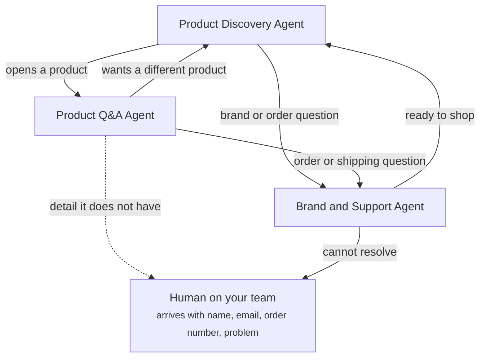

Escalation and handoff decide when an Agent passes a conversation on. An Agent hands off to another Agent when the shopper's need moves outside its job, and to a human on your team when no Agent can resolve it. In both cases the conversation passes with its context, so the shopper never repeats themselves.

## Agent-to-Agent handoff

Each Agent lists the situations it hands off in and the Agent it hands off to. When the situation arises, the conversation moves to that Agent with everything said so far and the shopper's [customer memory](/agents/customer-memory).

Typical reasons to hand off to another Agent:

- **The shopper's goal changes.** A shopper browsing opens a product and has questions about it.
- **The topic moves outside the job.** A shopper on a product page asks about shipping.
- **The problem is solved.** A shopper whose issue is resolved is ready to shop again.

The shopper sees one conversation. The new Agent picks up where the last one stopped, in the same brand voice.

## Human handoff

Some conversations need a person. An Agent brings in a human from your team when it cannot resolve the issue, or when its [fallback behavior](/agents/guardrails-and-fallback) says to.

A human handoff arrives ready to act on. Before handing off, the Agent collects:

- the shopper's name
- their email
- the order number
- the problem, in the shopper's words

Your team sees the conversation so far and these details together. The shopper does not start again.

While the shopper waits, the widget shows the handoff state, such as waiting for a person or a person has joined. Read [Conversation states](/components/widget/overview).

## Global and Agent escalation rules

Global escalation rules live in [Global settings](/global/overview) and apply to every Agent. They set how context passes on every handoff, and what a human handoff must collect. Each Agent's own escalation and handoff list adds its specific routes.

## Example

A gummy supplement store routes conversations between its three Agents and its team like this.

| From | To | When |
| ---- | -- | ---- |
| Product Discovery | Product Q&A | The shopper opens a product |
| Product Discovery | Brand and Support | The shopper asks a brand or order question |
| Product Q&A | Product Discovery | The shopper wants a different product |
| Product Q&A | Brand and Support | The shopper asks an order or shipping question |
| Product Q&A | Human on your team | The shopper accepts the offer to connect with the team |
| Brand and Support | Human on your team | The Agent cannot resolve the issue |
| Brand and Support | Product Discovery | The shopper is ready to shop |

## Related

<CardGroup cols={2}>
  <Card title="Customer memory" href="/agents/customer-memory" />
  <Card title="Guardrails and fallback" href="/agents/guardrails-and-fallback" />
  <Card title="Conversation states" href="/components/widget/overview" />
  <Card title="Intent routing" href="/global/intent-routing" />
</CardGroup>
