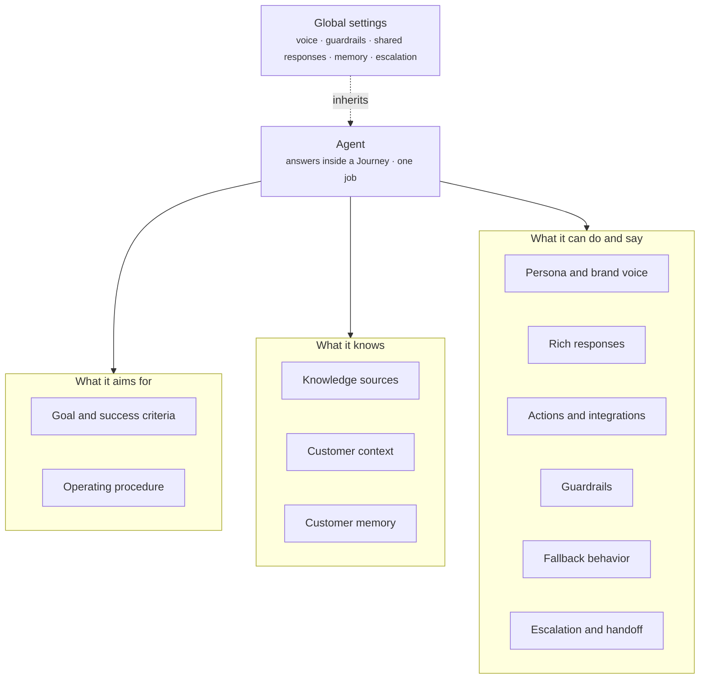

An Agent is the assistant that answers a shopper inside a Journey. Each Agent has one job, such as helping an undecided shopper pick a product or resolving an order problem. Every Agent follows the same shape of eleven parts and inherits the rest from Global settings.

## What an Agent contains

The diagram groups the eleven parts by what they do. Every Agent inherits from Global settings and adds to or narrows what it inherits.



| Part | What it holds | Page |
| ---- | ------------- | ---- |
| Goal and success criteria | What a good conversation achieves, and how you know it happened | [Goal and operating procedure](/agents/goal-and-operating-procedure) |
| Operating procedure | The numbered steps the Agent follows in a conversation | [Goal and operating procedure](/agents/goal-and-operating-procedure) |
| Persona and brand voice | How the Agent sounds, narrowed from the global voice | [Persona and brand voice](/agents/persona-and-brand-voice) |
| Knowledge sources | The catalog, FAQs, and policies the Agent answers from | [Knowledge and customer context](/agents/knowledge-and-context) |
| Customer context | What the Agent knows about the shopper right now, such as the page and arrival source | [Knowledge and customer context](/agents/knowledge-and-context) |
| Rich responses | The components the Agent may put in a reply, including follow-up suggestions | [Rich responses and actions](/agents/rich-responses-and-actions) |
| Actions and integrations | What the Agent can do, such as add to cart or start a return | [Rich responses and actions](/agents/rich-responses-and-actions) |
| Guardrails | What the Agent must never say or do, on top of the global guardrails | [Guardrails and fallback](/agents/guardrails-and-fallback) |
| Fallback behavior | What the Agent does when it cannot answer | [Guardrails and fallback](/agents/guardrails-and-fallback) |
| Customer memory | What the Agent remembers, so the shopper never repeats themselves | [Customer memory](/agents/customer-memory) |
| Escalation and handoff | When the Agent passes the conversation to another Agent or to a human | [Escalation and handoff](/agents/escalation-and-handoff) |

The **Agents** screen lists every Agent in the experience as a card with its name, a one-line description of its job, and a status.

<Frame caption="The Agents screen with Agents in a grid">
  
</Frame>

## How it fits

An Agent answers inside a [Journey](/orchestration/journeys). Each Journey names its Agent. The Journey's [conversation starters](/components/conversation/conversation-starter) and [proactive messages](/components/conversation/proactive-message) each route to a named Agent, so a tapped chip goes straight to the Agent shown next to it.

A question the shopper types goes through [intent routing](/global/intent-routing). The Intent Routing Agent reads the question and sends it to the right Agent. A shopper never picks an Agent.

Every Agent inherits [Global settings](/global/overview): the global persona and brand voice, the global guardrails, the shared rich responses and actions, the global escalation rules, and global customer memory. An Agent's own settings add to or narrow the global ones. An Agent can never loosen a global guardrail.

Once it has the conversation, the Agent composes one [assistant reply](/components/conversation/assistant-reply) per turn. For multi-step actions, such as tracking an order or starting a return, it runs a [Workflow](/agents/workflows).

## Example

A gummy supplement store runs three Agents: Product Discovery, Product Q&A, and Brand and Support. The Product Q&A Agent answers in the Product Q&A Journey, on every product page. Here it is with all eleven parts.

```yaml
# Product Q&A Agent
goal_and_success_criteria:
  goal: A shopper on a product page gets their doubts answered and buys with confidence.
  success: The product, or a better fit, is added to cart.
operating_procedure:
  - Answer in two or three sentences, straight from the product's FAQ.
  - For "Is this right for me?", ask a question or two, then confirm or suggest a better fit.
  - If the shopper is still unsure, open the Quiz.
  - Once doubts are cleared, point to the best-value pack. Suggest a bundle only when it fits.
persona_and_brand_voice: >-
  Friendly and confident, facts first. Light playfulness.
  Never jokes about how the product works or its effects.
knowledge_sources:
  - The product on screen and its own FAQ
  - Reviews, pack sizes, prices, Subscribe & Save, 30-day guarantee
customer_context:
  - Which product page they are on
  - Whether they have ordered this product before
  - Whether they came from an ad
rich_responses:
  - Product detail
  - Review summary
  - Bundle suggestion
  - Add to cart
  - Quiz component
actions_and_integrations:
  - Answers product questions
  - Checks product fit
  - Adds the right pack to the cart
  - Offers a reorder to returning customers
guardrails:
  - Only states results and timelines the product's FAQ states
fallback_behavior: Says it does not have that detail and offers to connect them with the team.
customer_memory:
  - Questions already answered
  - The pack size they chose
escalation_and_handoff:
  - To the Product Discovery Agent if they want a different product
  - To the Brand and Support Agent for order or shipping questions
```

Everything not listed here comes from Global settings. The Agent still follows the global guardrails, such as making no health or medical claims.

## In this section

<CardGroup cols={2}>
  <Card title="Goal and operating procedure" icon="bullseye" href="/agents/goal-and-operating-procedure">
    What a good conversation achieves, and the steps the Agent follows.
  </Card>
  <Card title="Persona and brand voice" icon="comment" href="/agents/persona-and-brand-voice">
    How the Agent sounds, and how it narrows the global voice.
  </Card>
  <Card title="Knowledge and customer context" icon="book-open" href="/agents/knowledge-and-context">
    What the Agent answers from, and what it knows about the shopper.
  </Card>
  <Card title="Rich responses and actions" icon="message" href="/agents/rich-responses-and-actions">
    The components it may show, and what it can do.
  </Card>
  <Card title="Guardrails and fallback" icon="shield-halved" href="/agents/guardrails-and-fallback">
    What it must never do, and what it does when it cannot answer.
  </Card>
  <Card title="Customer memory" icon="brain" href="/agents/customer-memory">
    What it remembers within a conversation and across visits.
  </Card>
  <Card title="Escalation and handoff" icon="people-arrows" href="/agents/escalation-and-handoff">
    Passing a conversation to another Agent or to your team.
  </Card>
  <Card title="Workflows" icon="diagram-project" href="/agents/workflows">
    How multi-step actions run, such as tracking an order.
  </Card>
</CardGroup>

## Related

<CardGroup cols={2}>
  <Card title="Global settings" href="/global/overview" />
  <Card title="Intent routing" href="/global/intent-routing" />
  <Card title="Journeys" href="/orchestration/journeys" />
  <Card title="Assistant reply" href="/components/conversation/assistant-reply" />
</CardGroup>
