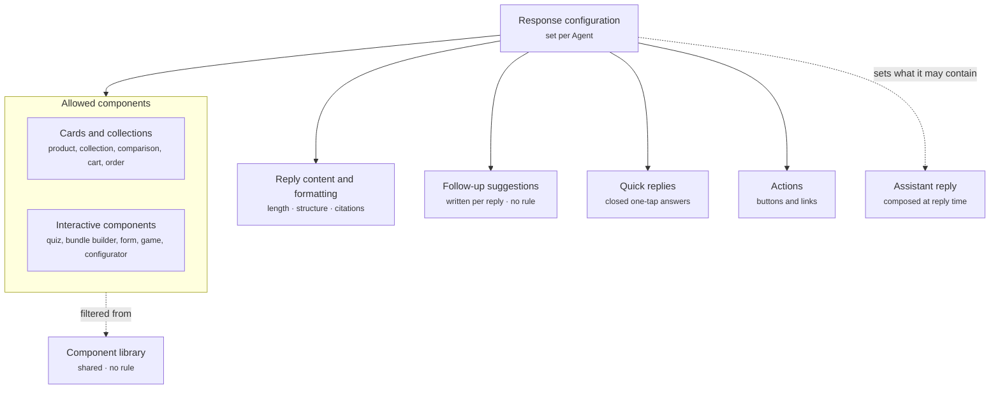

Response configuration decides the shape of an Agent's reply. It covers the reply text and its formatting, which components from the Component library the Agent may include, and whether it offers follow-up suggestions, quick replies, and actions. This is where the component list meets the Agent.

The Agent composes exactly one component, the [assistant reply](/components/conversation/assistant-reply), and it carries no rule. Response configuration sets what the reply may contain. The Agent picks from that set at reply time.

## What it contains

The diagram shows what a reply is composed from, and where the allowed cards and interactive components come from.



| Setting | What it controls | Example |
| ------- | ---------------- | ------- |
| Reply content and formatting | Length, structure, citations, and rich content in the reply text | Short paragraphs, cite knowledge sources |
| Allowed components | Which cards and interactive components the Agent may compose into a reply | Product card, product collection, comparison card |
| Follow-up suggestions | Whether the Agent offers follow-ups, and the suggestion set that caps them. What they say comes from the Agent's instructions | On, up to three |
| Quick replies | Whether the Agent may offer closed one-tap answers | Yes, for size and colour questions |
| Actions | Which buttons and links the Agent may attach | **View all results**, **Add to cart** |

## What an Agent can put in a reply

| Part | What it is | Where it comes from |
| ---- | ---------- | ------------------- |
| Reply text | The message content and its formatting, including citations or source references | Written by the Agent from its instructions and knowledge |
| Cards and collections | [Product cards](/components/cards/product-card), [product collections](/components/cards/product-collection), [comparison cards](/components/cards/comparison-card), [cart and checkout cards](/components/cards/cart-checkout-card), and [order and refund cards](/components/cards/order-refund-card) | The [Component library](/components/overview), filtered by the allowed list |
| Interactive components | [Quizzes](/components/interactive/quiz), [bundle builders](/components/interactive/bundle-builder), [forms](/components/interactive/form), [games](/components/interactive/game), and [configurators](/components/interactive/configurator) | The Component library, filtered by the allowed list |
| Follow-up suggestions | Open next steps under the reply, such as "Show me cheaper options". A [component](/components/conversation/follow-up-suggestion) of their own | Written by the Agent for each reply, from its instructions and the enabled Journeys. No rule |
| Quick replies | Closed one-tap answers with a fixed value, such as Yes, No, or Size 9. Part of the [assistant reply](/components/conversation/assistant-reply#quick-reply) | Chosen by the Agent when it asks a question |
| Actions | Buttons and links the shopper can act on, such as **View all results** or **Add to cart** | The allowed actions list |

## Allowed components

Cards and interactive components come from the shared [Component library](/components/overview) and carry no rule. Response configuration lists which of them this Agent may use. An order assistant is usually limited to [order and refund cards](/components/cards/order-refund-card). A shopping assistant gets the discovery set.

## Follow-up suggestions

Follow-ups carry no rule, no conditions, and no priority. The Agent writes them for every reply, based on the reply it just gave and the Journeys that are enabled. You shape them in the Agent's [instructions](/agents/instructions-and-model), and response configuration turns them on and sets the suggestion set, which caps how many show.

There are two main kinds.

- **Product Q&A follow-ups** ask the next question about the products in the reply, such as comparing, sizing, price, or ingredients.
- **Journey follow-ups** take the shopper into a Journey you have built, such as a quiz Journey or a support Journey.

Guidance in the instructions reads like this.

```text
After you recommend products, offer up to three follow-ups:
one to compare them, one about sizing,
and one that starts the quiz Journey if the shopper seems unsure.
```

## Follow-ups versus quick replies

The two look similar and do different jobs.

- A follow-up suggestion is an open next step that sends a prompt to the Agent or takes the shopper into a Journey. The Agent writes it for each reply. Read [Follow-up suggestion](/components/conversation/follow-up-suggestion).
- A quick reply is a closed answer to a question the Agent just asked. Tapping it sends its fixed value as if the shopper had typed it. Read [Quick reply](/components/conversation/assistant-reply#quick-reply).

## Chosen at reply time

The Agent chooses among its allowed components at the moment it answers. Nothing here is resolved by a Rulebook. Which Agent is answering, and so which response configuration applies, was decided upstream by the agent routing Rulebook. Read [Routing](/agents/routing).

Each part of a rendered reply emits its own impression and interaction events. Read [Assistant reply](/components/conversation/assistant-reply) for the anatomy and the event trail.

## How it fits

Response configuration is the last of an Agent's parts to act. Routing picks the Agent, instructions shape the answer, knowledge feeds it, guardrails bound it, and response configuration decides what the shopper sees.

## Example

A shopper asks for running shoes under a budget. The shopping assistant's response configuration allows product collections, comparison cards, and follow-ups. It replies with one sentence, a product collection of three matches, three follow-ups written from its instructions, and a **View all results** action. It does not offer a quiz, because quizzes are not on its allowed list.

The screenshot shows the **Response** tab of the Shopping assistant. Reply content is set to Short paragraphs with Cite knowledge sources on. Under Allowed components, Product card, Product collection, and Comparison card are checked, and Quiz, Bundle builder, and Form are unchecked. Follow-up suggestions is on with a cap of 3, Quick replies is on, and the Actions list holds **View all results** and **Add to cart**.

<Frame caption="Shopping assistant response configuration">
  
</Frame>

## Related

<CardGroup cols={2}>
  <Card title="Assistant reply" href="/components/conversation/assistant-reply" />
  <Card title="Component library" href="/components/overview" />
  <Card title="Follow-up suggestion" href="/components/conversation/follow-up-suggestion" />
  <Card title="Routing" href="/agents/routing" />
</CardGroup>
