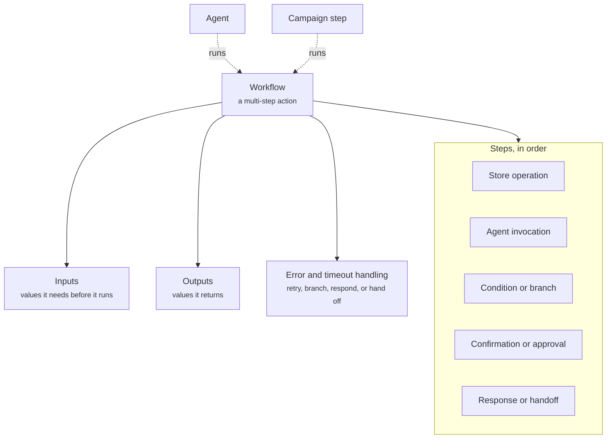

A Workflow is how a multi-step action runs, such as tracking an order or starting a return. It gives the parts of a conversation that must be exact a fixed path with defined inputs, outputs, and error handling. The Agent decides when to run it, and the Workflow decides what happens once it runs.

## What it contains

The diagram shows a Workflow, what it is built from, and who runs it.



| Concept | Meaning | Example |
| ------- | ------- | ------- |
| Inputs | The values a Workflow needs before it runs | Order number, items to return |
| Outputs | The values it returns | Order status, return label link |
| Steps | The ordered steps it runs | Look up order, confirm items, create label |
| Error and timeout handling | What happens when a step fails or takes too long | Retry the lookup once, then hand off to a human |

## Step types

| Step type | What it does | Example |
| --------- | ------------ | ------- |
| Store operation | Runs a fixed action against your store or other systems | Look up an order, create a return |
| Agent invocation | Asks an Agent for content or a judgement inside the Workflow | Summarize why the shopper is returning |
| Condition or branch | Chooses the next step from the values so far | Is the order within 30 days? |
| Confirmation or approval | Pauses until the shopper or someone on your team confirms | "Return these two packs?" |
| Response or handoff | Replies to the shopper, or hands the conversation to an Agent or a human | "Your return is started" |

When a step fails or times out, the Workflow retries it, branches, responds to the shopper, or hands off. A Workflow that hits an unhandled error ends and returns control to the Agent.

## Who runs a Workflow

- **An Agent.** Workflows back the Agent's [actions and integrations](/agents/rich-responses-and-actions). The Agent decides when the conversation needs one, passes the inputs, and uses the outputs in its reply. The Agent's [guardrails](/agents/guardrails-and-fallback) still apply, so a support Agent that must never block a return always runs the return.
- **A Campaign step.** A Workflow can be a step in a [Campaign](/orchestration/campaigns) sequence, which passes the inputs and can branch on the outputs.

An Agent reads its [knowledge and customer context](/agents/knowledge-and-context) directly. It changes nothing in your store except through an action.

## Example

The Brand and Support Agent runs a Start a return Workflow when a shopper says a product is not working for them.

```yaml
workflow: Start a return
inputs: [order_number, items]
steps:
  - Look up the order
  - Branch on whether the order is within the 30-day guarantee
  - Offer a better-fit swap first
  - Confirm the items with the shopper
  - Create the return and reply with the next steps
on_error: Hand off to a human with name, email, order number, and problem
```

## Related

<CardGroup cols={2}>
  <Card title="Rich responses and actions" href="/agents/rich-responses-and-actions" />
  <Card title="Guardrails and fallback" href="/agents/guardrails-and-fallback" />
  <Card title="Escalation and handoff" href="/agents/escalation-and-handoff" />
  <Card title="Campaigns" href="/orchestration/campaigns" />
</CardGroup>
