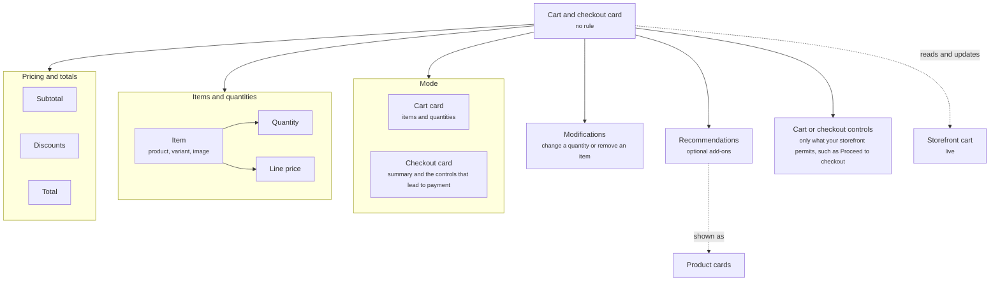

The cart and checkout card shows the shopper what is in their basket and lets them change it or check out from inside the conversation. As a cart card it focuses on items and quantities. As a checkout card it focuses on the summary and the controls that lead to payment. Either way, the shopper finishes without leaving the chat.

<Frame caption="The cart card with one item, a quantity of two, and three items">
  
</Frame>

## Anatomy

The diagram shows the cart and checkout card as its items, totals, modifications, recommendations, and controls, and the two modes it can take.



| Property | What it holds |
| -------- | ------------- |
| Items and quantities | Each product in the cart with its variant, image, and quantity. |
| Pricing and totals | Line prices, subtotal, discounts, and the total. |
| Modifications | Controls to change a quantity or remove an item. |
| Recommendations | Optional products suggested alongside the cart, such as an add-on for an item already in it, shown as [product cards](/components/cards/product-card). |
| Cart or checkout controls | The buttons the shopper can use, such as **Proceed to checkout**. Only the controls your storefront permits are shown. |

The card reads the live cart from your storefront. When the shopper changes a quantity on the card, the storefront cart changes with it.

## Where it appears

A cart and checkout card never shows on its own. One of these components includes it.

- In the [welcome message](/components/conversation/welcome-message), which is global. Every shopper sees the same one on every page, including shoppers with an empty cart, so for a returning shopper with items still in their cart, use a proactive message instead.
- In a [proactive message](/components/conversation/proactive-message), for example a cart recovery message that shows the items left behind. A cart recovery Campaign sends one at each step of its sequence.
- In the [assistant reply](/components/conversation/assistant-reply), where the Agent chooses it. The shopper asks what is in their cart, asks to remove something, or asks to check out, and the Agent answers with the card.
- On a page, inside a [page section](/components/page/page-sections) on the cart page, for example a [content block](/components/page/content-block) that shows the basket beside the discount that applies to it.

## Rules

A cart and checkout card carries no rule. It shows because the welcome message, or a proactive message or page section with a rule, included it, or because the Agent composed it into the assistant reply. The rule that decides whether and when the shopper sees it lives on that component, not on the card. The welcome message is the exception: it carries no rule and is global, so every shopper sees what it embeds. Read [Rules](/orchestration/rules).

## Example

The card that confirms an add to cart, shown in three states.

```yaml
Header: A check with "Added to your cart"
Line items: Thumbnail, title, size, quantity when more than one, and price
Total: Cart total with the item count
```

With one pair, the card shows that item and a total of one. When the shopper adds a second of the same pair, the line shows the quantity and the total counts both. With several products, each gets its own line and the total adds them up. The card reads the live storefront cart, so the cart page matches it on refresh.

## Related

<CardGroup cols={2}>
  <Card title="Product card" href="/components/cards/product-card" />
  <Card title="Order and refund status card" href="/components/cards/order-refund-card" />
</CardGroup>
