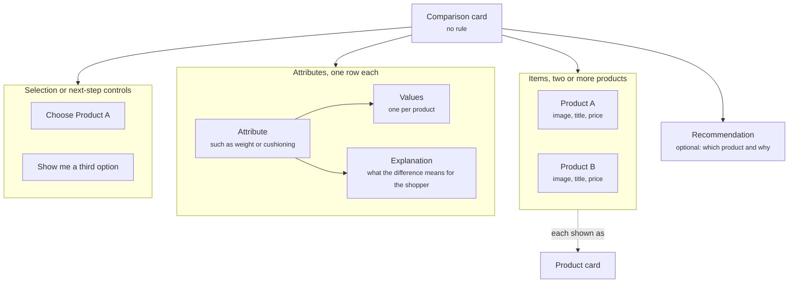

A comparison card lays two or more products side by side across the attributes that matter and explains the differences. It answers the question shoppers ask most often once they have narrowed the field: which one of these should I pick? It turns a list of specifications into a decision the shopper can make in one glance.

## Anatomy

The diagram shows a comparison card as its items, its attribute rows with their values and explanations, the optional recommendation, and the controls.

| Property | What it holds |
| -------- | ------------- |
| Items | The products being compared, each shown as a [product card](/components/cards/product-card) with its image, title, and price. |
| Attributes | The rows of the comparison, such as weight, material, or cushioning. |
| Values and explanations | The value of each attribute for each product, with a short explanation of what the difference means for the shopper. |
| Recommendation | Optional. Which product the Agent suggests and why, based on what the shopper said. |
| Selection or next-step controls | Buttons that let the shopper pick one, such as **Choose Product A**, or move on, such as **Show me a third option**. |

The attributes can be fixed for a category, such as the three specifications that always matter for running shoes, or chosen by the Agent from what the shopper asked about.

## Where it appears

A comparison card never shows on its own. One of these components includes it.

- In the [welcome message](/components/conversation/welcome-message), for example your two best sellers side by side, shown to every shopper when the widget opens.
- In a [proactive message](/components/conversation/proactive-message), for example when a shopper has viewed two products in a row and stalled. A message such as **Still deciding between these?** can carry the card.
- In the [assistant reply](/components/conversation/assistant-reply), where the Agent chooses it. The shopper asks to compare, or taps a follow-up suggestion such as **Compare the first two**, and the Agent answers with the card.
- On a page, inside a [comparison section](/components/page/comparison-section), for example on a product page to compare the product with its nearest alternative.

## Rules

A comparison card carries no rule. It shows because the welcome message, or a proactive message or comparison section with a rule, included it, or because the Agent composed it into the assistant reply. The rule that decides whether and when the shopper sees it lives on that component, not on the card. The welcome message is the exception: it carries no rule and is global, so every shopper sees what it embeds. Read [Rules](/orchestration/rules).

## Example

A shopper who was just shown three road shoes taps the follow-up "Compare the first two". The Agent replies with a comparison card: Product A and Product B side by side across the top, each with its image, title, and price, and below them four rows, **Weight**, **Cushioning**, **Drop**, and **Best for**, with the value for each product and a one-line note on what the difference means, such as "Product B is softer underfoot for long runs". Under the rows a short recommendation reads "For your marathon training, Product B is the better pick", followed by two buttons, **Choose Product B** and **Show me a third option**. Tapping **Choose Product B** returns that shoe as a product card ready to add to the cart.

<Frame caption="Two road shoes compared across four attributes">
  
</Frame>

## Related

<CardGroup cols={2}>
  <Card title="Product card" href="/components/cards/product-card" />
  <Card title="Comparison section" href="/components/page/comparison-section" />
  <Card title="Follow-up suggestions" href="/components/conversation/follow-up-suggestion" />
  <Card title="Product collection" href="/components/cards/product-collection" />
</CardGroup>
