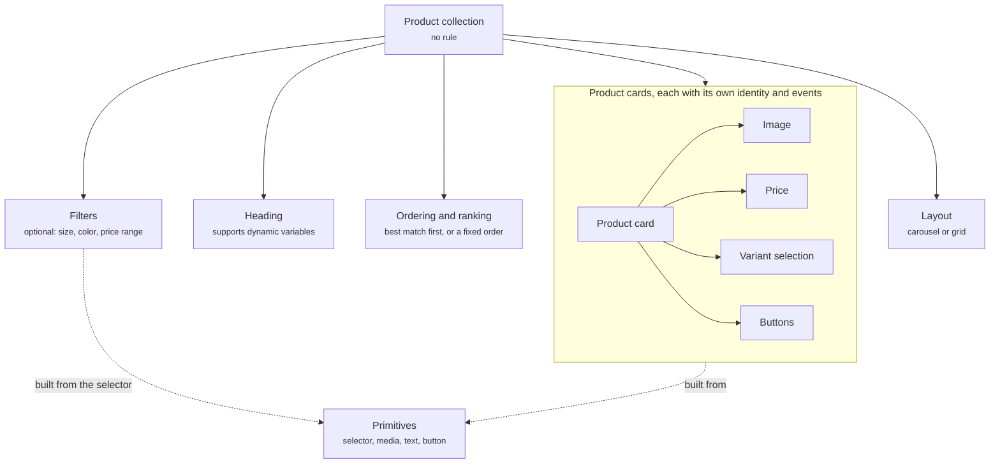

A product collection shows several [product cards](/components/cards/product-card) together under one heading, such as **Best matches for you**. It gives the shopper a set to choose from instead of one product at a time. It is how the Agent answers a question that has more than one good answer, and how a page shows a group of products picked for the visitor.

## Anatomy

The diagram shows a product collection, the properties that shape it, the product cards inside it, and the primitives those cards are built from.

| Property | What it holds |
| -------- | ------------- |
| Product cards | The products in the collection, each rendered as a [product card](/components/cards/product-card) with its own image, price, variant selection, and buttons. |
| Heading | The title above the collection, such as **Best matches for you** or **Complete the look**. Supports dynamic variables, so a heading can name the use case the shopper described. |
| Ordering and ranking | The order the products appear in. Best match first when the Agent picked them, or a fixed order such as price ascending or newest first when you configure the collection. |
| Filters | Optional controls that let the shopper narrow the set, such as size, color, or price range. Built from the [selector](/components/primitives#selector) primitive. |
| Layout | Carousel or grid. A carousel suits the conversation, where width is limited and the shopper swipes. A grid suits a page, where there is room to show the whole set at once. |

Each product card inside the collection keeps its own identity and emits its own events. You can follow a shopper from the collection being shown, to one card being clicked, to that product being added to the cart.

## Where it appears

A product collection never shows on its own. One of these components includes it.

- In the [welcome message](/components/conversation/welcome-message), for example the season's featured products, shown to every shopper when the widget opens.
- In a [proactive message](/components/conversation/proactive-message), for example alternatives sent when the product a shopper came to see is out of stock, or a set of picks for a shopper who has stalled on a collection page.
- In the [assistant reply](/components/conversation/assistant-reply), where the Agent chooses it. When a question has several matches, the Agent writes a sentence such as **These three are your best matches**, follows it with a product collection, and adds follow-up suggestions such as **Compare the first two** or **Only show black**.
- On a page, inside a [recommendation section](/components/page/recommendation-section). The section pairs the collection with an explanation of why these products were picked, and its rule decides which page and which visitor see it.

A collection on its own has no explanation. When you want copy that ties the picks to what the shopper said, did, or arrived from, use a [recommendation section](/components/page/recommendation-section) on a page, or let the Agent write the explanation in the assistant reply.

## Rules

A product collection carries no rule. It shows because the welcome message, or a proactive message or recommendation section with a rule, included it, or because the Agent composed it into the assistant reply. Ordering and filters shape what the shopper sees once the collection is on screen. They do not decide whether it shows. That decision lives on the component that included it. The welcome message is the exception: it carries no rule and is global, so every shopper sees what it embeds. Read [Rules](/orchestration/rules).

## Example

A shopper asks "Which of your low-tops work for everyday wear?" and the Agent has several good answers, so the reply shows a product collection as a horizontal carousel. Two cards are fully visible, a third peeks in at the right edge, and a round right arrow sits over the second card, which is how the shopper knows there is more to scroll. Each card keeps the product card layout in a compact form: the photo with image dots, the title, the rating and review count, the price, and a round cart icon button that adds the product straight from the collection. The first card is Speedcat OG at $120 with a 4.6 rating, and the second is Court Classic at $85 with a 4.4 rating. The same collection inside a page recommendation section renders as a grid with every card visible at once.

<Frame caption="Product collection as a carousel with two cards visible">
  
</Frame>

## Related

<CardGroup cols={2}>
  <Card title="Product card" href="/components/cards/product-card" />
  <Card title="Recommendation section" href="/components/page/recommendation-section" />
  <Card title="Assistant reply" href="/components/conversation/assistant-reply" />
  <Card title="Comparison card" href="/components/cards/comparison-card" />
</CardGroup>
