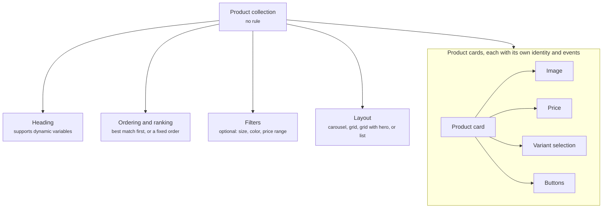

A product collection shows several [product cards](/components/cards/product-card) together under one heading, such as **Best matches for you**. It gives the shopper a set to choose from instead of one product at a time. It is how the Agent answers a question that has more than one good answer, and how a page shows a group of products picked for the visitor.

<Frame caption="A product collection as a carousel of compact product cards">
  
</Frame>

## Anatomy

The diagram shows a product collection, the properties that shape it, and the product cards inside it.



| Property | What it holds |
| -------- | ------------- |
| Product cards | The products in the collection, each rendered as a [product card](/components/cards/product-card) with its own image, price, variant selection, and buttons. |
| Heading | The title above the collection, such as **Best matches for you** or **Complete the look**. Supports dynamic variables, so a heading can name the use case the shopper described. |
| Ordering and ranking | The order the products appear in. Best match first when the Agent picked them, or a fixed order such as price ascending or newest first when you configure the collection. |
| Filters | Optional controls that let the shopper narrow the set, such as size, color, or price range. |
| Layout | Carousel, grid, grid with hero, or list. Read [Layouts](#layouts). |

## Layouts

| Layout | What the shopper sees | Suits |
| ------ | --------------------- | ----- |
| Carousel | Cards in a row the shopper swipes, with the next card peeking in at the edge. | The conversation, where width is limited. |
| Grid | Every card visible at once, in rows and columns. | A page, where there is room to show the whole set. |
| Grid with hero | One large card for the top pick, with the rest in a smaller grid beside or below it. | A set with one clear best match, such as **Our top pick for you**. |
| List | Products as rows, each with a small image, the title, the price, and an action. | Longer sets, and shoppers who want to scan names and prices quickly. |

Each product card inside the collection keeps its own identity and emits its own events. You can follow a shopper from the collection being shown, to one card being clicked, to that product being added to the cart.

## Where it appears

A product collection never shows on its own. One of these components includes it.

- In the [welcome message](/components/conversation/welcome-message), for example the season's featured products, shown to every shopper when the widget opens.
- In a [proactive message](/components/conversation/proactive-message), for example alternatives sent when the product a shopper came to see is out of stock, or a set of picks for a shopper who has stalled on a collection page.
- In the [assistant reply](/components/conversation/assistant-reply), where the Agent chooses it. When a question has several matches, the Agent writes a sentence such as **These three are your best matches**, follows it with a product collection, and adds follow-up suggestions such as **Compare the first two** or **Only show black**.
- On a page, inside a [recommendation and upsell section](/components/page/recommendation-section). The section pairs the collection with an explanation of why these products were picked, and its rule decides which page and which visitor see it.

A collection on its own has no explanation. When you want copy that ties the picks to what the shopper said, did, or arrived from, use a [recommendation and upsell section](/components/page/recommendation-section) on a page, or let the Agent write the explanation in the assistant reply.

## Rules

A product collection carries no rule. It shows because the welcome message, or a proactive message or recommendation and upsell section with a rule, included it, or because the Agent composed it into the assistant reply. Ordering and filters shape what the shopper sees once the collection is on screen. They do not decide whether it shows. That decision lives on the component that included it. The welcome message is the exception: it carries no rule and is global, so every shopper sees what it embeds. Read [Rules](/orchestration/rules).

## Example

Several products the Agent recommends at once, in a carousel the shopper swipes through.

```yaml
Layout: Carousel, with the next card peeking in at the edge
Cards: Product cards in a compact form: photo, brand, title, rating, price
Actions on each card: Save to wishlist, ask about this product, Add to cart
Badges: Shown where set, such as New
```

The same collection renders as a grid inside a page recommendation and upsell section, or as a list with one product per row for a longer set.

## Related

<CardGroup cols={2}>
  <Card title="Product card" href="/components/cards/product-card" />
  <Card title="Recommendation and upsell section" href="/components/page/recommendation-section" />
  <Card title="Assistant reply" href="/components/conversation/assistant-reply" />
  <Card title="Comparison card" href="/components/cards/comparison-card" />
</CardGroup>
