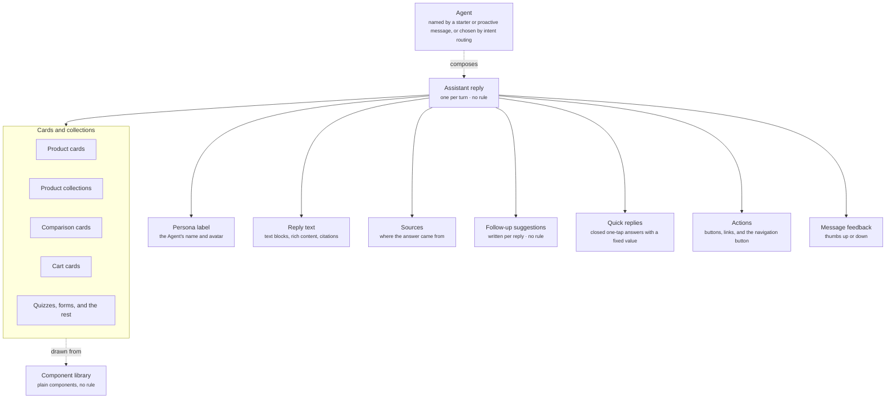

The assistant reply is what a shopper sees every time an Agent answers. It appears in the conversation, one per turn, and it is the one component an [Agent](/agents/overview) composes each turn. It carries no rule. Every part of it emits its own events, which is how you follow a shopper from a reply to a purchase.

## What it contains

The diagram shows the Agent composing the assistant reply and the parts the reply holds.

| Part | What it holds |
| ---- | ------------- |
| Persona label | The name and avatar of the Agent answering, from its [persona](/agents/persona-and-brand-voice). When a person from your team replies during a handoff, the label shows their name instead |
| Reply text | Text blocks, rich content, and citations or source references |
| Sources | Where the answer came from, such as a product page, an FAQ, or a policy. The shopper can open the list to check it |
| Cards and collections | Components from the [Component library](/components/overview): product cards, product collections, comparison cards, cart cards, quizzes, forms, and the rest |
| Follow-up suggestions | Open next steps under the reply, written by the Agent for each reply |
| Quick replies | Closed one-tap answers with a fixed value, such as Yes, No, or Size 9 |
| Actions | Buttons and links the shopper can act on, such as "View all results" or "Add to cart" |
| Navigation button | A link that opens a page after a short countdown, such as the size guide or the order status page. The shopper can tap it to go now or cancel it |
| Message feedback | A thumbs up or down under the reply, with reason chips on a down vote. Read [Feedback and CSAT](/components/conversation/feedback) |

The reply text and its formatting belong to the reply. Cards and collections are plain components the Agent composes in. [Follow-up suggestions](/components/conversation/follow-up-suggestion) are a component of their own, rendered under the reply. The Agent writes them for each reply from its instructions.

## Quick reply

A quick reply is a one-tap answer with a fixed value, such as **Yes**, **No**, or **Size 9**. Tapping it sends the value as if the shopper had typed it. It answers a question the Agent just asked. A follow-up suggestion is an open next step instead.

| Property | What it holds |
| -------- | ------------- |
| Label and value | The text on the chip and the value it stands for. The two can differ, such as a label of **Size 9** and a value of `US9`. |
| Payload | Extra data sent with the value, such as the product or question it answers. |
| Action | What tapping it does. Usually it sends the value to the Agent as the shopper's answer. |

Quick replies carry no rule. The Agent decides at reply time whether to offer them and which values to offer.

## How it is produced

No rule gates a reply. There is no priority, timing, or delivery restriction on a reply. Two things upstream decide what the shopper sees.

1. **Which Agent answers.** A tapped [conversation starter](/components/conversation/conversation-starter) or a reply to a [proactive message](/components/conversation/proactive-message) goes straight to the Agent named next to it in the active Journey. A typed question goes through [intent routing](/global/intent-routing), set in Global settings.
2. **The shape of the reply.** That Agent's [rich responses and actions](/agents/rich-responses-and-actions) decide the text and formatting, which follow-ups and quick replies to offer, and which cards and collections to render.

Follow-up suggestions follow the same path. They carry no rule, conditions, or priority. The Agent writes them for each reply, from the guidance in its [operating procedure](/agents/goal-and-operating-procedure) and the reply it just gave. Read [Agents](/agents/overview) for how Agents are set up.

## The event trail

Each rendered child of a reply has its own identity. It emits an impression event when it renders and an interaction event when the shopper acts on it. Because the identities are distinct, you can follow one shopper through a single reply:

Reply shown → product card clicked → follow-up suggestion selected → add to cart.

Every step in that trail is a separate event with a reference back to the reply it belongs to.

| Child | Impression event | Interaction events |
| ----- | ---------------- | ------------------ |
| Reply text | Reply shown | Citation or link opened |
| Sources | Sources shown | Source opened |
| Product card | Card shown | Card clicked, variant selected, add to cart |
| Product collection | Collection shown | A card inside it clicked |
| Comparison card | Comparison shown | Product selected from the comparison |
| Follow-up suggestion | Suggestion shown | Suggestion selected |
| Quick reply | Quick reply shown | Quick reply selected |
| Action | Action shown | Action clicked |
| Navigation button | Navigation shown | Page opened, or countdown cancelled |
| Message feedback | Feedback shown | Thumbs up, thumbs down, reason selected |

Impressions tell you what the shopper saw. Interactions tell you what they did with it. Together they answer "which follow-up suggestion leads to the most add-to-cart events" for a single reply.

## Example

A shopper has typed "I need road running shoes, size 9, under $150" and answered one question about cushioning. The reply opens with the sentence "Based on what you've told me, these three are your best matches", followed by a carousel of three product cards, each with an image, a price, and a size selector preset to 9. Under the carousel sit three follow-up chips, "Compare the first two", "Show me cheaper options", and "Only show black", and beneath those a single text button, **View all results**. The shopper's own message sits above the reply so the exchange reads as one turn. All four kinds of child appear in the one reply.

Under the reply text, the reply renders, in order:

1. A product collection holding Product A, Product B, and Product C.
2. Three follow-up suggestions: "Compare the first two", "Show me cheaper options", "Only show black".
3. One action: "View all results".

One reply, four kinds of child. Each is rendered and tracked separately.

## Related

<CardGroup cols={2}>
  <Card title="Agents" href="/agents/overview" />
  <Card title="Component library" href="/components/overview" />
  <Card title="Product card" href="/components/cards/product-card" />
  <Card title="Follow-up suggestion" href="/components/conversation/follow-up-suggestion" />
  <Card title="Feedback and CSAT" href="/components/conversation/feedback" />
  <Card title="Conversation states" href="/components/widget/overview" />
</CardGroup>
