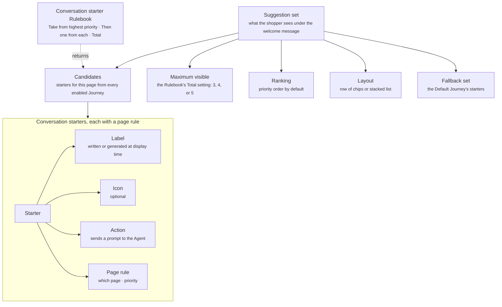

A conversation starter is a tappable prompt a shopper sees under the welcome message, before they type. Tapping one sends its prompt to the Agent. You set starters per page, so the home page, a product page, and the cart can each offer their own. Several starters show at once, three to five, drawn by priority from every enabled Journey by the conversation starter Rulebook.

## What it contains

The diagram shows the suggestion set the shopper sees, the settings that shape it, and the starters inside it with what each one holds.



| Property | What it holds |
| -------- | ------------- |
| Label | The text on the starter, written by you or generated at display time |
| Icon | An optional icon shown with the label |
| Action | What tapping the starter does. Usually it sends a prompt to the Agent |
| Rule | The page the starter shows on, and its priority. One rule can carry several starters |

A generated label is written at display time from variables on the page, such as `{product_name}` on a product page. Generated starters compete in the Rulebook exactly like written ones.

A starter holds its own label and embeds nothing from the [Component library](/components/overview). The assistant reply that follows a tap can render any card the library offers.

## Rule

A starter's rule has one condition: the page it shows on. Timing and delivery restrictions do not apply, because starters show once, together with the welcome message.

| Rule field | What you can set |
| ---------- | ---------------- |
| Page | A page type, such as home, product, collection, or cart, or a specific page or URL |
| Priority | Orders the rules that match the same page and decides which rule the Rulebook takes the first starters from |

Starters do not test where the shopper came from, who they are, or what is in their cart. A prompt that depends on the arrival source, a segment, or the cart belongs in a [proactive message](/components/conversation/proactive-message).

Several Journeys can propose starters for the same page. The conversation starter Rulebook collects every rule that matches the current page from every enabled Journey, orders them by priority, and builds the set with three settings.

| Setting | What it does |
| ------- | ------------ |
| Take from highest priority | How many starters to take from the highest-priority rule that matches the page |
| Then one from each | After that, take one starter from each remaining matching rule, in priority order |
| Total | The maximum number of starters to show. Choose 3, 4, or 5 |

The Default Journey's starters, at priority 0, match every page and are always the last matching rule. A page with no starters configured shows the Default Journey's starters.

Read the [worked example](/orchestration/how-rulebooks-resolve#worked-example-conversation-starters) to see how the same candidates produce different sets under four different settings.

## Suggestion set

The starters the Rulebook returns render inside a suggestion set. The set turns the Rulebook's result into what the shopper sees. It is a setting on the starters, not a component with a rule of its own.

| Setting | What it controls |
| ------- | ---------------- |
| Ranking | The order of the visible starters. Priority order by default |
| Layout | How the visible starters are arranged, such as a row of chips or a stacked list |

The number of visible starters is the Rulebook's Total setting. The fallback set is the Default Journey's starters.

## Examples

Two ways to set starters. Each one describes the configuration, not the exact copy.

### Generic

The same fixed prompts on every page, stacked above the launcher before the widget opens.

```yaml
Page: Every page
Starters: Three fixed prompts about choosing a product, building a routine, and the brand
Priority: 0 (Default Journey)
```

<Frame caption="Generic starters stacked above the launcher">
  
</Frame>

### Personalized per page

Prompts written for one page, here the collection page where the shopper browses the whole range.

```yaml
Page: Collection page (Shop All)
Starters: Three prompts for choosing from the range: by need, by routine, and by bestseller
Priority: 10
```

<Frame caption="Starters written for the collection page">
  
</Frame>

## Related

<CardGroup cols={2}>
  <Card title="Rulebooks" href="/orchestration/rulebooks" />
  <Card title="Welcome message" href="/components/conversation/welcome-message" />
  <Card title="Proactive message" href="/components/conversation/proactive-message" />
  <Card title="How rulebooks resolve conflicts" href="/orchestration/how-rulebooks-resolve" />
</CardGroup>
