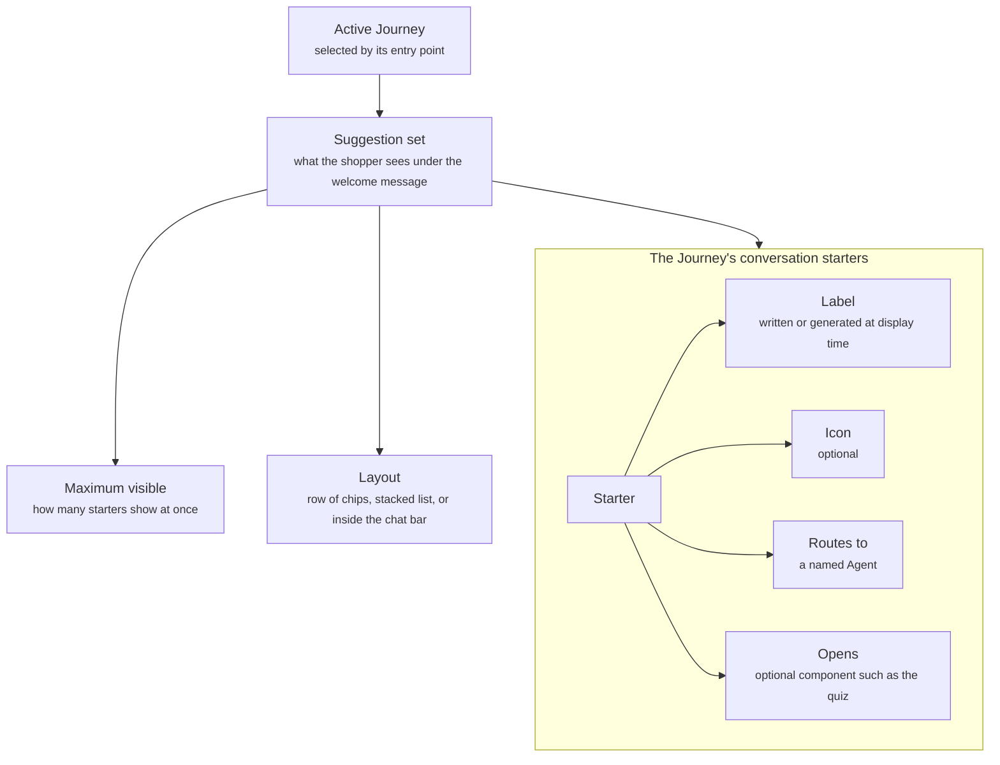

A conversation starter is a tappable prompt a shopper sees under the welcome message, before they type. Starters belong to the active [Journey](/orchestration/journeys), the one selected by the shopper's entry point, so a product page, a collection page, and the returns page can each offer their own. Tapping a starter sends it straight to the Agent named next to it. A starter can also open a component, such as the [quiz](/components/interactive/quiz).

<Frame caption="Generic starters stacked above the launcher">
  
</Frame>

## What it contains

The diagram shows the suggestion set the shopper sees, the settings that shape it, and the starters inside it with what each one holds.



| Property | What it holds |
| -------- | ------------- |
| Label | The text on the starter, written by you or generated at display time |
| Icon | An optional icon shown with the label |
| Routes to | The Agent that answers when the shopper taps it. Usually the Journey's own Agent, but a starter can name a different one |
| Opens | An optional component the starter opens, such as the [quiz](/components/interactive/quiz) or a [form](/components/interactive/form) |

A generated label is written at display time from variables on the page, such as `{product_name}` on a product page. Generated starters sit in the set exactly like written ones.

A starter holds its own label. The reply that follows a tap is composed by the Agent it routes to and can render any card the [Component library](/components/overview) offers.

## Rules

A starter carries no rule of its own. It belongs to a Journey and shows whenever that Journey applies. The Journey applies because the shopper's page and context match its [entry point](/orchestration/rules#entry-points). When the shopper moves to a page that selects a different Journey, the starters change with it. On a page no other Journey claims, the Default Journey's starters show.

Starters do not test where the shopper came from, who they are, or what is in their cart. A prompt that depends on the arrival source, a segment, or a past order belongs in a [proactive message](/components/conversation/proactive-message), which carries a "shows when" rule.

Tapping a starter skips [intent routing](/global/intent-routing). The starter goes straight to the Agent named next to it. A question the shopper types goes through intent routing instead.

## Suggestion set

The active Journey's starters render inside a suggestion set. It is a setting on the starters, not a component with a rule of its own.

| Setting | What it controls |
| ------- | ---------------- |
| Maximum visible | How many starters show at once, usually three to five |
| Order | The order you list the starters in the Journey |
| Layout | How the visible starters are arranged, such as a row of chips, a stacked list, or inside the [chat bar](/components/widget/overview) with a typewriter style |

## Examples

Two ways to set starters. Each one describes the configuration, not the exact copy.

### Generic

The Default Journey's starters, shown on any page no other Journey claims, stacked above the launcher before the widget opens.

```yaml
Journey: Default, entry point is any page not covered by another Journey
Starters: Three fixed prompts about choosing a product, building a routine, and the brand
Routes to: Product Discovery Agent, and the brand prompt to the Brand and Support Agent
```

### Personalized per Journey

Prompts written for one Journey, here the Product Discovery Journey, whose entry point includes the collection page where the shopper browses the whole range.

```yaml
Journey: Product Discovery, entry point is the home page or a collection page
Starters: Three prompts for choosing from the range: by need, by routine, and by bestseller
Routes to: Product Discovery Agent, and the routine prompt opens the quiz
```

<Frame caption="Starters written for the collection page">
  
</Frame>

## Related

<CardGroup cols={2}>
  <Card title="Journeys" href="/orchestration/journeys" />
  <Card title="Welcome message" href="/components/conversation/welcome-message" />
  <Card title="Proactive message" href="/components/conversation/proactive-message" />
  <Card title="Intent routing" href="/global/intent-routing" />
</CardGroup>
