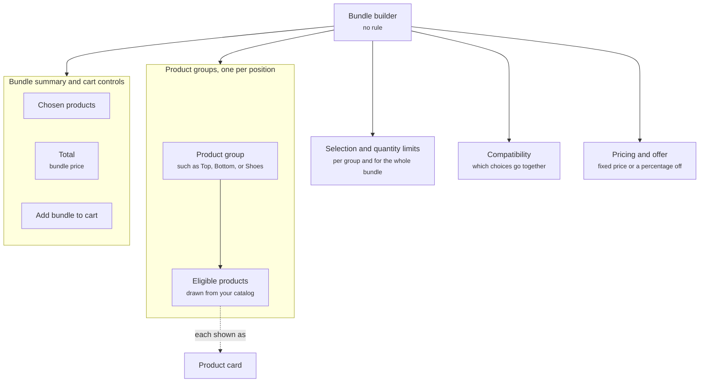

A bundle builder lets a shopper assemble a set from product groups you define. Build the look: pick a top, a bottom, and a pair of shoes, see the bundle price update, and add all three to the cart at once. It raises order value while keeping the shopper in control of each choice.

## Anatomy

The diagram shows a bundle builder as its product groups with their eligible products, the limits and compatibility that govern selection, the pricing, and the summary with its cart controls.

| Property | What it holds |
| -------- | ------------- |
| Product groups | The positions in the bundle, such as **Top**, **Bottom**, and **Shoes**, or open groups such as **Pick any three**. |
| Eligible products | The products that can fill each group, drawn from your catalog. |
| Selection and quantity limits | How many products a group takes, whether a group is required, and the minimum and maximum for the whole bundle. |
| Compatibility | Which choices go together, such as a size that must match across items or a product that excludes another. |
| Pricing and offer | How the bundle price is calculated, such as a fixed price or a percentage off when every required group is filled. |
| Bundle summary and cart controls | The running list of chosen products, the total, and the button that adds the whole bundle to the cart. |

Each product group uses a [product card](/components/cards/product-card) for its candidates, so image, price, and variant selection work the same way as anywhere else. Selection limits, compatibility, and pricing govern what the shopper can pick once the builder is on screen. They do not decide whether it shows.

A bundle builder assembles several products into one order. To let a shopper shape a single product from options, use a [configurator](/components/interactive/configurator).

## Where it appears

A bundle builder never shows on its own. One of these components includes it.

- In the [welcome message](/components/conversation/welcome-message), for example a storewide "complete the look" offer every shopper sees when the widget opens.
- In a [proactive message](/components/conversation/proactive-message), for example on a product page after the shopper has viewed two items that go together.
- In the [assistant reply](/components/conversation/assistant-reply), where the Agent chooses it. The shopper asks to complete a look, or the Agent offers a set around a product they liked.
- On a page, inside a [content block](/components/page/content-block), for example a bundle discount on a product page or on a dynamic landing page.

## Rules

A bundle builder carries no rule. It shows because the welcome message, or a proactive message or page section with a rule, included it, or because the Agent composed it into the assistant reply. The rule that decides whether and when the shopper sees it lives on that component, not on the builder. The welcome message is the exception: it carries no rule and is global, so every shopper sees what it embeds. Read [Rules](/orchestration/rules).

## Example

A shopper on the product page for a pair of trail shoes asks the widget "What goes with these?" The assistant reply holds a bundle builder titled **Build your trail kit** with three product groups stacked top to bottom: **Shoes**, already filled with the pair on the page, then **Socks** and **Insoles**, each showing a row of product cards to choose from. As the shopper picks a pair of socks and an insole, the summary at the bottom lists the three items, shows the bundle price beside the struck-through separate total with the line "Save 15% on the set", and enables **Add bundle to cart**.

<Frame caption="Trail kit bundle builder with all three groups filled">
  
</Frame>

## Related

<CardGroup cols={2}>
  <Card title="Product card" href="/components/cards/product-card" />
  <Card title="Configurator" href="/components/interactive/configurator" />
  <Card title="Content block" href="/components/page/content-block" />
  <Card title="Cart and checkout card" href="/components/cards/cart-checkout-card" />
</CardGroup>
