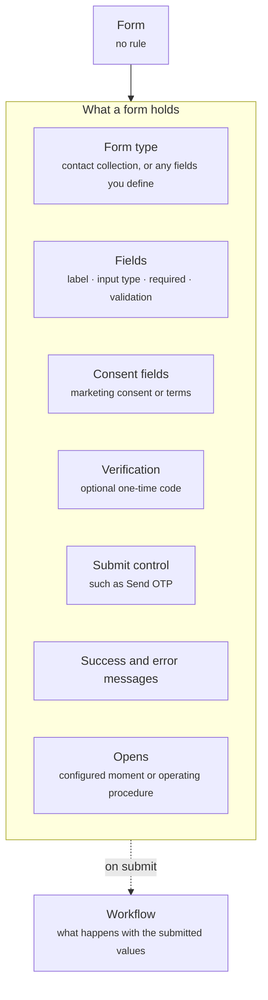

A form collects structured information from a shopper inside the conversation. The most common use is contact collection: an email for a back-in-stock alert, a phone number for a callback, a name for a personalized offer. The same component handles any other set of fields you need.

<Frame caption="A contact form asking for a name and a verified phone number">
  
</Frame>

## Anatomy

The diagram shows a form as its type, its fields with what each one holds, its consent and submit controls, its messages, and the Workflow that runs on submit.



| Property | What it holds |
| -------- | ------------- |
| Form type | What the form is for. Contact collection is the built-in type, and other types hold any fields you define. |
| Fields | The inputs the shopper fills in. Each field has the properties in the table below. |
| Consent fields | Checkboxes for marketing consent or terms, with the text the shopper agrees to. |
| Verification | An optional one-time code sent to the phone number or email the shopper entered, confirmed before the form submits. |
| Submit control | The button that submits the form, such as **Notify me**. |
| Success and error messages | What the shopper sees after a successful submission, and what they see when validation fails or the submission cannot complete. |

Each field holds these properties.

| Property | What it holds |
| -------- | ------------- |
| Label | The name of the field as the shopper sees it. |
| Input type | The kind of value expected, such as text, email, phone, or number. |
| Required | Whether the shopper must fill it in. |
| Validation | The rules the value must meet before the form submits. |

Validation is a property of the form. It governs what the shopper can submit once the form is on screen, not whether the form shows. What happens with the submitted values, such as creating a contact or triggering a back-in-stock alert, runs through a [Workflow](/agents/workflows).

## Where it appears

A form never shows on its own. One of these components includes it.

- In the [welcome message](/components/conversation/welcome-message), for example a newsletter sign-up offered to every shopper when the widget opens.
- In a [proactive message](/components/conversation/proactive-message), for example an offer that asks for an email in exchange for a discount.
- In the [assistant reply](/components/conversation/assistant-reply), where the Agent chooses it. The Agent needs details to continue, such as an email to send a size guide or to set a back-in-stock alert, and asks for them with the form rather than in free text.
- On a page, inside a [content block](/components/page/content-block), for example a sign-up block on a dynamic landing page, or one that trades an email for a discount.

## When the form opens

You decide the moment the form appears in the conversation. The right moment depends on what the form is for.

| Moment | Opens when | Typical use |
| ------ | ---------- | ----------- |
| After a few messages | The shopper has sent a set number of messages, such as two or three | Lead capture, once the shopper is engaged but before they leave |
| When the Agent needs details | The Agent cannot continue without information, such as an order ID and email to look up an order | Order lookup, returns, back-in-stock alerts |
| Before a handoff | The conversation is about to pass to a person on your team | Collecting name, email, and the problem so the shopper never repeats it |
| On arrival | A proactive message or the welcome message includes it | A sign-up offered up front, such as an email for a discount |

The moment can also be dynamic. You describe in the Agent's [operating procedure](/agents/goal-and-operating-procedure) when to ask, such as "ask for a name and phone number after the shopper's third message", and the Agent opens the form at that point. The shopper can close the form and keep chatting, and the Agent does not ask again in the same conversation unless it needs the details to act.

## Rules

A form carries no rule of its own. The moment you choose above, or the component that includes it, decides when the shopper sees it. A form inside a proactive message or a page section follows that component's rule. Read [Rules](/orchestration/rules).

## Example

Two forms, each opened at the moment it is needed.

### Lead capture

Asks for contact details once the shopper is engaged.

```yaml
Type: Contact collection
Opens: After the shopper's third message
Fields: Name, and a phone number with a country code picker
Verification: One-time code sent to the phone number
Submit: Send OTP, disabled until both fields are valid
Close: The shopper can dismiss the sheet and keep chatting
```

### Order lookup

Asks for what the Agent needs to find an order.

```yaml
Type: Order lookup
Opens: When the shopper asks about an order and the Agent has no order on file
Fields: Order ID and email
Submit: Find my order
Then: The Agent shows the order status card
```

## Related

<CardGroup cols={2}>
  <Card title="Workflows" href="/agents/workflows" />
  <Card title="Content block" href="/components/page/content-block" />
  <Card title="Proactive messages" href="/components/conversation/proactive-message" />
</CardGroup>
