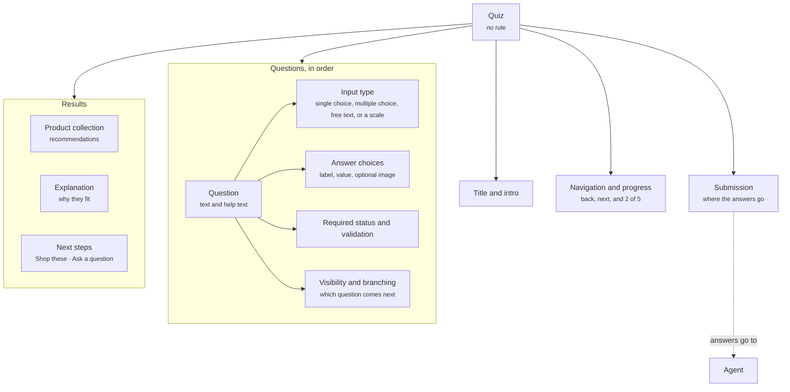

A quiz walks a shopper through a few questions and ends with a recommendation. It gives shoppers who do not know what to ask a structured way in, and it gives the Agent the answers it needs to recommend well. A shoe finder that asks about use, fit, and budget and then shows three matches is a quiz.

<Frame caption="A shopper taking the quiz in the conversation">
  <video autoPlay muted loop playsInline src="/images/interactive/quiz.mp4"></video>
</Frame>

## Anatomy

The diagram shows a quiz as its intro, its questions with what each one holds, its progress and submission, and the results the shopper reaches.



| Property | What it holds |
| -------- | ------------- |
| Title and intro | The quiz name and a sentence that tells the shopper what they get at the end. |
| Questions | The ordered list of questions. Each question has the properties in the table below. |
| Navigation and progress | Back and next controls, and a progress indicator such as **2 of 5**. |
| Submission | What happens when the shopper finishes: where the answers go and what the Agent does with them. |
| Results | What the shopper sees at the end: a [product collection](/components/cards/product-collection) of recommendations, an explanation of why they fit, and next steps such as **Shop these** or **Ask a question**. |

Each question holds these properties.

| Property | What it holds |
| -------- | ------------- |
| Text and help text | The question and an optional line of guidance under it. |
| Input type | How the shopper answers: single choice, multiple choice, free text, or a scale. |
| Answer choices | Each choice has a label, a value, and an optional image. |
| Required status and validation | Whether the shopper can skip the question, and any rules the answer must meet. |
| Visibility and branching | When the question shows, based on earlier answers, and which question comes next. |

Branching is a property of the quiz. It decides which question comes next once the shopper is in the quiz, not whether the quiz shows at all.

## Where it appears

A quiz never shows on its own. One of these components includes it.

- In the [welcome message](/components/conversation/welcome-message), for example a fit finder offered to every shopper when the widget opens.
- In a [proactive message](/components/conversation/proactive-message), for example when a shopper has scrolled a collection for a while without opening a product.
- In the [assistant reply](/components/conversation/assistant-reply), where the Agent chooses it. A [conversation starter](/components/conversation/conversation-starter) such as **Help me find a shoe** leads straight into it, and the Agent can offer it whenever a shopper's question is too broad to answer directly.
- On a page, inside a [content block](/components/page/content-block) on a collection page or a dynamic landing page, for example under a heading such as **Not sure where to start?**.

## Rules

A quiz carries no rule. It shows because the welcome message, or a proactive message or page section with a rule, included it, or because the Agent composed it into the assistant reply. The rule that decides whether and when the shopper sees it lives on that component, not on the quiz. The welcome message is the exception: it carries no rule and is global, so every shopper sees what it embeds. Read [Rules](/orchestration/rules).

## Example

A shopper asks to take the quiz, and the Agent starts it in the conversation.

```yaml
Start: The shopper taps a starter or asks to take the quiz
Intro: One line saying it will ask a few quick questions
Questions: Three or four, one at a time, each with lettered choices
Free answer: The shopper can type their own answer instead of picking a choice
Result: A product collection of the best matches, with a line explaining why
```

## Related

<CardGroup cols={2}>
  <Card title="Product collection" href="/components/cards/product-collection" />
  <Card title="Conversation starters" href="/components/conversation/conversation-starter" />
</CardGroup>
