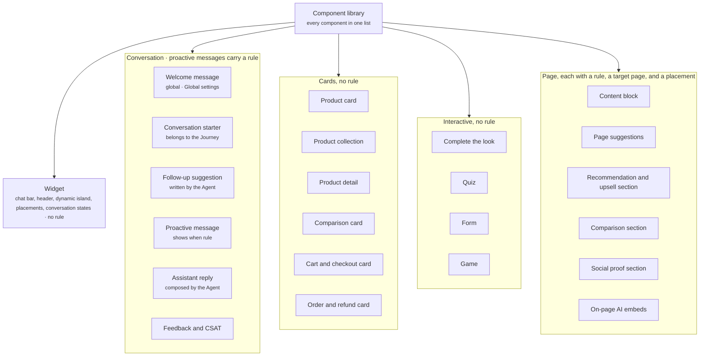

The Component library is every component in a Crossword experience, in one list. A component is anything a shopper can see or interact with, from the chat bar to a section on a product page. The list splits into five families. A few components carry a rule that decides when and where they show. The rest show because the active [Journey](/orchestration/journeys) holds them, or because an Agent or another component placed them.

## Families

The diagram shows the Component library, its five families, and the components in each family, with the families that carry a rule named as such.

| Family | What it covers | Carries a rule? |
| ------ | -------------- | --------------- |
| Widget | The chat widget itself: the chat bar, the header, the dynamic island, where the widget sits, and the states it shows between replies. | No. It is the same in every Journey. What shows inside it comes from the active Journey. |
| Conversation | What the shopper sees in the chat: messages, starters, suggestions, the assistant reply, and feedback. | Proactive messages carry a "shows when" rule inside the active Journey. Starters carry no rule of their own: they belong to the Journey and show whenever it applies. Follow-up suggestions do not, because the Agent writes them for each reply. The welcome message does not, because it is global and set in [Global settings](/global/overview). The assistant reply does not, because the Agent composes it. |
| Cards | Structured units for products, comparisons, carts, and orders. | No. Shown inside a message, a reply, or a page section. |
| Interactive | Pieces the shopper works through step by step. | No. Shown the same way as cards, or opened by a starter. |
| Page | Sections and embeds Crossword inserts into or replaces on a merchant page. Read [Page sections](/components/page/page-sections). | Yes. A target page, a placement, and a rule, separate from any Journey. |

## Every component

| Component | Family | Carries a rule? | What it does |
| --------- | ------ | --------------- | ------------ |
| [Widget](/components/widget/overview) | Widget | No | The chat window: header, dynamic island, conversation, and chat bar, styled to your brand. |
| [Placements](/components/widget/placements) | Widget | No | Where the widget sits: a middle bar, a floating widget in a corner, or a sidebar. |
| [Welcome message](/components/conversation/welcome-message) | Conversation | No (global) | The first message a shopper reads when the widget opens. One per experience, set in Global settings, the same in every Journey. |
| [Conversation starter](/components/conversation/conversation-starter) | Conversation | No. Belongs to the Journey | A tappable prompt under the welcome message. Each routes to a named Agent and can open a component such as the quiz. |
| [Suggestion set](/components/conversation/conversation-starter#suggestion-set) | Conversation | No | The cap and layout that turn starters or follow-ups into what the shopper sees. |
| [Follow-up suggestion](/components/conversation/follow-up-suggestion) | Conversation | No. Set in the Agent | A next-step prompt under an assistant reply. The Agent writes them for each reply from its instructions, and the suggestion set caps them. |
| [Proactive message](/components/conversation/proactive-message) | Conversation | Yes ("shows when") | A message Crossword sends before the shopper asks. Shows when its rule is met inside the active Journey, and routes to a named Agent. |
| [Assistant reply](/components/conversation/assistant-reply) | Conversation | No | What the Agent composes each turn: reply text, cards, follow-ups, quick replies, and actions. |
| [Quick reply](/components/conversation/assistant-reply#quick-reply) | Conversation | No | A one-tap answer with a fixed value, such as Yes, No, or Size 9, inside an assistant reply. |
| [Feedback and CSAT](/components/conversation/feedback) | Conversation | No | A thumbs up or down on a reply, and a satisfaction survey card at the end of a conversation. |
| [Product card](/components/cards/product-card) | Cards | No | A single product with image, price, variants, and actions. |
| [Product collection](/components/cards/product-collection) | Cards | No | Several product cards under a heading, as a carousel, grid, or list, ranked and optionally filtered. |
| [Product detail](/components/cards/product-detail) | Cards | No | One product in full, with a size choice and actions. |
| [Comparison card](/components/cards/comparison-card) | Cards | No | Two or more products compared across attributes, with an explanation. |
| [Cart and checkout card](/components/cards/cart-checkout-card) | Cards | No | The shopper's basket, totals, and checkout controls. |
| [Order and refund card](/components/cards/order-refund-card) | Cards | No | An order reference, its status, and the actions a shopper can take. |
| [Complete the look](/components/interactive/complete-the-look) | Interactive | No | A set built around one product. Pieces can be selected, swapped, or all added to cart. |
| [Quiz](/components/interactive/quiz) | Interactive | No | A guided set of questions that ends in a recommendation. |
| [Form](/components/interactive/form) | Interactive | No | Contact collection and other forms, with fields, validation, and consent. |
| [Game](/components/interactive/game) | Interactive | No | A rules-based interaction with an outcome or reward. |
| [Content block](/components/page/content-block) | Page | Yes | A heading, copy, media, and a call to action on a merchant page. |
| [Page suggestions](/components/page/page-suggestions) | Page | Yes | A suggestion set on a merchant page, outside the widget. |
| [Recommendation and upsell section](/components/page/recommendation-section) | Page | Yes | A product collection with a contextual explanation on a merchant page. |
| [Comparison section](/components/page/comparison-section) | Page | Yes | A comparison on a merchant page. |
| [Social proof section](/components/page/social-proof-section) | Page | Yes | Reviews, testimonials, or data selected for the shopper's context. |
| [On-page AI embeds](/components/page/page-embeds) | Page | Yes | Small AI elements on a merchant page, such as an Ask AI button, a size guide, or notify me. |

## Rules

Crossword uses three kinds of rule. An [entry point](/orchestration/rules#entry-points) selects the active Journey, and everything the Journey holds follows from it.

- **Conversation starters** carry no rule of their own. They belong to the active Journey and show whenever it applies. Each routes to a named Agent.
- **Proactive messages** carry a "shows when" rule. Each shows when its rule is met inside the active Journey, and routes to a named Agent.
- **Page sections and on-page AI embeds** carry a page section rule, separate from any Journey: a target page, a placement, conditions, and priority, with optional timing and delivery limits.

The welcome message carries no rule. It is global, set once in [Global settings](/global/overview), and every shopper sees it. Follow-up suggestions carry no rule either: the Agent writes them for each reply.

Plain components have properties and no rule. A product card shows because something placed it: a message that embeds it, a page section that holds it, or the Agent composing the assistant reply. The widget components show wherever the widget is placed. Read [Rules](/orchestration/rules) for what a rule can contain.

<CardGroup cols={2}>
  <Card title="Rules" icon="sliders" href="/orchestration/rules">
    Entry points, "shows when" rules, and page section rules.
  </Card>
  <Card title="Journeys" icon="route" href="/orchestration/journeys">
    How the active Journey decides which starters and proactive messages a shopper sees.
  </Card>
</CardGroup>

## Example

In the dashboard, the library is one screen. The five families run across the top as tabs, **Widget** through **Page**, and the selected family opens a grid of component tiles, each with its name, a one-line description, and a **Rule** badge where the component carries one. Selecting a tile, such as **Welcome message**, opens its properties in a panel on the right.