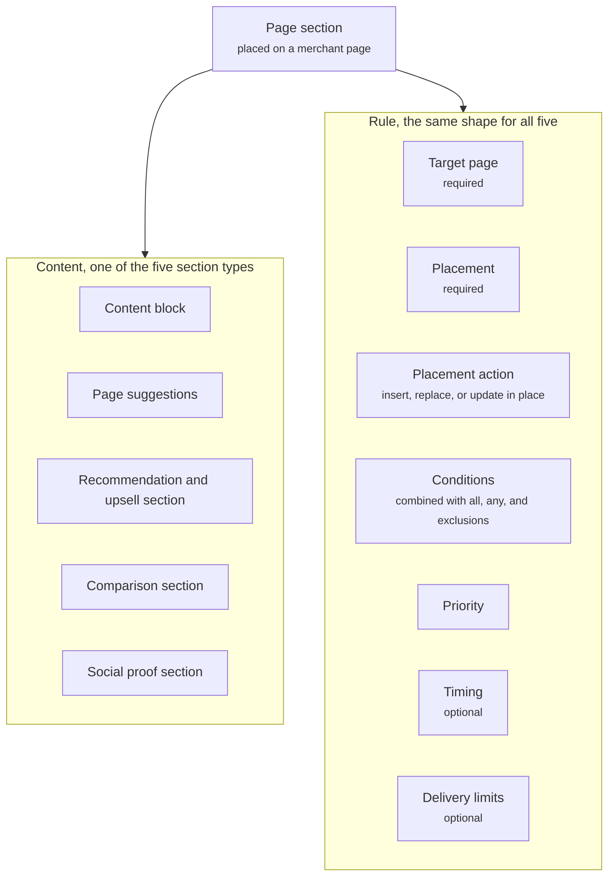

A page section is a component Crossword places on a merchant page rather than in the chat widget. Your storefront keeps its header, footer, and layout. Crossword inserts a section, replaces one, or updates one in place: a "Why this is right for you" block under the product title, or a "Picked for your trip" recommendation and upsell section on the cart page. Every page section carries a rule, so each one decides for itself when it shows and for whom.

<Frame caption="A product page with three page sections highlighted">
  
</Frame>

## The five section types

| Section | What it does |
| ------- | ------------ |
| [Content block](/components/page/content-block) | A heading, copy, media, and a call to action. The general-purpose section. |
| [Page suggestions](/components/page/page-suggestions) | A set of prompts that open the conversation with a question already sent. |
| [Recommendation and upsell section](/components/page/recommendation-section) | A product collection with an explanation of why these products were picked. |
| [Comparison section](/components/page/comparison-section) | A comparison card placed on the page. |
| [Social proof section](/components/page/social-proof-section) | Reviews, testimonials, or data selected for the shopper's context. |

## The shared rule shape

The diagram shows a page section as its content, one of the five section types, plus the rule that every type carries. [On-page AI embeds](/components/page/page-embeds) carry the same rule.



Each type holds its own content. All five carry the same rule, which says where the section goes and when it is a candidate.

| Field | What you set |
| ----- | ------------ |
| Target page | Required. Product, cart, home, collection, about, or another approved page. |
| Placement | Required. A location on the page, or an existing part of the page such as your reviews block. |
| Placement action | Required. Insert the section at the placement, replace what is there, or update it in place. |
| Conditions | UTM parameters, referrer or arrival source, page or URL, segment membership, shopper attributes, session behavior, device and browser. Combined with all, any, and exclusions. |
| Priority | Orders candidates for the same placement. |
| Timing | Optional. A delay after the page loads, or a scheduled window. |
| Delivery limits | Optional. Frequency cap, suppression, and repeat behavior across sessions. |

Sections that render with the page, such as page suggestions, rarely need timing or delivery limits. Conditions, timing, priority, and delivery restrictions are defined in [Rules](/orchestration/rules). Target pages, placements, and actions are set up under [Pages and placements](/orchestration/pages-and-placements).

## How a placement picks a winner

A page section carries its own rule, separate from any Journey. Each placement on the page resolves on its own and returns one result.

1. Crossword collects the sections whose target page and placement match the current page.
2. It walks those sections from the highest priority down.
3. The first section whose conditions match, and that has not hit its delivery limits, shows at that placement.

A page can have several placements, and each shows its own result, so several sections can sit on the same page. When no section matches a placement, the section with no conditions at priority 0 shows, if you set one. If there is none, the storefront's own content stays as it is.

## Dynamic landing pages

When Crossword controls the whole page body inside your header and footer, that is a dynamic landing page. Its placements resolve the same way, and the page configuration itself is chosen by its own rule. Read [Pages and placements](/orchestration/pages-and-placements#dynamic-landing-pages).

## Example

One product page with three page sections, each in its own placement.

```yaml
Target page: Product page
Sections:
  - Review summary: one line beside the star rating, with a See more link
  - AI summary: a content block under the product description, with Show more
  - Ask AI: page suggestions under the product badges, with an Ask something else button
Placement action: Insert
Conditions: Every shopper on a product page
```

## Related

<CardGroup cols={2}>
  <Card title="Component library" href="/components/overview" />
  <Card title="Pages and placements" href="/orchestration/pages-and-placements" />
  <Card title="Rules" href="/orchestration/rules" />
  <Card title="On-page AI embeds" href="/components/page/page-embeds" />
</CardGroup>
