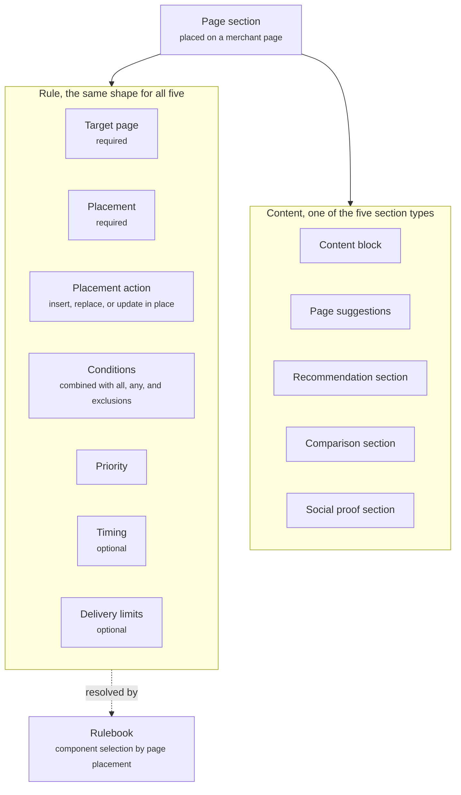

A page section is a component Crossword places on a merchant page rather than in the chat widget. Your storefront keeps its header, footer, and layout. Crossword inserts a section, replaces one, or updates one in place: a "Why this is right for you" block under the product title, or a "Picked for your trip" recommendation section on the cart page. Every page section carries a rule, so each one decides for itself when it shows and for whom.

## The five section types

| Section | What it does |
| ------- | ------------ |
| [Content block](/components/page/content-block) | A heading, copy, media, and a call to action. The general-purpose section. |
| [Page suggestions](/components/page/page-suggestions) | A set of prompts that open the conversation with a question already sent. |
| [Recommendation section](/components/page/recommendation-section) | A product collection with an explanation of why these products were picked. |
| [Comparison section](/components/page/comparison-section) | A comparison card placed on the page. |
| [Social proof section](/components/page/social-proof-section) | Reviews, testimonials, or data selected for the shopper's context. |

## The shared rule shape

The diagram shows a page section as its content, one of the five section types, plus the rule that every type carries.

Each type holds its own content. All five carry the same rule, which says where the section goes and when it is a candidate.

| Field | What you set |
| ----- | ------------ |
| Target page | Required. Product, cart, home, collection, about, or another approved page. |
| Placement | Required. A location on the page, or an existing part of the page such as your reviews block. |
| Placement action | Required. Insert the section at the placement, replace what is there, or update it in place. |
| Conditions | UTM parameters, referrer or arrival source, page or URL, segment membership, shopper attributes, session behavior, device and browser. Combined with all, any, and exclusions. |
| Priority | Orders candidates for the same placement. |
| Timing | Optional. A delay after the page loads, or a scheduled window. |
| Delivery limits | Optional. Frequency cap, suppression, and repeat behavior across sessions. |

Sections that render with the page, such as page suggestions, rarely need timing or delivery limits. Conditions, timing, priority, and delivery restrictions are defined in [Rules](/orchestration/rules). Target pages, placements, and actions are set up under [Pages and placements](/orchestration/pages-and-placements).

## How a placement picks a winner

The component selection by page placement [Rulebook](/orchestration/rulebooks) resolves page sections. Each placement resolves on its own and returns one result.

1. Every enabled Journey contributes the sections whose target page and placement match the current page.
2. The Rulebook walks those candidates from the highest priority down.
3. The first section whose rule matches, and that has not hit its delivery limits, wins for that placement.

A page can have several placements, and each shows its own winner, so sections from different Journeys can sit on the same page. When no rule matches, the Default Journey's section for that placement shows. If it has none, the storefront's own content stays as it is. Read [How rulebooks resolve conflicts](/orchestration/how-rulebooks-resolve).

## Dynamic landing pages

When Crossword controls the whole page body inside your header and footer, that is a dynamic landing page. Its placements resolve the same way; the page configuration itself is chosen by the dynamic landing page selection Rulebook. Read [Pages and placements](/orchestration/pages-and-placements#dynamic-landing-pages).

## Example

A sneaker brand's product page for a trail shoe, with two placements highlighted. Directly above the add-to-cart button, an inserted content block reads **The pair from the video** with a line of copy and a **Find my size** button, placed there by the [YouTube Unboxing Journey](/use-cases/youtube-unboxing-journey) for shoppers who arrived from the unboxing video. Further down, where the storefront's "You may also like" carousel normally sits, a recommendation section has replaced it with the heading **Complete your trail kit** and three product cards. The header, gallery, description, and footer are the storefront's own.

<Frame caption="Product page with two highlighted placements">
  
</Frame>

## Related

<CardGroup cols={2}>
  <Card title="Component library" href="/components/overview" />
  <Card title="Pages and placements" href="/orchestration/pages-and-placements" />
  <Card title="Rules" href="/orchestration/rules" />
  <Card title="Rulebooks" href="/orchestration/rulebooks" />
</CardGroup>
