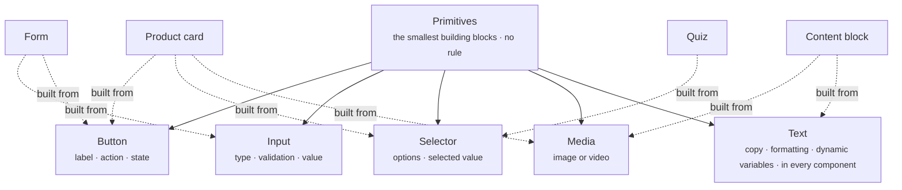

Primitives are the smallest building blocks in Crossword. Every card, interactive component, and page section is assembled from them. You rarely configure a primitive on its own. You meet them as the properties of the components you configure: the **Add to cart** button on a product card, the size picker on a variant selector, the headline on a content block.

## Anatomy

The diagram shows the five primitives with what each one holds, and a few of the components built from them.

### Button

A control the shopper taps to do something.

| Property | What it holds |
| -------- | ------------- |
| Label | The text on the button, such as **Add to cart**. |
| Action | What tapping it does: send a message, open a link, add to cart, submit a form, or move to the next step. |
| State | Whether the button is enabled, disabled, loading, or already done. |

### Input

A field the shopper types into.

| Property | What it holds |
| -------- | ------------- |
| Type | The kind of value expected, such as text, number, email, or phone. |
| Validation | The rules the value must satisfy before it is accepted. |
| Value | What the shopper entered. |

### Selector

A set of options the shopper picks from.

| Property | What it holds |
| -------- | ------------- |
| Options | The choices available, such as a list of sizes. |
| Selected value | The option the shopper chose. |

The selector is always the picker inside another component, such as the variant selector on a product card or the answer choices in a quiz. When the Agent needs a single closed answer in the conversation, it offers [quick replies](/components/conversation/assistant-reply#quick-reply) instead.

### Media

An image or a video.

| Property | What it holds |
| -------- | ------------- |
| Image or video | The asset to show, with its alt text. |

### Text

Copy with formatting.

| Property | What it holds |
| -------- | ------------- |
| Copy | The text itself. |
| Formatting | Emphasis, lists, links, and other rich text. |
| Dynamic variables | Values merged into the copy at display time, such as the product name. |

## Where it appears

Primitives appear wherever the component that contains them appears. A button inside a product card shows up in the welcome message, a proactive message, an assistant reply, or a page section along with the card. Media can also stand on its own in the [welcome message](/components/conversation/welcome-message).

| Primitive | Found in |
| --------- | -------- |
| Button | Every card, form submit controls, quiz navigation, bundle cart controls, and the call to action on a content block. |
| Input | [Forms](/components/interactive/form), free-text [quiz](/components/interactive/quiz) answers. |
| Selector | [Product card](/components/cards/product-card) variants, [quiz](/components/interactive/quiz) answer choices, [configurator](/components/interactive/configurator) options. |
| Media | [Product cards](/components/cards/product-card), [content blocks](/components/page/content-block), and the [welcome message](/components/conversation/welcome-message) directly. |
| Text | Every component. |

## Rules

A primitive has no rule. It shows because the component it belongs to shows, and that component either carries a rule of its own, such as a page section, was placed by one that does, such as a product card inside a proactive message, or shows without a rule, such as the global welcome message or a card the Agent composed into an assistant reply. Read [Rules](/orchestration/rules) for what a rule can contain and [Component library](/components/overview) for which components carry one.

Each primitive still has its own identity and its own impression and interaction events. That is how you can see that a shopper tapped **Add to cart** on the second product card in a reply, rather than only that the reply was shown.

## Example

The screenshot shows a form assembled from primitives, laid out on a grey panel with nothing else around it. Each field pairs a label with an input: **NAME** holds the placeholder "Jordan Lee", and **WORK EMAIL** holds "jordan@acme.com" with a green check inside the field, which is the input's validation state made visible. **MESSAGE** is a textarea, a taller input for free text, with the placeholder "Tell us about your use case". Below it a checkbox reads "We're an agency or reseller", and two buttons close the form: **Discard** as the secondary action and **Submit** as the primary one. The email uses a placeholder domain, as every example in these docs does.

<Frame caption="A form built from label, input, textarea, checkbox, and button primitives">
  
</Frame>
