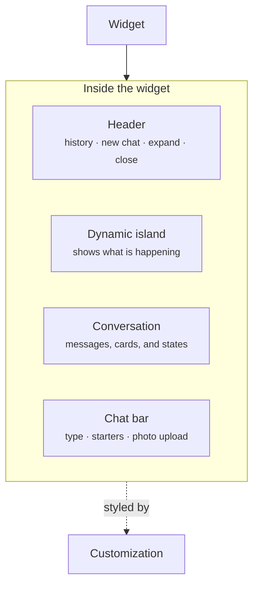

The widget is where the conversation happens. It opens from a bar or a launcher on your storefront, and everything a shopper sees in the chat lives inside it: the header, the conversation, and the chat bar.

<Frame caption="The widget open beside a storefront, with the brand's name and logo in the header">
  
</Frame>

## What it contains

| Part | What it does |
| ---- | ------------ |
| Header | Shows your brand name and logo, with controls for chat history, a new chat, expand, and close. During a handoff it shows the person's name. |
| Dynamic island | A small pill in the header that shows what is happening, such as searching, added to cart, order status, or a person joining. |
| Conversation | The messages, the [assistant reply](/components/conversation/assistant-reply) with its cards, and states such as thinking, a person joining, or a turn that fails. |
| Chat bar | Where the shopper types or uploads a photo. It can show [conversation starters](/components/conversation/conversation-starter) and a first answer before the chat opens. |

## Customization

You set how the widget looks once for the experience. It applies everywhere the widget appears.

| Setting | What it changes |
| ------- | --------------- |
| Brand name and logo | What the header shows |
| Accent color | Buttons, chips, and highlights |
| Theme | Light or dark |
| Material | Glass or solid surfaces |
| Placement | Where the widget sits on the page. Read [Placements](/components/widget/placements). |

## Related

<CardGroup cols={2}>
  <Card title="Placements" href="/components/widget/placements" />
  <Card title="Assistant reply" href="/components/conversation/assistant-reply" />
  <Card title="Conversation starter" href="/components/conversation/conversation-starter" />
  <Card title="Escalation and handoff" href="/agents/escalation-and-handoff" />
</CardGroup>
