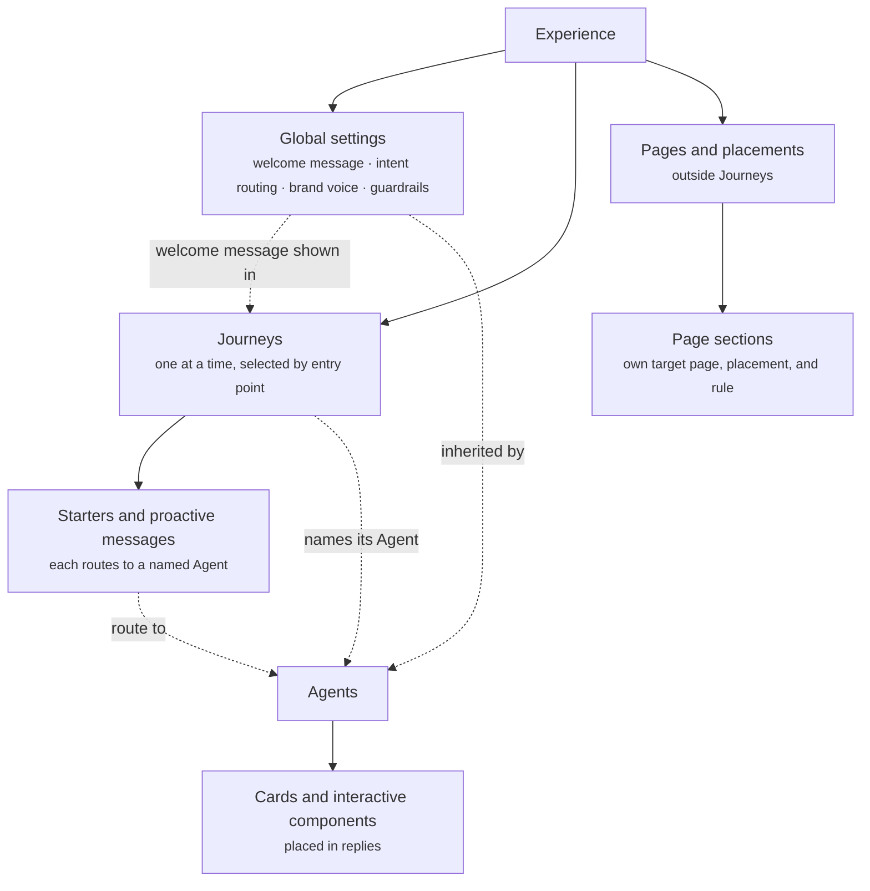

Crossword has its own vocabulary because it does more than answer chat messages. It decides what a shopper sees, when they see it, and what happens next. The objects that make those decisions nest inside each other, so it helps to learn the layers before the individual features.

## The layers

An experience holds Global settings, Journeys, and Pages and placements. Crossword selects one Journey for the shopper by its entry point. The Journey holds its conversation starters and proactive messages, and names its Agent. Agents place cards and interactive components in their replies. Page sections sit outside Journeys, under Pages and placements.

Global settings sit above both Journeys and Agents. Each Journey holds its starters and proactive messages and names its Agent.

1. **[Experience](/orchestration/channels-and-experiences).** One storefront's configuration on one channel. An experience lives on a single channel such as your website, Instagram, or iMessage.
2. **[Global settings](/global/overview).** What every Journey and Agent shares. The welcome message, intent routing for typed questions, brand voice, global guardrails, and shared customer memory.
3. **[Journeys](/orchestration/journeys).** One situation a shopper is in, selected by its entry point. One Journey applies at a time. Each holds its own conversation starters, proactive messages, Agent, and goals.
4. **[Components](/components/overview).** Everything a shopper can see or interact with. Welcome messages, starters, product cards, quizzes, page sections. Some carry a rule that says when and where they show. Others are plain content placed inside them.
5. **[Agents](/agents/overview).** Who answers inside a Journey. An Agent composes the assistant reply from text, cards, and follow-up suggestions at the moment of the question. Tapped starters and proactive messages go straight to the Agent named next to them. Typed questions reach an Agent through [intent routing](/global/intent-routing).

Four more things act on this structure without being part of the chain. [Campaigns](/orchestration/campaigns) run sequences over time and can activate Journeys or send messages. [Experiments](/orchestration/experiments) split traffic between Journeys. [Deployment](/orchestration/deployment) publishes the whole experience. [Quality and governance](/quality/overview) measures, tests, and versions it. The first three are mapped in [How it fits together](/orchestration/overview).

## Which components carry rules

Every component is in one list, but they come in two kinds. Some carry their own rule. The rest show because the Journey the shopper is in holds them, or because an Agent or another component placed them. The Journey itself is selected by its [entry point](/orchestration/rules#entry-points).

| Family | Components | Carries a rule? |
| ------ | ---------- | --------------- |
| Widget | [Widget](/components/widget/overview) and its [placements](/components/widget/placements) | No. They make up the chat widget itself. |
| Conversation | [Conversation starter](/components/conversation/conversation-starter) | No rule of its own. It belongs to a Journey, shows whenever that Journey applies, and routes to a named Agent. It can open a component such as the quiz. |
| Conversation | [Proactive message](/components/conversation/proactive-message) | Yes. A "shows when" rule, such as time on page, scroll, arrival source, or past orders, inside the active Journey. Routes to a named Agent. |
| Conversation | [Follow-up suggestion](/components/conversation/follow-up-suggestion) | No. Set in the Agent. The Agent writes them for each reply from its operating procedure. |
| Conversation | [Welcome message](/components/conversation/welcome-message) | No. It is global. You set it once in [Global settings](/global/overview), and it is the same in every Journey. |
| Conversation | [Assistant reply](/components/conversation/assistant-reply), [feedback](/components/conversation/feedback) | No. The Agent composes the reply each turn, and feedback sits under it. |
| Cards | [Product card](/components/cards/product-card), [product collection](/components/cards/product-collection), [comparison card](/components/cards/comparison-card), [cart and checkout card](/components/cards/cart-checkout-card), [order and refund card](/components/cards/order-refund-card), [product detail card](/components/cards/product-detail) | No. Placed inside a message, a reply, or a page section. |
| Interactive | [Complete the look](/components/interactive/complete-the-look), [quiz](/components/interactive/quiz), [form](/components/interactive/form), [game](/components/interactive/game) | No. Placed the same way as cards, or opened by a starter. |
| Page | [Content block](/components/page/content-block), [page suggestions](/components/page/page-suggestions), [recommendation and upsell section](/components/page/recommendation-section), [comparison section](/components/page/comparison-section), [social proof section](/components/page/social-proof-section) | Yes. A target page, a placement, a rule, and optional timing and delivery limits. See [Page sections](/components/page/page-sections). |

Read [Rules](/orchestration/rules) for what a rule can contain.

## Glossary

| Term | Meaning |
| ---- | ------- |
| [Channel](/orchestration/channels-and-experiences) | A surface Crossword runs on. Web, Instagram, iMessage, or another supported channel. |
| [Experience](/orchestration/channels-and-experiences) | One storefront's configuration on one channel. Holds Global settings, Journeys, Agents, Campaigns, Pages and placements, Experiments, and Deployment. |
| [Global settings](/global/overview) | What every Journey and Agent in an experience shares. The welcome message, intent routing, brand voice, global guardrails, shared rich responses, escalation defaults, and customer memory. |
| [Journey](/orchestration/journeys) | One situation a shopper is in, selected by its entry point. Holds a welcome message for reference, its own conversation starters and proactive messages, the Agent that answers, and its goals. One Journey applies to a shopper at a time. |
| [Entry point](/orchestration/rules#entry-points) | The pages, and sometimes a condition such as "user is logged in", that select a Journey. When entry points overlap, the more specific one wins. |
| [Default Journey](/orchestration/journeys#entry-points-and-the-default-journey) | The Journey that covers any page no other Journey claims. |
| [Goal](/orchestration/journeys#goals) | The outcome a Journey exists for. Each Journey has one primary and one secondary goal, such as add to cart and Subscribe & Save. |
| [Intent routing](/global/intent-routing) | The Global setting that sends each typed question to the right Agent. Tapped starters and proactive messages skip it and go straight to the Agent named next to them. |
| [Campaign](/orchestration/campaigns) | A stateful customer-engagement program that enrolls an audience and orchestrates actions over time. |
| [Sequence](/orchestration/campaigns) | The ordered steps inside a Campaign. Messages, waits, branches, and actions. |
| [Rule](/orchestration/rules) | A condition that decides when something applies. Entry points select Journeys, "shows when" rules time proactive messages, and page sections carry their own rules. |
| [Component](/components/overview) | Anything a shopper can see or interact with. Messages, suggestions, cards, interactive pieces, and page sections. |
| [Component library](/components/overview) | The single list of every component, grouped into families. Shared across every experience. |
| [Agent](/agents/overview) | The assistant that answers inside a Journey and composes the assistant reply. Has a goal, an operating procedure, a persona, knowledge, guardrails, and the actions it can take. |
| [Operating procedure](/agents/goal-and-operating-procedure) | The numbered steps an Agent follows to reach its goal, such as ask one or two questions, then recommend one best pick. |
| [Fallback behaviour](/agents/guardrails-and-fallback) | What an Agent does when it cannot answer, such as saying so honestly and offering the quiz, or bringing in a human. |
| [Customer memory](/agents/customer-memory) | What an Agent remembers about a shopper, such as what they are looking for, questions already answered, or an order number once shared. |
| [Escalation and handoff](/agents/escalation-and-handoff) | When an Agent passes the conversation to another Agent or to a human on your team, with the conversation so far. |
| [Workflow](/agents/workflows) | A deterministic set of steps an Agent or a Campaign can run. Look up an order, generate a return label, apply a coupon. |
| [Audience](/orchestration/audiences) | Who something applies to. Expressed as a Segment. |
| [Segment](/orchestration/audiences) | A reusable definition of a customer group. Static segments have assigned members. Dynamic segments recalculate membership from conditions. |
| [Placement](/orchestration/pages-and-placements) | A location on a merchant page where Crossword inserts, replaces, or updates content. |
| [Experiment](/orchestration/experiments) | A split of traffic between two or more Journeys, measured against a goal event. |
| [Environment](/orchestration/deployment) | A deployment target such as Test or Production. Each holds a published revision of the experience and its own installation snippet. |
| [Revision](/orchestration/deployment) | An automatically numbered snapshot created each time you publish an experience. |

## Two principles that shape everything

**One Journey at a time, selected by entry point.** A shopper is always in exactly one [Journey](/orchestration/journeys). Crossword picks it by matching the shopper's page and context against each Journey's entry point. When entry points overlap, the more specific one wins, and the Default Journey covers every page no other Journey claims. The shopper sees that Journey's starters and proactive messages, and nothing from any other Journey.

**Everything a Journey shows routes to an Agent.** Each conversation starter and each proactive message names the Agent it goes to, and the Journey names the Agent that answers in it. A tapped starter or a reply to a proactive message goes straight to that Agent. A typed question goes through [intent routing](/global/intent-routing) in Global settings.

## Where to go next

<CardGroup cols={2}>
  <Card title="Journeys" icon="route" href="/orchestration/journeys">
    What a Journey contains, from entry point to goals.
  </Card>
  <Card title="Agents" icon="robot" href="/agents/overview">
    Who answers inside a Journey, and how.
  </Card>
  <Card title="Global settings" icon="globe" href="/global/overview">
    The welcome message, intent routing, and defaults every Journey shares.
  </Card>
  <Card title="Journeys vs campaigns" icon="code-branch" href="/orchestration/journeys-vs-campaigns">
    When the situation is enough and when you need a stateful sequence.
  </Card>
  <Card title="Component library" icon="cubes" href="/components/overview">
    Every component in one list, with which ones carry rules.
  </Card>
  <Card title="Rules" icon="sliders" href="/orchestration/rules">
    Entry points, "shows when" rules, and page section rules.
  </Card>
</CardGroup>
