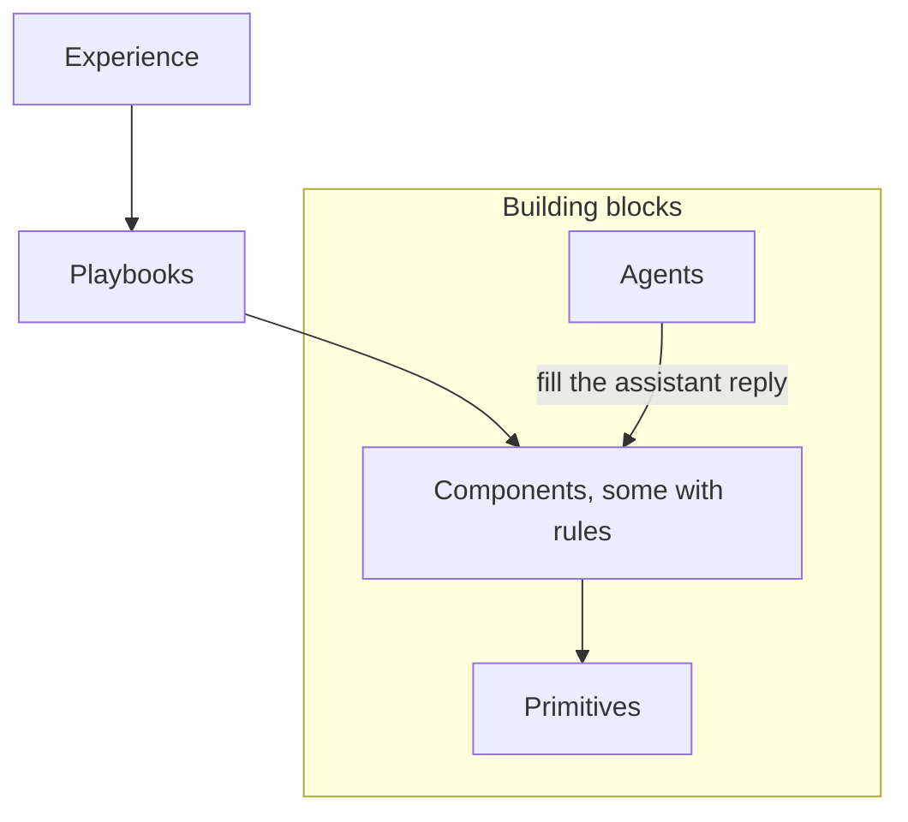

Crossword has its own vocabulary because it does more than answer chat messages. It decides what a shopper sees, when they see it, and what happens next. The objects that make those decisions nest inside each other, so it helps to learn the layers before the individual features.

## The layers

Content in Crossword nests. An experience holds Playbooks. Playbooks hold components. Components are built from primitives.

Each layer contains the one below it. The box holds the building blocks: what you place, and who answers the shopper.

1. **[Experience](/orchestration/channels-and-experiences).** One storefront's configuration on one channel. An experience lives on a single channel such as your website, Instagram, or iMessage.
2. **[Playbooks](/orchestration/playbooks).** Reusable collections of contextual behavior. A Playbook holds components, and nothing switches it on as a whole. Each component with a rule decides for itself.
3. **[Components](/components/overview).** Everything a shopper can see or interact with. Welcome messages, starters, product cards, quizzes, page sections. One list, in five families. Some carry a rule that says when and where they show. Others are plain content placed inside them.
4. **[Primitives](/components/primitives).** The buttons, inputs, selectors, media, and text every component is built from.
5. **[Agents](/agents/overview).** Who answers when a shopper asks something. An Agent composes the assistant reply from text, cards, and follow-up suggestions at the moment of the question. Welcome messages and starters are chosen before any Agent is involved.

Four more things act on this structure without being part of the chain. [Rulebooks](/orchestration/rulebooks) pick which component wins when several Playbooks propose one. [Campaigns](/orchestration/campaigns) run sequences over time and can activate Playbooks or send messages. [Experiments](/orchestration/experiments) split traffic between Playbooks. [Deployment](/orchestration/deployment) publishes the whole experience. All four are covered under [Orchestration](/orchestration/overview).

The screenshot below is a product page on a sneaker storefront with the chat widget open, annotated with callouts. The callouts label one Playbook, three components that carry rules (the welcome message, the conversation starters, and a page section below the buy box), one plain component placed inside a message (a product card), and the assistant reply the Agent composed. Everything in the image except the storefront itself is one of the layers above.

<Frame caption="One product page, with each layer labelled">
  
</Frame>

## Which components carry rules

Every component is in one list, but they come in two kinds. Some carry a rule: conditions, priority, and sometimes timing and delivery limits. A [Rulebook](/orchestration/rulebooks) resolves them against others of the same type. The rest are plain content with properties and no rule. They show because a rule-based component or an Agent placed them.

| Family | Components | Carries a rule? |
| ------ | ---------- | --------------- |
| Conversation | [Welcome message](/components/conversation/welcome-message), [conversation starter](/components/conversation/conversation-starter), [follow-up suggestion](/components/conversation/follow-up-suggestion), [proactive message](/components/conversation/proactive-message) | Yes. Conditions and priority. Proactive messages also carry timing and delivery limits. |
| Conversation | [Assistant reply](/components/conversation/assistant-reply) | No. The Agent composes it each turn. |
| Cards | [Product card](/components/cards/product-card), [product collection](/components/cards/product-collection), [comparison card](/components/cards/comparison-card), [cart and checkout card](/components/cards/cart-checkout-card), [order and refund card](/components/cards/order-refund-card) | No. Placed inside a message, a reply, or a page section. |
| Interactive | [Quiz](/components/interactive/quiz), [bundle builder](/components/interactive/bundle-builder), [form](/components/interactive/form), [game](/components/interactive/game), [configurator](/components/interactive/configurator) | No. Placed the same way as cards. |
| Page | [Content block](/components/page/content-block), [page suggestions](/components/page/page-suggestions), [recommendation section](/components/page/recommendation-section), [comparison section](/components/page/comparison-section), [social proof section](/components/page/social-proof-section), [offer section](/components/page/offer-section) | Yes. A target page, a placement, a rule, and optional timing and delivery limits. See [Page sections](/components/page/page-sections). |
| Primitives | [Button, input, selector, media, text](/components/primitives) | No. |

Read [Rules](/orchestration/rules) for what a rule can contain.

## Glossary

| Term | Meaning |
| ---- | ------- |
| [Channel](/orchestration/channels-and-experiences) | A surface Crossword runs on. Web, Instagram, iMessage, or another supported channel. |
| [Experience](/orchestration/channels-and-experiences) | One storefront's configuration on one channel. Holds Playbooks, Rulebooks, Campaigns, Experiments, and Deployment. |
| [Playbook](/orchestration/playbooks) | A reusable collection of components and their rules that Crossword applies when relevant. Enabling a Playbook makes its rules eligible for evaluation. |
| [Default Playbook](/orchestration/playbooks) | The one Playbook in each experience that supplies baseline settings and fallback content when no other rule matches. |
| [Rulebook](/orchestration/rulebooks) | The engine for one component type that looks at every eligible rule and decides what shows. There is one Rulebook for welcome messages, one for conversation starters, and so on. |
| [Campaign](/orchestration/campaigns) | A stateful customer-engagement program that enrolls an audience and orchestrates actions over time. |
| [Sequence](/orchestration/campaigns) | The ordered steps inside a Campaign. Messages, waits, branches, and actions. |
| [Rule](/orchestration/rules) | The conditions, timing, priority, and delivery restrictions attached to one rule-based component. Rules live on components, not on Playbooks. |
| [Component](/components/overview) | Anything a shopper can see or interact with. Messages, suggestions, cards, interactive pieces, and page sections. Some carry a rule, the rest are placed by one that does. |
| [Component library](/components/overview) | The single list of every component, in five families. Shared across every experience. |
| [Primitive](/components/primitives) | The smallest building block. Button, input, selector, media, text. |
| [Agent](/agents/overview) | The assistant that composes the assistant reply. Has routing rules, instructions, knowledge, guardrails, and response settings. |
| [Workflow](/agents/workflows) | A deterministic set of steps an Agent or a Campaign can run. Look up an order, generate a return label, apply a coupon. |
| [Audience](/orchestration/audiences) | Who something applies to. Expressed as a Segment. |
| [Segment](/orchestration/audiences) | A reusable definition of a customer group. Static segments have assigned members. Dynamic segments recalculate membership from conditions. |
| [Placement](/orchestration/pages-and-placements) | A location on a merchant page where Crossword inserts, replaces, or updates content. |
| [Experiment](/orchestration/experiments) | A split of traffic between two or more Playbooks, measured against a goal event. |
| [Environment](/orchestration/deployment) | A deployment target such as Test or Production. Each holds a published revision of the experience and its own installation snippet. |
| [Revision](/orchestration/deployment) | An automatically numbered snapshot created each time you publish an experience. |

## Two principles that shape everything

**Rules belong to components, not to Playbooks.** A [Playbook](/orchestration/playbooks) does not have one master condition that switches everything on. Each welcome message, starter, proactive message, or page section inside it carries its own rule. Enabling the Playbook makes those rules eligible. The Rulebook for each component type then decides what wins. Read [Rules](/orchestration/rules) and [How rulebooks resolve conflicts](/orchestration/how-rulebooks-resolve).

**Playbooks are not mutually exclusive.** A visitor can qualify for YouTube Unboxing, Returning Customer, and VIP Customer at the same time. The Playbooks do not fight. Each contributes candidates to the relevant Rulebook, and the Rulebook resolves them. Some surfaces allow one winner, such as the welcome message. Others allow several, such as conversation starters.

## Where to go next

<CardGroup cols={2}>
  <Card title="Playbooks vs campaigns" icon="code-branch" href="/orchestration/playbooks-vs-campaigns">
    When contextual behavior is enough and when you need a stateful sequence.
  </Card>
  <Card title="How rulebooks resolve conflicts" icon="scale-balanced" href="/orchestration/how-rulebooks-resolve">
    Priority, single or multiple winners, limits, and fallback.
  </Card>
  <Card title="Component library" icon="cubes" href="/components/overview">
    Every component in one list, with which ones carry rules.
  </Card>
  <Card title="Rules" icon="sliders" href="/orchestration/rules">
    What a rule can contain and which components carry one.
  </Card>
</CardGroup>
