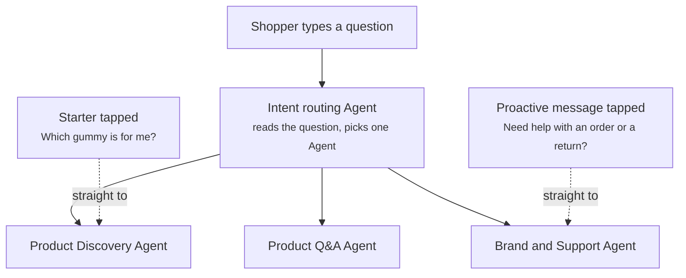

Intent routing decides which Agent answers a question the shopper types. Every typed question goes to the intent routing Agent, which reads what the shopper is asking and sends it to the right Agent. A shopper never chooses an Agent.

Intent routing is part of [Global settings](/global/overview), so it works the same way in every Journey of an experience.

## How a question reaches an Agent

A shopper reaches an Agent in one of two ways. A typed question goes through intent routing. A tapped starter or proactive message skips routing and goes straight to the Agent named next to it.

## Typed questions

When a shopper types, intent routing reads the question and matches it to the Agent whose job covers it. It routes on what the shopper asks, not on the page they are on. A shopper on a product page who types "Where is my order?" reaches the support Agent, not the product Agent.

Every typed question goes through routing, including follow-ups. A shopper who moves from product questions to an order question reaches the right Agent without asking for it.

## Starters and proactive messages

[Conversation starters](/components/conversation/conversation-starter) and [proactive messages](/components/conversation/proactive-message) each name their Agent. When the shopper taps one, the conversation goes straight to that Agent, and intent routing is not involved.

This lets a Journey send a tap to an Agent other than its own. In the Default Journey, "What makes you different?" goes to the Brand and Support Agent, while the other starters go to the Product Discovery Agent. Read [Journeys](/orchestration/journeys).

## Handoff between Agents

Once an Agent has a conversation, it can hand it to another Agent when the shopper's need changes. The Product Discovery Agent hands off to the Product Q&A Agent when the shopper opens a product. The conversation so far travels with the handoff, so the shopper never repeats themselves. Read [Escalation and handoff](/agents/escalation-and-handoff).

## Handoff from a Campaign

A [Campaign](/orchestration/campaigns) step can hand a shopper to an Agent when a sequence needs a live conversation. The step names the Agent, so intent routing is not involved.

## Example

A gummy supplement store runs three Agents: the Product Discovery Agent, the Product Q&A Agent, and the Brand and Support Agent. Three shoppers type a question.

| Where the shopper is | What they type | Agent that answers | Why |
| -------------------- | -------------- | ------------------ | --- |
| Home page | "I keep waking up tired. Which gummy should I try?" | Product Discovery Agent | The shopper has not picked a product yet and needs a recommendation |
| Sleep gummies product page | "How fast does this start working?" | Product Q&A Agent | The question is about the product on screen, answered from its own FAQ |
| Energy gummies product page, logged in | "Where is my order?" | Brand and Support Agent | The question is about an order, so routing skips the product Agent even on a product page |

## Related

<CardGroup cols={2}>
  <Card title="Global settings" href="/global/overview" />
  <Card title="Escalation and handoff" href="/agents/escalation-and-handoff" />
  <Card title="Journeys" href="/orchestration/journeys" />
  <Card title="Agents" href="/agents/overview" />
</CardGroup>
