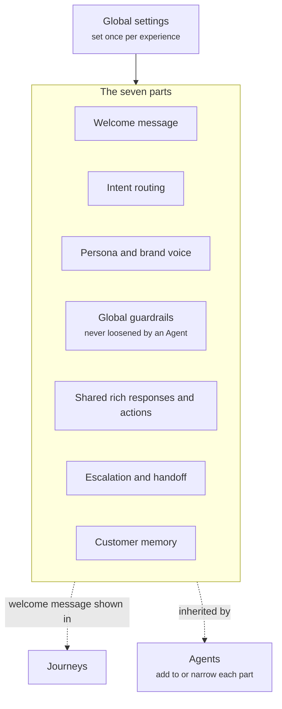

Global settings are the defaults every Agent in an experience inherits, and the welcome message every Journey shows. You set them once, and they apply everywhere: the greeting a shopper reads first, how typed questions find the right Agent, how Crossword sounds, and the lines no Agent may cross.

Agents build on these defaults. An Agent can add to a global setting or narrow it for its own job. An Agent can never loosen a global guardrail.

## What global settings contain

Global settings have seven parts. Every Agent in the experience inherits all seven. Journeys show the welcome message for reference.



| Part | What it sets | Read |
| ---- | ------------ | ---- |
| Welcome message | The greeting every shopper reads when the widget opens | [Welcome message](/components/conversation/welcome-message) |
| Intent routing | How a typed question reaches the right Agent | [Intent routing](/global/intent-routing) |
| Persona and brand voice | How every Agent sounds by default | [Persona and brand voice](/agents/persona-and-brand-voice) |
| Global guardrails | What no Agent may ever say or do | [Guardrails and fallback](/agents/guardrails-and-fallback) |
| Shared rich responses and actions | The cards, components, and actions every Agent can use | [Rich responses and actions](/agents/rich-responses-and-actions) |
| Escalation and handoff | How a conversation passes between Agents and to your team | [Escalation and handoff](/agents/escalation-and-handoff) |
| Customer memory | What Crossword remembers about every shopper | [Customer memory](/agents/customer-memory) |

## Welcome message

The welcome message is the first thing a shopper reads when the widget opens. It is one greeting for the whole experience, and every Journey shows it unless the Journey leaves it off. Agents do not change it, because the Agent enters only once the shopper taps a starter or types a question. Read [Welcome message](/components/conversation/welcome-message).

## Intent routing

Every typed question goes to the intent routing Agent, which sends it to the Agent best placed to answer. Tapped starters and proactive messages skip this step and go straight to the Agent named next to them. Agents extend routing by handing a conversation to each other when the shopper's need changes. Read [Intent routing](/global/intent-routing).

## Persona and brand voice

The global persona is the voice every Agent speaks in by default: tone, sentence length, and how much playfulness is allowed. An Agent can narrow it for its job. A support Agent, for example, can drop the jokes and emojis while it resolves a problem. Read [Persona and brand voice](/agents/persona-and-brand-voice).

## Global guardrails

Global guardrails are the rules every Agent follows, whatever its own instructions say. An Agent can add guardrails of its own, such as a cap on how many products it recommends at once. An Agent can never remove or loosen a global guardrail. Read [Guardrails and fallback](/agents/guardrails-and-fallback).

## Shared rich responses and actions

Shared rich responses and actions are the cards, interactive components, and actions every Agent can use, such as a [product card](/components/cards/product-card) with **Add to cart** or the [quiz](/components/interactive/quiz). An Agent inherits them all and adds the ones its job needs, such as an order status card for support. Read [Rich responses and actions](/agents/rich-responses-and-actions).

## Escalation and handoff

Escalation and handoff sets how a conversation moves between Agents and to a human on your team. The global setting guarantees the conversation so far travels with it, so the shopper never repeats themselves. Each Agent adds its own handoff targets, such as passing order questions to the support Agent. Read [Escalation and handoff](/agents/escalation-and-handoff).

## Customer memory

Customer memory is what Crossword remembers about every shopper, such as where they came from and whether they have taken the quiz. Every Agent can read it. An Agent adds what matters to its own job, such as the questions it has already answered or the pack size a shopper chose. Read [Customer memory](/agents/customer-memory).

## Example

The global settings from a gummy supplement store's board, written out in full. The store runs three Agents: the Product Discovery Agent, the Product Q&A Agent, and the Brand and Support Agent. All three inherit everything below.

```yaml
Global settings:
  Welcome message: "Hi! Energy, sleep, mood or strength: what are you after today?"
  Intent routing:
    Typed questions: Go to the intent routing Agent, which sends each one to the right Agent
    Tapped starters and proactive messages: Go straight to the Agent named next to them
  Persona and brand voice:
    - Playful, upbeat, and a little cheeky, like the brand's own FAQ
    - Short, friendly sentences, with one emoji at most
    - Nerdy about mushrooms, but always in plain words
  Global guardrails:
    - No health or medical claims. Never says a product treats, cures, or prevents anything
    - Says "Please check with your doctor" if the shopper is on medication, pregnant, or has a condition
    - Only shares facts the brand has published. Never invents details
    - Shows products as cards, never as long text lists
    - Never asks for card or payment details
    - Never promises refunds or delivery dates it cannot confirm
  Shared rich responses and actions:
    - Product cards with Add to cart
    - Quiz component ("Find my routine")
    - Handoff to a human on the team
  Escalation and handoff:
    Between Agents: The chat passes with the conversation so far, so the shopper never repeats themselves
    To a human: Arrives with name, email, order number, and the problem already collected
  Customer memory:
    - The page they are on and where they came from (ad, Google, or direct)
    - Logged-in status and past orders
    - Quiz result, once they have taken it
```

Each Agent then builds on these defaults.

- The **Product Q&A Agent** narrows the voice to friendly and confident, facts first, and never jokes about how a product works. It adds a guardrail: it only states results and timelines the product's FAQ states.
- The **Brand and Support Agent** drops jokes and emojis when a shopper has a problem. It adds the order status card, and a guardrail that it never blocks a return.
- The **Product Discovery Agent** adds a guardrail to recommend at most two products at a time, and remembers what the shopper is looking for.

None of them can drop a global guardrail. Every Agent still makes no health claims and never asks for payment details.

## Related

<CardGroup cols={2}>
  <Card title="Intent routing" href="/global/intent-routing" />
  <Card title="Agents" href="/agents/overview" />
  <Card title="Journeys" href="/orchestration/journeys" />
  <Card title="Quality and governance" href="/quality/overview" />
</CardGroup>
