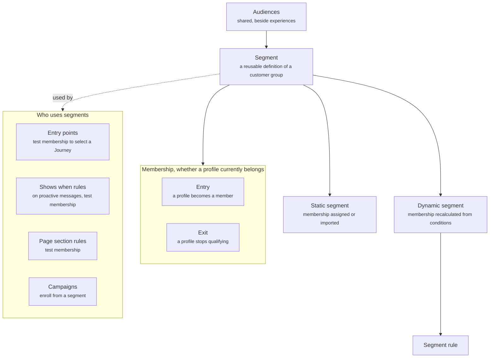

An audience is who something applies to, and you express it as a segment: a reusable definition of a customer group. Defining a group once means every Campaign and every rule on a component can point at it instead of rebuilding the same logic.

Segments are shared. They sit beside experiences, not inside them, so the same segment serves your web experience and your Instagram experience.

## What it contains

The diagram shows how Audiences break down into segments, the two kinds of segment, what membership means, and who uses segments.

| Concept | Meaning | Example |
| ------- | ------- | ------- |
| Segment | A reusable definition of a customer group | High-value customers |
| Static segment | Membership is explicitly assigned or imported, and does not change until you update it | A list of loyalty members uploaded from your CRM |
| Dynamic segment | Membership is continuously recalculated from conditions | Shoppers with a cart over $50 and inactive for 30 minutes |
| Segment rule | The conditions that define dynamic membership | Lifetime orders over 3 |
| Membership | Whether a profile currently belongs to the segment | Yes |
| Entry | A profile becomes a member | A shopper places their fourth order |
| Exit | A profile stops qualifying | A shopper completes the purchase in their cart |

## How Campaigns use segments

A Campaign names a segment as its audience. Cart Recovery says "Audience: High-value abandoned-cart shoppers" and nothing more. The segment holds the conditions. The Campaign holds the enrollment rule, re-entry policy, and sequence. Change the segment rule and every Campaign that uses it picks up the change. Read [Campaigns](/orchestration/campaigns).

## How rules use segments

Segment membership is a condition on the rules of proactive messages and page sections. A proactive message can require membership in "Returning customers". A page section can exclude "Already purchased Product A". This lets a Journey react to who the shopper is, not only to where they came from. Read [Rules](/orchestration/rules).

## Enrollment is not membership

Segment membership and Campaign enrollment are two different states.

- **Membership** is whether the profile currently matches the segment. For a dynamic segment it can change at any moment.
- **Enrollment** is whether the shopper is currently inside a Campaign's sequence. It starts at the entry trigger and ends at exit or completion.

A shopper can be enrolled in a Campaign and no longer be a member of its segment. Each Campaign states what happens then: **Exit Campaign** or **Continue Campaign**. Read [Journeys vs campaigns](/orchestration/journeys-vs-campaigns) for the choice.

## How it fits

Segments sit beside experiences, alongside the Component library. Above them are the shopper profiles and events that feed their rules. Below them are the consumers. Entry points, "shows when" rules on proactive messages, and page section rules test membership. Campaigns enroll from them.

## Example

A segment called High-value abandoned-cart shoppers is dynamic. Its rule is cart value over $50 and inactive for 30 minutes. A cart recovery Campaign enrolls from it. A proactive message rule in the Returning Customer Journey tests membership in it to offer help with checkout. When a shopper purchases, they stop qualifying and exit the segment.

## Related

<CardGroup cols={2}>
  <Card title="Campaigns" href="/orchestration/campaigns" />
  <Card title="Rules" href="/orchestration/rules" />
</CardGroup>
