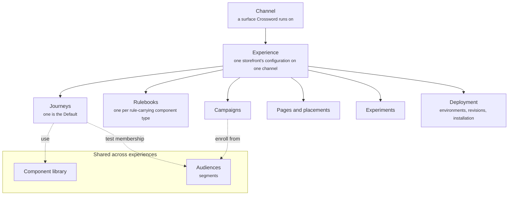

A channel is a surface Crossword runs on, and an experience is one storefront's configuration on one channel. Together they give every Journey, Rulebook, Campaign, and page a single home that you configure and publish as one unit.

Your storefront can have one experience per channel. The web experience holds what shoppers see on your site. The Instagram experience holds what they see in direct messages. Each is configured, tested, and deployed on its own.

## What it contains

The diagram shows a channel above an experience, the six things the experience holds, and the two shared things that sit beside it.

| Concept | Meaning | Example |
| ------- | ------- | ------- |
| Channel | A surface Crossword runs on | Web, Instagram, iMessage, or another supported channel |
| Experience | One storefront's configuration on one channel | Your storefront's web experience |
| Journeys | Reusable collections of contextual behavior. One is the Default | Default, YouTube Unboxing, Returning Customer |
| Rulebooks | One per rule-carrying component type. Each resolves the eligible rules into what shows | Conversation starter selection |
| Campaigns | Stateful programs that enroll an audience and run a sequence over time | Cart recovery |
| Pages and placements | Dynamic landing pages and personalization of your existing pages | A recommendation section on the cart page |
| Experiments | Traffic splits between two or more Journeys, measured against a goal | Quiz-led vs conversation-led discovery |
| Deployment | Environments, published revisions, and installation | Test and Production |

## What is shared across experiences

Two things sit beside experiences rather than inside them.

- **Component library.** Messages, suggestions, cards, interactive components, and page sections are defined once and used by any Journey in any experience. Read [Component library](/components/overview).
- **Audiences.** Segments are defined once. Any Campaign in any experience can enroll from them, and any rule on a component can test membership. Read [Audiences and segments](/orchestration/audiences).

Changing a component or a segment changes it everywhere it is used.

## How it fits

Channels sit at the top. Each channel holds the experiences that run on it. Each experience holds its Journeys, Rulebooks, Campaigns, Pages and placements, Experiments, and Deployment.

Below the experience, Journeys hold components, some of which carry a rule, and components are built from primitives. Read [Core concepts](/concepts) for the full chain.

The experience is also the unit of publishing. When you publish, Crossword snapshots the whole experience as a numbered revision and pushes it to an environment. Read [Deployment](/orchestration/deployment).

## Example

A sneaker brand runs Crossword on its website and on Instagram. The web experience has a Default Journey, a YouTube Unboxing Journey, a cart recovery Campaign, and a Test and a Production environment. The Instagram experience has its own Default Journey and its own Campaigns. Both experiences pull product cards from the same Component library and enroll shoppers from the same segments.

The screenshot shows the **Channels** screen, which lists every channel the storefront runs on. Filter tabs read **All**, **Connected**, **Disconnected**, and **Error**, with a search box and a **New channel** button beside them. The table has a row per channel with its type, the Agent assigned to it, its status, the messages it has handled today, and its last activity. The six rows cover a Web Chat widget, a WhatsApp number, an email inbox, a Slack channel, an SMS number, and a REST API webhook, each answered by an Agent such as Support Concierge or Billing Resolver. Four are Connected and busy, while the Slack channel is in Error and the SMS channel is Disconnected, and neither has handled a message today.

<Frame caption="The Channels screen with six channels and their Agents">
  
</Frame>

## Related

<CardGroup cols={2}>
  <Card title="Journeys" href="/orchestration/journeys" />
  <Card title="Deployment" href="/orchestration/deployment" />
</CardGroup>
