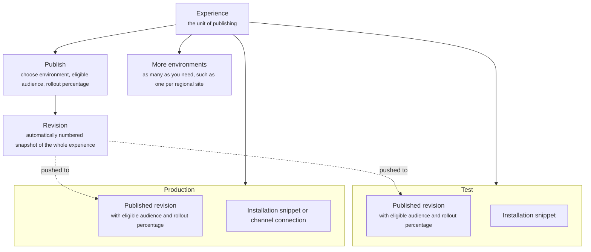

Deployment is how a configured experience reaches shoppers. It gives you separate environments to test in and to serve from, a numbered revision every time you publish, and the installation code or channel connection each environment needs.

Deployment acts on the whole experience. A revision is a snapshot of the global settings and every Journey, Agent, Campaign, page, and Experiment at the moment you publish.

## What it contains

The diagram shows an experience, its environments and what each one holds, and how publishing creates the revision an environment serves.

| Concept | Meaning | Example |
| ------- | ------- | ------- |
| Environment | A deployment target with its own installation snippet and its own published version | Test, Production |
| Published version | The revision an environment currently serves. You can change it at any time | Revision 12 |
| Revision | An automatically numbered snapshot of the whole experience, created each time you publish | Revision 15 |
| Publish | The action that creates a revision and pushes it to an environment | Publish to Production |
| Eligible audience | Who the published revision applies to. Everyone, or a segment | All visitors |
| Rollout percentage | The share of the eligible audience that receives the published revision | 10% |
| Installation snippet | The code that connects a website to an environment | A script tag for your storefront |
| Channel connection | The account link that connects a conversational channel to an environment | Your Instagram business account |

## Environments

Each experience starts with **Test** and **Production**. Create as many more as you need, such as one per regional site. Every environment has its own installation snippet or channel connection, so a staging site and a live site never share traffic.

Each environment serves one published revision at a time. Change it to move forward to a newer revision or back to an older one.

Agents also keep their own version history. For versioning and rolling back a single Agent, read [Quality and governance](/quality/overview).

## Publishing

1. Click **Publish** on the experience.
2. Choose the environment.
3. Choose the eligible audience and the rollout percentage.
4. Confirm.

Crossword creates the next revision number and pushes it to the environment. Revision numbers are automatic and never reused. Nothing changes in an environment until you publish to it, so you can keep editing the experience while Production serves an earlier revision.

The rollout percentage lets you introduce a revision gradually. Visitors outside the rollout continue to receive the revision the environment served before.

## Installation

For a website, copy the environment's **installation snippet** into your site. For a conversational channel such as Instagram or iMessage, connect the channel account to the environment instead.

## How it fits

Deployment sits at the end of the chain. Channels hold experiences, experiences hold everything you configure, and Deployment turns that configuration into a revision an environment serves. Read [Channels and experiences](/orchestration/channels-and-experiences).

Experiments and Campaigns are part of what gets published. A running Experiment continues to split traffic in the environment it is published to, and Campaigns continue their sequences across revisions.

## Example

Your storefront's web experience has two environments. Test runs on your staging site and serves revision 14. Production runs on your live site and serves revision 12. You publish revision 15 to Test, check it, then publish it to Production at 10% of traffic. When the numbers look right you raise the rollout to 100%.

## Related

<CardGroup cols={2}>
  <Card title="Channels and experiences" href="/orchestration/channels-and-experiences" />
</CardGroup>
