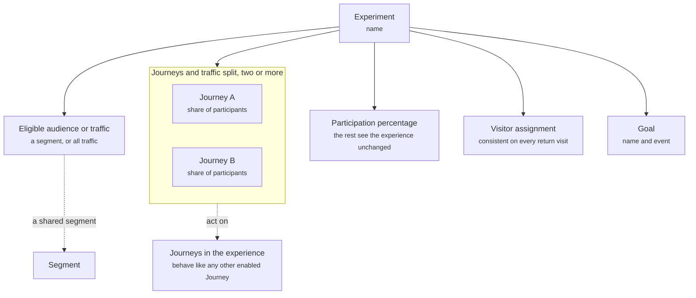

An Experiment splits traffic between two or more Journeys and measures which one drives a goal event. It answers "which approach works better?" with data instead of a guess.

Experiments act on Journeys, not on the whole experience. Everything outside the Journeys under test stays the same for every visitor.

## What it contains

The diagram shows an Experiment, the parts that decide who takes part and how, and the Journeys it acts on.

| Concept | Meaning | Example |
| ------- | ------- | ------- |
| Name | What the Experiment is called | Product Discovery Method |
| Eligible audience or traffic | Who can be entered into the Experiment: a segment, or all traffic | New visitors |
| Participation percentage | What share of the eligible audience is entered. The rest see the experience without the Experiment | 40% |
| Journeys and traffic split | The Journeys under test and the share of participants each receives. Two or more are supported | A 50% / B 50%, or A 40% / B 30% / C 30% |
| Visitor assignment | Each participant is assigned once and sees the same Journey on every return visit | Consistent |
| Goal | The name of the outcome and the event that records it | Add to cart, `add_to_cart` |

## How assignment works

A visitor who is eligible and inside the participation percentage is assigned to one Journey. The assignment is consistent: the same visitor sees the same Journey every time they return while the Experiment runs. That keeps the comparison clean. A visitor who is not eligible, or who falls outside the participation percentage, sees the experience as if the Experiment did not exist.

An assigned Journey behaves like any other Journey. It applies at its entry point, with its own starters, proactive messages, Agent, and goals. The Journeys under test can differ in one component or in many.

## How it fits

An Experiment lives inside an experience and acts on Journeys. It does not change global settings, Campaigns, or the Default Journey.

Publishing and Experiments are separate. Deployment publishes the whole experience, including any running Experiment. Read [Deployment](/orchestration/deployment).

## Example

An Experiment called Product Discovery Method tests whether a quiz or a conversation drives more add-to-carts. Journey A is conversation-led discovery: the shopping Agent without a quiz. Journey B is quiz-led discovery: the same Agent with a quiz. Traffic splits 50/50. The goal event is `add_to_cart`. Read the build in Quiz-led vs conversation-led discovery.

## Related

<CardGroup cols={2}>
  <Card title="Journeys" href="/orchestration/journeys" />
</CardGroup>
