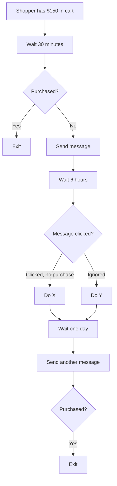

Journeys and Campaigns both change what a shopper sees. They answer different questions. A Journey answers "what should happen right now, given this context?" A Campaign answers "what should happen to this person over the next hours or days?"

## The short version

A **Journey** is a reusable collection of contextual behaviors that Crossword applies when relevant. It has no memory of the shopper's progress. Every rule inside it is evaluated fresh against the current context.

A **Campaign** is a stateful customer-engagement program that enrolls an audience and orchestrates actions over time. The word stateful is the difference. A Campaign remembers where each shopper is in its sequence.

If the behavior depends only on what is true right now, use a Journey. If the behavior depends on what already happened and what should happen next, use a Campaign.

## A Journey in practice

Take a Journey called YouTube Unboxing. It exists to serve shoppers who arrive from an unboxing video. It does not switch on as a whole. Instead, each rule-based component inside it carries its own rule.

| Component | Rule inside the Journey |
| --------- | ------------------------ |
| Proactive message | If source is YouTube Unboxing A, greet on arrival with "Looking for the pair from the video?" |
| Conversation starter | On the featured product's page, show a starter about the pair, such as "Does this pair run true to size?" |
| Content block | On a product page, show video-specific product context |
| Proactive message | If 15 seconds pass with no engagement, offer sizing assistance |
| Recommendation section | If the shopper arrives from the video and the featured SKU is unavailable, show alternatives |

Every row is immediate and contextual. Nothing waits for tomorrow. Nothing depends on what the shopper did on a previous visit.

The screenshot shows the YouTube Unboxing Journey open on the **Journeys** screen with its Enabled toggle on. The components list has the six rows from the table above. Each row shows the component type, its label, and its rule in one line, such as the arrival greeting with Source is YouTube Unboxing A and the sizing nudge with 15 seconds of inactivity. No condition appears on the Journey itself.

<Frame caption="YouTube Unboxing Journey components and rules">
  
</Frame>

## A Campaign in practice

Now take a Campaign called Cart Recovery.

This is not a Journey. It has memory of where the shopper currently is in the sequence. It waits, checks, branches, and continues. That memory is what makes it a Campaign.

The screenshot shows the Cart Recovery Campaign open on the **Campaigns** canvas. The steps match the diagram above: Wait 30 minutes, a Purchased? branch with Yes leading to Exit, Send message, Wait 6 hours, a Message clicked? branch with paths for Clicked and Ignored, Wait one day, Send another message, and a final Purchased? branch to Exit. The header shows the Campaign as Active with 312 shoppers enrolled and the goal event `purchase`.

<Frame caption="Cart Recovery sequence on the Campaign canvas">
  
</Frame>

## What a Campaign is made of

| Concept | Meaning | Example |
| ------- | ------- | ------- |
| Audience | Who the Campaign is for | Shoppers with abandoned carts |
| Enrollment rule | When someone enters | Cart value over $50 and inactive for 30 minutes |
| Re-entry policy | Whether they can enter again | Once every 7 days |
| Exit rule | When they leave | Purchase completed |
| Goal | The outcome the Campaign seeks | Complete purchase |
| Sequence | The stateful orchestration | Message, wait, branch, message |
| Step | One node in the Sequence | Wait 6 hours |
| Branch | Selects the next path | Was the message clicked? |
| Wait | Delays progression | 6 hours |
| Campaign message | Proactive outreach sent by a step | "Still thinking it over?" |
| Action | Something a step executes | Add a coupon, update an attribute |
| Workflow call | Runs an operational Workflow | Generate a return label |
| Journey activation | Makes a Journey applicable for a defined scope or lifetime | Apply "Abandoned Cart Return Visit" on the next website visit |
| Agent handoff | Starts or routes into an Agent when interaction is needed | Shopping assistance |
| Conversion or completion | The Campaign goal occurred | Purchase |

A Campaign can be a single step. Enter segment, send message, end. You do not need a long sequence to justify a Campaign. You need state.

## Proactive messages: which one?

Proactive messages are the place where the two most often get confused, because both can send one. The test is the same. Is it about right now, or about over time?

**Contextual proactive message.** This belongs in a Journey's proactive-message rules.

> On a product page, and the visitor came from the unboxing campaign, and 15 seconds have elapsed, and they have not engaged. Show "Need help finding your size?"

It is immediate website behavior. The rule reads the current session and fires or does not.

**Lifecycle proactive message.** This belongs in a Campaign.

> Cart abandoned. Wait 30 minutes. Send a message. Wait 6 hours. Check for purchase. Send another message.

It spans time and depends on what already happened.

## Campaigns and Journeys work together

A Campaign step can activate a Journey. Cart Recovery might apply an "Abandoned Cart Return Visit" Journey on the shopper's next visit. The Campaign handles the timing and the memory. The Journey handles what the shopper sees when they land. Neither has to do the other's job.

## Audience exit is a choice

Campaign enrollment and segment membership are not the same thing. A shopper can leave a dynamic segment while they are halfway through a Campaign. Each Campaign states what happens then.

| On audience exit | Behavior |
| ---------------- | -------- |
| Exit Campaign | The shopper leaves the sequence immediately |
| Continue Campaign | The shopper finishes the sequence they are in |

## When to use which

| You want to | Use |
| ----------- | --- |
| Greet visitors from an ad with their own proactive message | Journey |
| Change the welcome message every shopper sees | The Default Journey |
| Show different starters on a product page | Journey |
| Nudge a shopper who has been idle for 15 seconds | Journey |
| Follow up on an abandoned cart over the next day | Campaign |
| Send a one-time message to everyone who joins a segment | Campaign |
| Re-engage a customer 30 days after their last order | Campaign |
| Change what a returning shopper sees when a Campaign brings them back | Campaign that activates a Journey |

## Related

<CardGroup cols={2}>
  <Card title="Journeys" href="/orchestration/journeys" />
  <Card title="Campaigns" href="/orchestration/campaigns" />
  <Card title="Proactive messages" href="/components/conversation/proactive-message" />
  <Card title="Audiences and segments" href="/orchestration/audiences" />
</CardGroup>
