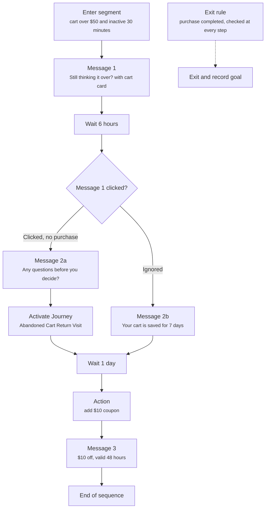

Journeys and Campaigns both change what a shopper sees. They answer different questions. A Journey answers "what should happen right now, given this context?" A Campaign answers "what should happen to this person over the next hours or days?"

## The short version

A **Journey** is one situation a shopper is in, selected by its entry point. It has no memory of the shopper's progress. Crossword checks the entry point against the current page and context, and each proactive message's "shows when" rule against the current session.

A **Campaign** is a stateful customer-engagement program that enrolls an audience and orchestrates actions over time. The word stateful is the difference. A Campaign remembers where each shopper is in its sequence.

If the behavior depends only on what is true right now, use a Journey. If the behavior depends on what already happened and what should happen next, use a Campaign.

## A Journey in practice

Take a Journey called YouTube Unboxing. It exists to serve shoppers who arrive on the featured product's page from an unboxing video. Its entry point selects it, and while it applies, everything it shows routes to its Agent.

| Part | In the YouTube Unboxing Journey |
| ---- | ------------------------------- |
| Entry point | Arrives on Product A's page, and the source is YouTube Unboxing A |
| Welcome message | The global greeting from Global settings, shown for reference |
| Conversation starter | "Does this pair run true to size?" routes to the shopping Agent |
| Proactive message | "Looking for the pair from the video?" shows when the shopper arrives, and routes to the shopping Agent |
| Proactive message | "Need help finding your size?" shows when 15 seconds pass with no engagement, and routes to the shopping Agent |
| Agent | The shopping Agent |
| Goals | Primary: add to cart. Secondary: view the size guide |

Every row is immediate and contextual. Nothing waits for tomorrow. Nothing depends on what the shopper did on a previous visit.

## A Campaign in practice

Now take a Campaign called Cart Recovery.

This is not a Journey. It has memory of where the shopper currently is in the sequence. It waits, checks, branches, and continues. That memory is what makes it a Campaign.

## What a Campaign is made of

| Concept | Meaning | Example |
| ------- | ------- | ------- |
| Audience | Who the Campaign is for | Shoppers with abandoned carts |
| Enrollment rule | When someone enters | Cart value over $50 and inactive for 30 minutes |
| Re-entry policy | Whether they can enter again | Once every 7 days |
| Exit rule | When they leave | Purchase completed |
| Goal | The outcome the Campaign seeks | Complete purchase |
| Sequence | The stateful orchestration | Message, wait, branch, message |
| Step | One node in the Sequence | Wait 6 hours |
| Branch | Selects the next path | Was the message clicked? |
| Wait | Delays progression | 6 hours |
| Campaign message | Proactive outreach sent by a step | "Still thinking it over?" |
| Action | Something a step executes | Add a coupon, update an attribute |
| Workflow call | Runs an operational Workflow | Generate a return label |
| Journey activation | Makes a Journey applicable for a defined scope or lifetime | Apply "Abandoned Cart Return Visit" on the next website visit |
| Agent handoff | Starts or routes into an Agent when interaction is needed | Shopping assistance |
| Conversion or completion | The Campaign goal occurred | Purchase |

A Campaign can be a single step. Enter segment, send message, end. You do not need a long sequence to justify a Campaign. You need state.

## Proactive messages: which one?

Proactive messages are the place where the two most often get confused, because both can send one. The test is the same. Is it about right now, or about over time?

**Contextual proactive message.** This belongs in a Journey, with a "shows when" rule.

> Inside the YouTube Unboxing Journey, shows when 15 seconds pass with no engagement: "Need help finding your size?"

It is immediate website behavior. The rule reads the current session inside the active Journey and shows the message or does not.

**Lifecycle proactive message.** This belongs in a Campaign.

> Cart abandoned for 30 minutes. Send a message. Wait 6 hours. Branch on whether it was clicked. Wait a day. Send a final message. Exit the moment the shopper buys.

It spans time and depends on what already happened.

## Campaigns and Journeys work together

A Campaign step can activate a Journey. Cart Recovery might apply an "Abandoned Cart Return Visit" Journey on the shopper's next visit. The Campaign handles the timing and the memory. The Journey handles what the shopper sees when they land: its starters, its proactive messages, and the Agent that answers. Neither has to do the other's job.

## Audience exit is a choice

Campaign enrollment and segment membership are not the same thing. A shopper can leave a dynamic segment while they are halfway through a Campaign. Each Campaign states what happens then.

| On audience exit | Behavior |
| ---------------- | -------- |
| Exit Campaign | The shopper leaves the sequence immediately |
| Continue Campaign | The shopper finishes the sequence they are in |

## When to use which

| You want to | Use |
| ----------- | --- |
| Greet visitors from an ad with their own proactive message | A proactive message in a Journey, with a "shows when" rule on the source |
| Change the welcome message every shopper sees | [Global settings](/global/overview) |
| Show different starters on a product page | A Journey whose entry point is the product page |
| Nudge a shopper who has been idle for 15 seconds | A proactive message in a Journey |
| Follow up on an abandoned cart over the next day | Campaign |
| Send a one-time message to everyone who joins a segment | Campaign |
| Re-engage a customer 30 days after their last order | Campaign |
| Change what a returning shopper sees when a Campaign brings them back | Campaign that activates a Journey |

## Related

<CardGroup cols={2}>
  <Card title="Journeys" href="/orchestration/journeys" />
  <Card title="Campaigns" href="/orchestration/campaigns" />
  <Card title="Proactive messages" href="/components/conversation/proactive-message" />
  <Card title="Audiences and segments" href="/orchestration/audiences" />
</CardGroup>
