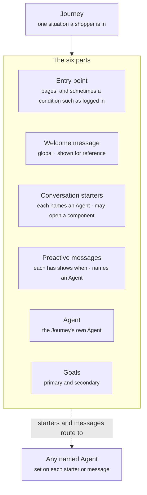

A Journey is one situation a shopper is in, such as browsing a collection, reading a product page, or looking for help with an order. Crossword selects it by its **entry point**, the pages and sometimes a condition that describe that situation. Only one Journey applies to a shopper at a time, and each starter or proactive message it shows routes to the Agent you name for it.

## What a Journey contains

Every Journey has the same six parts. The diagram shows them from the entry point at the top to the goals at the bottom.



| Part | What it holds | Example from the board |
| ---- | ------------- | ---------------------- |
| Entry point | The pages that select this Journey, and sometimes a condition | Arrives on a product page |
| Welcome message | The global greeting. You set it once in [Global settings](/global/overview), and it is the same in every Journey. The Journey card shows it for reference only | "Hi! Energy, sleep, mood or strength: what are you after today?" |
| Conversation starters | The tappable prompts this Journey offers. Each one routes to a named Agent and can open a component | "Is this right for me?" routes to the Product Q&A Agent and opens the quiz if the shopper is unsure |
| Proactive messages | Messages Crossword sends without being asked. Each one carries a "shows when" rule and routes to a named Agent | "Running low? Want to reorder?" shows when the shopper has ordered this product before |
| Agent | The Agent that answers in this Journey | Product Q&A Agent |
| Goals | One primary and one secondary outcome | Primary: add to cart. Secondary: bundle or Subscribe & Save |

## Entry points and the Default Journey

The entry point decides which Journey a shopper is in. Most entry points are pages, such as the home page, collection pages, or every product page. Some add a condition, such as "user is logged in".

- **Selection.** Crossword checks the shopper's page and context against every Journey's entry point and applies the one that matches. When the shopper moves to another page, Crossword checks again.
- **Specificity.** When entry points overlap, the more specific one wins. A Journey for one product's page wins over a Journey for every product page.
- **Fallback.** The **Default Journey** covers any page no other Journey claims. Every shopper is always in exactly one Journey, so there are always starters to tap and an Agent to answer.

On the board, the Product Discovery Journey claims the home and collection pages, the Product Q&A Journey claims product pages, and the Brand FAQ Journey claims the About Us and FAQ pages. A shopper on a blog post matches none of them, so the Default Journey applies.

## Starters and proactive messages route to Agents

Everything a Journey shows leads to an Agent, and the Journey card names that Agent next to each item.

- **Conversation starters** belong to the Journey. The shopper sees them whenever the Journey applies. Tapping one sends it straight to the Agent named next to it. A starter can also open a component, such as the [quiz](/components/interactive/quiz).
- **Proactive messages** each carry their own "shows when" rule, such as 30 seconds on the page, a scroll to the reviews, a paid ad as the arrival source, or a past order. The message shows when its rule is met inside the active Journey. A reply goes straight to the Agent named next to it. Read [Rules](/orchestration/rules) for what a "shows when" rule can test.
- **Typed questions** do not use the Journey's routing. They go through [intent routing](/global/intent-routing), set in Global settings, which sends each question to the right Agent.

A starter can name a different Agent from the Journey's own. On the board, the Default Journey's "What makes you different?" starter goes to the Brand and Support Agent, while its other starters go to the Product Discovery Agent.

## Goals

Each Journey names one primary and one secondary goal. The primary goal is the outcome the Journey exists for. The secondary goal is the next best result when the primary one does not happen.

| Journey | Primary goal | Secondary goal |
| ------- | ------------ | -------------- |
| Default | Interacted | View product page |
| Product Discovery | Interacted | View product page |
| Product Q&A | Add to cart | Bundle or Subscribe & Save |
| Brand FAQ | Answered question or ticket deflection | Back to shopping |
| Support | Ticket deflection | Convert a return to an exchange |

Each Journey's goals become its success metric. Read [Quality and governance](/quality/overview) for how those metrics roll up.

## How it fits

A Journey lives inside an experience, next to the settings and Agents it uses.

- **[Agents](/agents/overview)** answer inside a Journey. The Journey names its Agent, and each starter and proactive message names the Agent it routes to.
- **[Global settings](/global/overview)** hold what every Journey shares: the welcome message, intent routing for typed questions, brand voice, and global guardrails.
- **[Quality and governance](/quality/overview)** measures each Journey against its goals, and tests every Journey before it goes live.
- **[Rules](/orchestration/rules)** is the reference for entry points and "shows when" rules.
- **[Campaigns](/orchestration/campaigns)** handle what happens over time. Read [Journeys vs campaigns](/orchestration/journeys-vs-campaigns) to choose between them.

## Example

The Product Q&A Journey from a gummy supplement store's board, written out as one Journey card.

```yaml
Journey: Product Q&A
Entry point: Arrives on a product page
Welcome message: "Hi! Energy, sleep, mood or strength: what are you after today?"  # global, shown for reference
Conversation starters:
  - Starter: Is this right for me?
    Routes to: Product Q&A Agent
    Does: Checks fit, and opens the quiz if the shopper is unsure
  - Starter: One per product
    Routes to: Product Q&A Agent
    Examples:
      Sleep: Will I wake up groggy?
      Energy: Will I crash later?
      Passion: Works for men and women?
      Creatine: Need a loading phase?
  - Starter: Best value pack?
    Routes to: Product Q&A Agent
Proactive messages:
  - Message: "Curious how fast %Product Name% works? Most people notice it in the first week."
    Shows when: 30 seconds on the product page, or the shopper scrolls to reviews
    Routes to: Product Q&A Agent
  - Message: "Running low on %Product Name%? Want to reorder?"
    Shows when: On the product page, and the shopper has ordered this product before
    Routes to: Product Q&A Agent
  - Message: "Here from our %Ad Angle% ad? Ask me anything about %Product Name%."
    Shows when: Source is a paid ad, and 5 seconds on the product page
    Routes to: Product Q&A Agent
Agent: Product Q&A Agent
Goals:
  Primary: Add to cart
  Secondary: Bundle or Subscribe & Save
```

Tokens such as `%Product Name%` and `%Ad Angle%` are filled in when the message shows.

The board below plans the whole store as Journeys and Agents. Each Journey column follows the same shape as the card above.

<Frame caption="The store's Journeys and Agents, each Journey from entry point to goals">
  
</Frame>

Read [Five Journeys, three Agents](/use-cases/five-journeys-three-agents) for the full setup behind this board.

## Related

<CardGroup cols={2}>
  <Card title="Agents" icon="robot" href="/agents/overview">
    Who answers inside a Journey.
  </Card>
  <Card title="Global settings" icon="globe" href="/global/overview">
    The welcome message, intent routing, and defaults every Journey shares.
  </Card>
  <Card title="Rules" icon="sliders" href="/orchestration/rules">
    Entry points and "shows when" rules.
  </Card>
  <Card title="Journeys vs campaigns" icon="code-branch" href="/orchestration/journeys-vs-campaigns">
    When the situation is enough and when you need a sequence over time.
  </Card>
</CardGroup>
