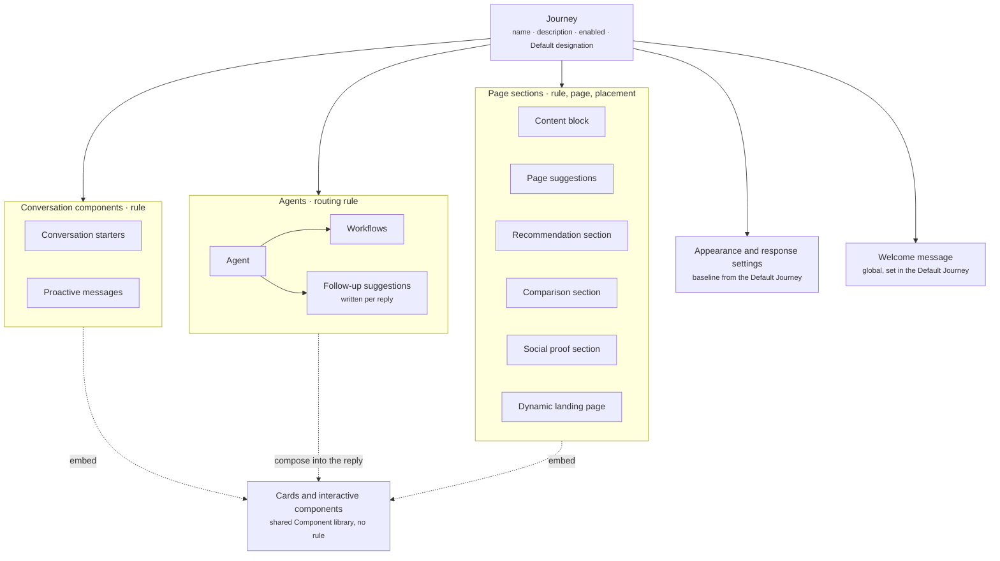

A Journey is a reusable collection of contextual behaviors that Crossword applies when relevant. It lets you group everything a shopper in one situation should see, such as arriving from a video or returning with items in their cart, without writing that situation into every component by hand.

A Journey does not switch on as a whole. Each rule-based component inside it carries its own rule. Enabling the Journey makes those rules eligible for evaluation, and the Rulebook for each component type decides what actually shows.

## What it contains

A Journey is a container. It holds three kinds of rule-based components plus the settings that shape the whole experience. The Default Journey also holds the experience's one welcome message, which carries no rule. The plain components those hold, such as cards and quizzes, come from the shared library.

| Concept | Meaning | Example |
| ------- | ------- | ------- |
| Name and description | What the Journey is for | "YouTube Unboxing: shoppers arriving from unboxing videos" |
| Enabled or disabled | Whether the Journey's rules are eligible for evaluation | Enabled |
| Default designation | Marks the one Journey that supplies baseline settings and fallback content | Default Journey |
| Appearance and response settings | Baseline look, tone, and reply behavior for the experience. Supplied by the Default Journey | Brand colors, reply length |
| Welcome message | The experience's one global welcome message. Only the Default Journey holds it, it carries no rule, and every shopper sees it on every page | "Hello! How can I help?" |
| Conversation components | Conversation starters and proactive messages, each with its own rule | A proactive greeting for video arrivals |
| Agents | The configured assistants this Journey makes available, each with a routing rule. Each Agent writes the follow-up suggestions under its replies, from its instructions, with no rule | A shopping assistant |
| Page sections | Content blocks, page suggestions, recommendation, comparison, and social proof sections, and dynamic landing page configurations, each with a rule, a target page, and a placement | Video context on a product page |

## The Default Journey

Every experience has exactly one Default Journey. It does three jobs.

- It supplies the baseline **appearance and response settings** for the experience.
- It holds the experience's one **welcome message**. The welcome message carries no rule, and every shopper sees it on every page. Other Journeys do not add welcome messages.
- It supplies the **fallback** for every Rulebook. Its components carry no rule, or a rule that always matches, at priority 0.

The Default Journey guarantees a shopper always sees the welcome message, always has starters, and always reaches an Agent, even when no other Journey applies. It cannot be disabled.

## Two principles

**Rules belong to components, not to Journeys.** There is no master condition on a Journey. Each starter, proactive message, Agent, and page section inside it carries its own rule. A starter's rule is the page it shows on, and a priority. The others carry their own conditions and priority, and proactive messages and page sections add timing and delivery restrictions. Cards and interactive components placed inside them carry no rule. Neither does the welcome message, which is global and set once in the Default Journey. Read [Rules](/orchestration/rules).

**Journeys are not mutually exclusive.** A visitor can qualify for YouTube Unboxing, Returning Customer, and VIP Customer at once. The Journeys do not fight. Each contributes candidates to the relevant Rulebook, and the Rulebook resolves them. Read [How rulebooks resolve conflicts](/orchestration/how-rulebooks-resolve).

## How it fits

A Journey lives inside an experience. Below it sit the components it holds. The rule-based ones decide when they show. The cards and interactive components placed inside them come from the shared Component library and carry no rule of their own.

Three things act on Journeys from outside.

- **Rulebooks** take the eligible rules from every enabled Journey and decide what shows.
- **Campaigns** can activate a Journey for a shopper for a defined scope or lifetime, such as their next visit. Read [Journeys vs campaigns](/orchestration/journeys-vs-campaigns).
- **Experiments** split traffic between two or more Journeys and measure a goal. Read [Experiments](/orchestration/experiments).

## Example

The board below plans one web experience for a wellness gummy brand as five Journeys. Each Journey is a column of components, and each component notes the rule that makes it eligible.

- **Default Web Experience Journey.** Starters with no rule, a welcome message that shows on every page, and a discovery Agent that hands off to the quiz or to support by intent. No proactive messages.
- **Product Discovery and Q&A Journey.** Starters set on product pages, home, and collections, and proactive messages such as "Running low? Want to reorder?" for shoppers who ordered before. A product Q&A Agent answers from the product's FAQ and the catalog.
- **Quiz Journey.** Starts when a shopper taps "Find my routine" or says they are not sure. A quiz Agent asks six questions as chips and ends with a diagnosis card and an offer.
- **Brand and Support Journey.** Starters and proactive messages on the About, FAQ, shipping, and returns pages, with a brand FAQ Agent and a support Agent.
- **Traffic sources.** How each arrival, paid social, a search for the brand, or direct, lands in one of the Journeys above, with the proactive message that greets it.

Each Journey lists its goal, such as add to cart, quiz completed, or ticket deflection. The yellow note at the bottom is an open decision the team was still weighing when the board was drawn.

<Frame caption="One web experience planned as five Journeys">
  
</Frame>

## Related

<CardGroup cols={2}>
  <Card title="Rulebooks" href="/orchestration/rulebooks" />
  <Card title="Journeys vs campaigns" href="/orchestration/journeys-vs-campaigns" />
  <Card title="YouTube unboxing journey" href="/use-cases/youtube-unboxing-journey" />
</CardGroup>
