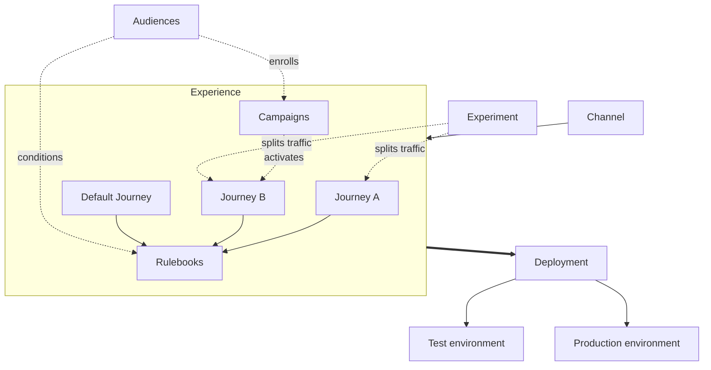

The [Core concepts](/concepts) page shows how content nests. [Components](/components/overview) covers everything a shopper can see or interact with, and [Agents](/agents/overview) covers who composes the assistant reply. This section covers everything that acts on those components: what proposes them, what resolves them, what runs over time, what tests them, and what publishes them.

## The full map

Read it in four parts.

- **Inside the experience.** Journeys propose candidates for each rule-based component type. Rulebooks resolve the proposals into what shows. The Default Journey supplies the fallback. Campaigns run over time and can activate a Journey for a shopper's next visit.
- **Audiences.** Shared segments that Campaigns enroll and that rules on components can test against.
- **Experiments.** Act on Journeys, not on the experience. An experiment splits traffic between two or more Journeys and measures a goal event.
- **Deployment.** Acts on the whole experience. Publishing creates a numbered revision and pushes it to an environment. Each environment has its own installation snippet.

The screenshot shows the overview of a sneaker storefront's Web experience. The side navigation lists Journeys, Rulebooks, Campaigns, Audiences, Pages and placements, Experiments, and Deployment. The summary cards read three Journeys enabled, five Rulebooks, one active Campaign named Cart Recovery, one running Experiment named Product Discovery Method, and Deployment with Test on revision 15 and Production on revision 12.

<Frame caption="Web experience overview with its sections">
  
</Frame>

## In this section

<CardGroup cols={2}>
  <Card title="Channels and experiences" href="/orchestration/channels-and-experiences">
    Where Crossword runs and the container everything lives in.
  </Card>
  <Card title="Journeys" href="/orchestration/journeys">
    Reusable collections of contextual behavior.
  </Card>
  <Card title="Rules" href="/orchestration/rules">
    Conditions, timing, priority, and delivery restrictions on rule-based components.
  </Card>
  <Card title="Rulebooks" href="/orchestration/rulebooks">
    Where proposals from every Journey are resolved.
  </Card>
  <Card title="How rulebooks resolve conflicts" href="/orchestration/how-rulebooks-resolve">
    Priority, winners, limits, and fallback, with worked examples.
  </Card>
  <Card title="Campaigns" href="/orchestration/campaigns">
    Stateful programs that run a sequence over time.
  </Card>
  <Card title="Journeys vs campaigns" href="/orchestration/journeys-vs-campaigns">
    When context is enough and when you need state.
  </Card>
  <Card title="Audiences and segments" href="/orchestration/audiences">
    Static and dynamic segments, membership, entry, and exit.
  </Card>
  <Card title="Pages and placements" href="/orchestration/pages-and-placements">
    Dynamic landing pages and personalising existing pages.
  </Card>
  <Card title="Experiments" href="/orchestration/experiments">
    Split traffic between Journeys and measure a goal.
  </Card>
  <Card title="Deployment" href="/orchestration/deployment">
    Environments, publishing, revisions, and installation.
  </Card>
</CardGroup>
