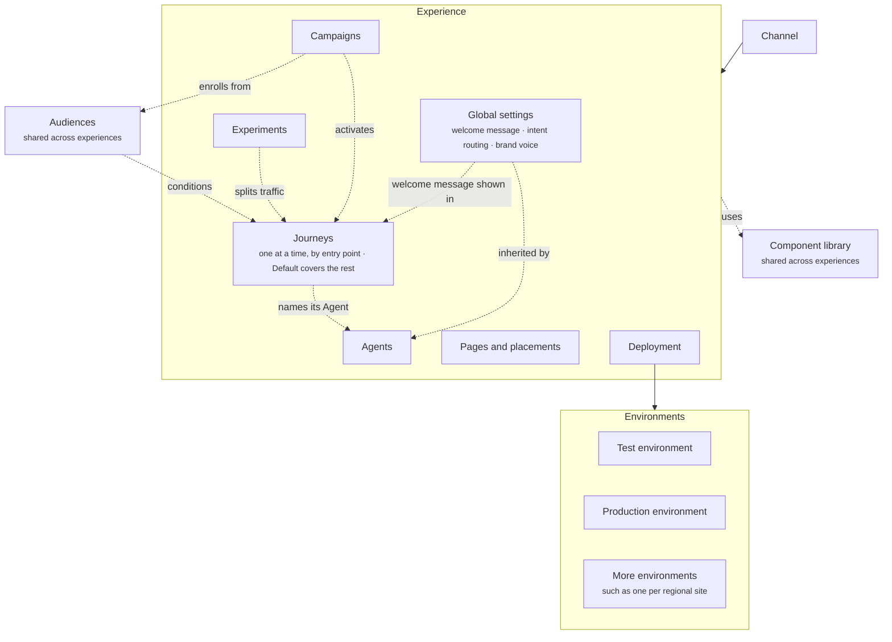

The [Core concepts](/concepts) page shows how content nests. [Components](/components/overview) covers everything a shopper can see or interact with, and [Agents](/agents/overview) covers who composes the assistant reply. This section covers the experience that holds them and everything that acts on them: the rules that select a Journey, what runs over time, what tests it, and what publishes it.

## The full map

Read it in five parts.

- **Inside the experience.** [Global settings](/global/overview) hold what every Journey and Agent shares. Each Journey is selected by its entry point, and one applies to a shopper at a time. The Default Journey covers any page no other Journey claims. Each Journey names the [Agent](/agents/overview) that answers in it. Pages and placements hold the page sections Crossword places on your storefront.
- **Campaigns.** Run over time and can activate a Journey for a shopper's next visit.
- **Audiences.** Shared segments that Campaigns enroll and that entry points and "shows when" rules can test against.
- **Experiments.** Act on Journeys, not on the experience. An experiment splits traffic between two or more Journeys and measures a goal event.
- **Deployment.** Publishes the whole experience. Publishing creates a numbered revision and pushes it to an environment. Each environment has its own installation snippet.

## In this section

<CardGroup cols={2}>
  <Card title="Channels and experiences" href="/orchestration/channels-and-experiences">
    Where Crossword runs and the container everything lives in.
  </Card>
  <Card title="Journeys" href="/orchestration/journeys">
    One situation a shopper is in, selected by its entry point.
  </Card>
  <Card title="Rules" href="/orchestration/rules">
    Entry points, shows when rules on proactive messages, and page section rules.
  </Card>
  <Card title="Global settings" href="/global/overview">
    The welcome message, intent routing, and defaults every Journey shares.
  </Card>
  <Card title="Campaigns" href="/orchestration/campaigns">
    Stateful programs that run a sequence over time.
  </Card>
  <Card title="Journeys vs campaigns" href="/orchestration/journeys-vs-campaigns">
    When context is enough and when you need state.
  </Card>
  <Card title="Audiences and segments" href="/orchestration/audiences">
    Static and dynamic segments, membership, entry, and exit.
  </Card>
  <Card title="Pages and placements" href="/orchestration/pages-and-placements">
    Dynamic landing pages and personalising existing pages.
  </Card>
  <Card title="Experiments" href="/orchestration/experiments">
    Split traffic between Journeys and measure a goal.
  </Card>
  <Card title="Deployment" href="/orchestration/deployment">
    Environments, publishing, revisions, and installation.
  </Card>
</CardGroup>
