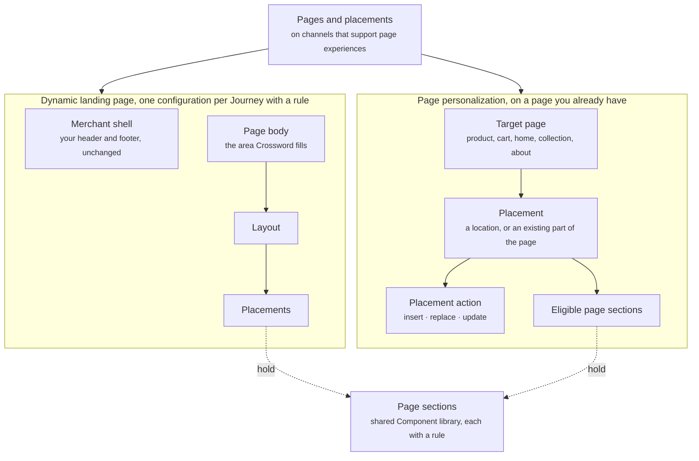

Pages and placements are how Crossword changes what a shopper sees on a page, not only in the chat. A dynamic landing page gives Crossword a whole page body to fill. Page personalization gives it a placement on a page you already have.

This applies to channels that support page experiences, such as Web. Conversation-only channels such as Instagram and iMessage do not have pages or placements.

## What it contains

The diagram shows the two ways Crossword reaches a page, what a dynamic landing page is made of, what page personalization is made of, and where the page sections that fill both come from.

| Concept | Meaning | Example |
| ------- | ------- | ------- |
| Dynamic landing page | A page whose body Crossword controls, inside your storefront's shell | A landing page for visitors from a video |
| Merchant shell | Your header and footer, unchanged | Your navigation and footer links |
| Page body | The area Crossword fills | Everything between header and footer |
| Layout and placements | The arrangement of the body and the placements in it | Hero, two-column section, full-width section |
| Page personalization | Changing part of a page you already have | A recommendation section on the cart page |
| Target page | The page type or path personalization applies to | Product, cart, home, collection, about, or another approved page |
| Placement | Where on the target page the change lands | A location on the page, or an existing part of the page |
| Placement action | How the change is applied: insert, replace, or update | Insert above the reviews section |
| Eligible page sections | Which page sections, with which settings, the placement can hold | Recommendation section, content block |

## Dynamic landing pages

A dynamic landing page keeps your storefront's header and footer and hands the body to Crossword. You define the layout and its placements, and each placement holds a page section from the [Component library](/components/overview).

Each landing page configuration lives inside a Journey with its own rule. When a visitor arrives, the dynamic landing page selection Rulebook picks one configuration. The page section in each placement is then chosen by the component selection by page placement Rulebook. Read [Rulebooks](/orchestration/rulebooks).

## Page personalization

Page personalization works on pages you already have. You pick a target page, a placement, and an action.

- **Target pages.** Product, cart, home, collection, about, and other approved pages.
- **Placements.** A location on the page, such as above the fold or after the product description, or an existing part of the page such as your reviews section.
- **Actions.** **Insert** adds a page section at the placement. **Replace** swaps the existing content for a page section. **Update** keeps the existing part of the page and changes its content.

Each placement lists the page sections it can hold. A placement that replaces the merchant reviews block accepts a social proof section. A placement above the add-to-cart button accepts a content block or a recommendation section.

Page sections fill placements: content blocks, page suggestions, recommendation sections, comparison sections, and social proof sections. Read [Page sections](/components/page/page-sections) and [Page suggestions](/components/page/page-suggestions).

## How it fits

Pages and placements live inside an experience. The page sections themselves live inside Journeys, each with a rule, a target page, and a placement. Two Rulebooks resolve them: dynamic landing page selection returns one page configuration, and component selection by page placement returns one page section per placement. Every page section comes from the shared Component library.

Page sections carry the same rules as conversation components, plus timing and delivery restrictions. A page section can react to UTM parameters, segment membership, and cart contents like any other rule-based component. Read [Rules](/orchestration/rules).

## Example

A sneaker brand runs an unboxing campaign on YouTube. Visitors from the video land on a dynamic landing page: the brand's own header and footer, with a Crossword-controlled body that shows the pair from the video, a comparison with two alternatives, and reviews that mention fit. On the product page for that pair, page personalization inserts a "Why this is right for you" content block above the existing reviews section.

The screenshot shows the **Pages and placements** screen of the Web experience. The Dynamic landing pages tab has Unboxing landing page open, with its rule reading `utm_campaign` equals `unboxing-a` and a body of three sections: the featured product, a comparison section with two alternatives, and a social proof section filtered to reviews that mention fit. The Placements tab beside it lists the product page template with a placement named Above reviews, filled by the content block "Why this is right for you".

<Frame caption="Unboxing landing page and a product page placement">
  
</Frame>

## Related

<CardGroup cols={2}>
  <Card title="Page sections" href="/components/page/page-sections" />
  <Card title="Page suggestions" href="/components/page/page-suggestions" />
</CardGroup>
