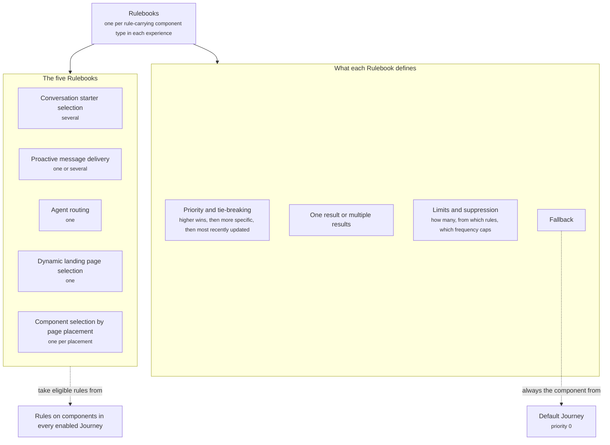

A Rulebook is the engine for one component type that looks at every eligible rule from every enabled Journey and decides what shows. It is how several Journeys can propose the same kind of component without fighting.

There is one Rulebook per rule-carrying component type in each experience. Journeys propose. Rulebooks decide.

## What it contains

The diagram shows the five Rulebooks, what each one defines, and where its candidates and its fallback come from.

| Concept | Meaning | Example |
| ------- | ------- | ------- |
| Priority and tie-breaking | Which candidate wins when more than one rule matches. Higher priority wins. Ties go to the more specific rule, then to the most recently updated | Priority 8 beats priority 7 |
| One result or multiple results | Whether the Rulebook returns a single winner or a set | Page placement returns one per placement. Conversation starters return a set |
| Limits and suppression | How many results to return, how to draw them from the matching rules, and which frequency caps apply | Take 2 from the highest, then 1 from each, total 3 |
| Fallback | What to return when nothing matches. Always the Default Journey's component | The Default Journey's starters |

## The five Rulebooks

| Rulebook | Result mode | What it decides |
| -------- | ----------- | --------------- |
| Conversation starter selection | Several | Which starters appear under the welcome message, up to a total limit |
| Proactive message delivery | One or several, your choice per experience | Which proactive messages are delivered, and whether they stack or only the first shows |
| [Agent routing](/agents/routing) | One | Which Agent takes the conversation |
| Dynamic landing page selection | One | Which landing page configuration a visitor is served |
| Component selection by page placement | One per placement | Which page section fills each placement on a page |

Multiple-result Rulebooks carry extra settings for how the set is built: how many to take from the highest-priority matching rule, how many from each remaining rule, and the total limit. The proactive message Rulebook adds a choice between **First by priority** and **Stack**.

## Fallback

Every Rulebook falls back to the Default Journey. The Default Journey's components carry no rule, or a rule that always matches, at priority 0. Because they always match and always lose to anything higher, they show only when nothing else applies. This is what guarantees the shopper always has starters and always reaches an Agent.

The welcome message has no Rulebook. It carries no rule, and there is one per experience, set in the Default Journey. Every shopper sees the same welcome message on every page. Read [Welcome message](/components/conversation/welcome-message).

## How it fits

Rulebooks sit inside an experience, beside Journeys. They take input from the rules on components in every enabled Journey and hand the result to the conversation, the page, or the channel.

Rulebooks do not hold content and do not hold conditions. Components come from the Component library, and conditions live on the components themselves. Read [Rules](/orchestration/rules) for what a rule contains.

Campaigns feed Rulebooks indirectly. When a Campaign activates a Journey for a shopper, that Journey's rules become eligible for that shopper, and the Rulebooks evaluate them like any other. Read [Campaigns](/orchestration/campaigns).

## Example

Three Journeys are enabled: YouTube Unboxing, Instagram Ad, and Default. A visitor arrives from an Instagram ad about a discount and lands on a product page. Each Journey proposes a page section for the placement after the product description. The component selection by page placement Rulebook walks the candidates from the highest priority down and returns the first match: the "Deals under $50" recommendation section from the Instagram Ad Journey. The YouTube content block did not match, and the Default section was never needed.

The full walk-through, with conversation starters and proactive messages as well, is in [How rulebooks resolve conflicts](/orchestration/how-rulebooks-resolve).

The screenshot shows the **Rulebooks** screen with the five Rulebooks listed and Component selection by page placement open on the product page's after-description placement. Result mode reads One per placement and tie-breaking reads More specific, then most recently updated. The Candidates panel lists four page sections from the three enabled Journeys with priorities 10, 8, 7, and 0. A preview for a visitor arriving from an Instagram ad about a discount highlights "Deals under $50" at priority 8 as the winner.

<Frame caption="Page placement Rulebook with its candidates">
  
</Frame>

## Related

<CardGroup cols={2}>
  <Card title="How rulebooks resolve conflicts" href="/orchestration/how-rulebooks-resolve" />
  <Card title="Rules" href="/orchestration/rules" />
</CardGroup>
