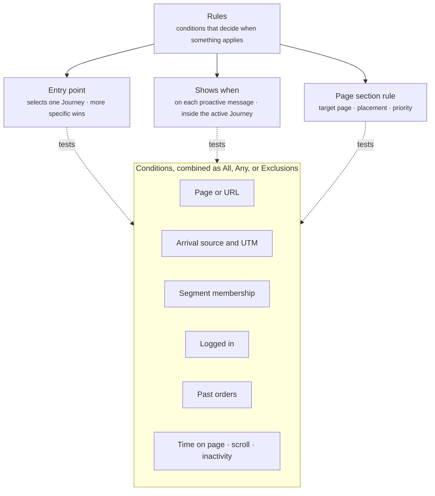

A rule is a set of conditions that decides when something applies. Crossword uses rules in three places. An **entry point** selects the Journey a shopper is in. A **"shows when" rule** decides when a proactive message appears inside that Journey. A **page section rule** decides where and when a section shows on a merchant page.

Everything else in a Journey follows from the Journey the shopper is in. Conversation starters show whenever their Journey applies. The welcome message is global and set in [Global settings](/global/overview). Tapped starters and proactive messages go straight to the Agent named next to them, and typed questions go through [intent routing](/global/intent-routing). Read [Core concepts](/concepts#which-components-carry-rules) for the full table.

The diagram shows the three kinds of rule, what each one decides, and the conditions they draw on.

| Rule | Lives on | What it decides |
| ---- | -------- | --------------- |
| Entry point | A Journey | Which Journey the shopper is in |
| Shows when | A proactive message | When the message appears inside the active Journey |
| Page section rule | A page section | Where on the page the section goes, and whether it shows |

## Entry points

An entry point is the set of pages, and sometimes a condition, that selects a Journey. Most entry points are pages alone. Some add a condition, such as "user is logged in".

| Journey | Entry point |
| ------- | ----------- |
| Default | Any page not covered by another Journey |
| Product Discovery | Arrives on the home page or a collection page |
| Product Q&A | Arrives on a product page |
| Brand FAQ | Arrives on the About Us or FAQ page |
| Support | Arrives on the shipping, returns, or contact page, or the user is logged in |

One Journey applies to a shopper at a time. When entry points overlap, the more specific one wins. A Journey for one product's page wins over a Journey for every product page. The Default Journey matches any page, so it applies only when no other entry point does.

## Shows when rules

Each proactive message carries its own "shows when" rule. The message appears when its rule is met inside the active Journey. A proactive message in a Journey the shopper is not in never shows.

| Proactive message | Shows when |
| ----------------- | ---------- |
| "Curious how fast `%Product Name%` works? Most people notice it in the first week." | 30 seconds on the product page, or the shopper scrolls to reviews |
| "Running low on `%Product Name%`? Want to reorder?" | On the product page, and the shopper has ordered this product before |
| "Here from our `%Ad Angle%` ad? Ask me anything about `%Product Name%`." | Source is a paid ad, and 5 seconds on the product page |
| "Hi! Need help with an order or a return?" | 10 seconds on the returns page |

A "shows when" rule can also carry delivery restrictions, so a message does not repeat too often.

| Restriction | Meaning | Example |
| ----------- | ------- | ------- |
| Frequency cap | The maximum number of deliveries per shopper in a period | Once per session |
| Suppression | Conditions under which the message is skipped even though its rule is met | Skip if the shopper has already opened chat this session |
| Repeat behavior | What happens after the shopper dismisses or acts on the message | Do not show again for 7 days |

## Page section rules

A [page section](/components/page/page-sections) carries its own rule, separate from any Journey. The rule names a target page and a placement, and can use every condition on this page.

| Field | What you set |
| ----- | ------------ |
| Target page | Required. Product, cart, home, collection, about, or another approved page |
| Placement | Required. A location on the page, or an existing part of the page such as your reviews block |
| Placement action | Required. Insert the section at the placement, replace what is there, or update it in place |
| Conditions | Any of the conditions below, combined with All, Any, and Exclusions |
| Priority | Orders sections that target the same placement. The highest-priority match shows |
| Timing | Optional. A delay after the page loads, or a scheduled window |
| Delivery restrictions | Optional. Frequency cap, suppression, and repeat behavior |

Target pages and placements are set up under [Pages and placements](/orchestration/pages-and-placements).

## Conditions

Conditions test the current page and session. Entry points, "shows when" rules, and page section rules draw on the same list.

| Condition | What it tests | Example |
| --------- | ------------- | ------- |
| Page or URL | The page the shopper is on, by type or by path | Page type is product, or path starts with `/collections/` |
| Arrival source | Where the shopper came from, whether or not UTM parameters are present | Source is a paid ad, or Google brand search |
| UTM parameters | `utm_source`, `utm_medium`, `utm_campaign`, `utm_content`, or `utm_term` on the arrival URL | `utm_campaign` equals `unboxing-a` |
| Segment membership | Whether the shopper's profile is in a segment | Member of "High-value customers" |
| Logged in | Whether the shopper is signed in to your store | User is logged in |
| Past orders | What the shopper has ordered before | Has ordered this product before |
| Time on page | How long the shopper has been on the current page | 30 seconds on the product page |
| Scroll | How far the shopper has scrolled, or whether they reached a part of the page | Scrolls to reviews |
| Inactivity | How long the shopper has gone without interacting | 15 seconds with no engagement |

Time on page, scroll, and inactivity describe what the shopper does after arriving. They suit "shows when" rules and page section timing, not entry points.

## Condition combinations

A rule can hold more than one condition. You choose how they combine.

- **All.** Every condition must match.
- **Any.** At least one condition must match.
- **Exclusions.** Conditions that must not match. An exclusion stops the rule from matching even when everything else does.

You can combine these. The Support Journey's entry point uses Any: the shipping, returns, or contact page, or the user is logged in. The paid ad message uses All: the source is a paid ad, and 5 seconds have passed on the product page.

## Example

A proactive message in the Product Q&A Journey, written out in plain language.

> **Journey:** Product Q&A, entry point is any product page.
> **Shows when (all):** the source is a paid ad, and 5 seconds on the product page.
> **Exclusion:** the shopper has already opened chat this session.
> **Delivery restrictions:** once per session.
> **Content:** "Here from our `%Ad Angle%` ad? Ask me anything about `%Product Name%`."
> **Routes to:** Product Q&A Agent.

A shopper clicks a paid ad and lands on a product page. The product page entry point puts them in the Product Q&A Journey. Five seconds later the "shows when" rule is met, and the message appears. If the shopper replies, the conversation goes straight to the Product Q&A Agent.

## Related

<CardGroup cols={2}>
  <Card title="Journeys" href="/orchestration/journeys" />
  <Card title="Proactive messages" href="/components/conversation/proactive-message" />
  <Card title="Page sections" href="/components/page/page-sections" />
  <Card title="Intent routing" href="/global/intent-routing" />
</CardGroup>
