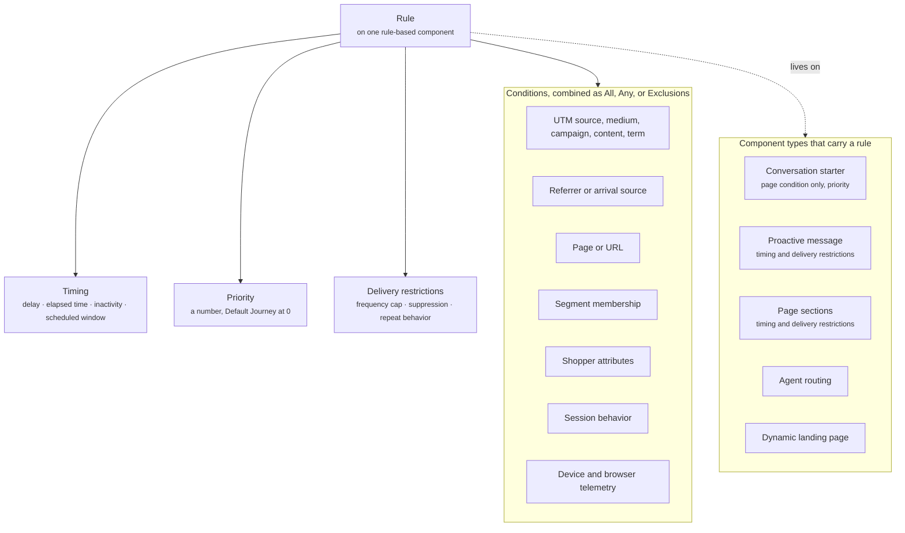

A rule is the set of conditions, timing, priority, and delivery restrictions attached to one rule-based component. Rules live on the component, not on the Journey. A Journey has no master condition. Enabling a Journey makes the rules on its components eligible for evaluation, and the Rulebook for each component type decides what wins.

Not every component carries a rule. Conversation starters, proactive messages, and every page section do. Agent routing and dynamic landing page selection follow the same model. A conversation starter's rule is the narrowest: its only condition is the page it shows on. Cards, interactive components, primitives, and the assistant reply carry no rule. They show because a rule-based component or an Agent placed them. The welcome message carries no rule either. It is global: one per experience, set in the Default Journey, and every shopper sees it. [Follow-up suggestions](/components/conversation/follow-up-suggestion) carry no rule: they are configured in the Agent's [instructions](/agents/instructions-and-model), and the Agent writes them for each reply. Read [Core concepts](/concepts#which-components-carry-rules) for the full table.

This page is the reference for what a rule can contain. For how competing rules are resolved, read [How rulebooks resolve conflicts](/orchestration/how-rulebooks-resolve).

A rule has up to four parts.

The diagram shows the four parts a rule is built from and the component types that carry one.

| Part | What it answers |
| ---- | --------------- |
| Conditions | Is this component a candidate right now? |
| Timing | When should it appear? Only on component types that support it |
| Priority | Which candidate wins when more than one matches? |
| Delivery restrictions | How often, and when not? Only on component types that support it |

## Conditions

Conditions test the current session. A component becomes a candidate when its conditions match. Conversation starters use only the page or URL condition. The other rule-based components can use every condition in this table.

| Condition | What it tests | Example |
| --------- | ------------- | ------- |
| UTM source | `utm_source` on the arrival URL | `utm_source` equals `youtube` |
| UTM medium | `utm_medium` on the arrival URL | `utm_medium` equals `video` |
| UTM campaign | `utm_campaign` on the arrival URL | `utm_campaign` equals `unboxing-a` |
| UTM content | `utm_content` on the arrival URL | `utm_content` contains `discount` |
| UTM term | `utm_term` on the arrival URL | `utm_term` equals `running-shoes` |
| Referrer or arrival source | Where the visitor came from, whether or not UTM parameters are present | Referrer is Instagram |
| Page or URL | The page the shopper is on, by type or by path | Page type is product, or path starts with `/collections/` |
| Segment membership | Whether the shopper's profile is in a segment | Member of "High-value customers" |
| Shopper attributes | Values on the shopper's profile | Signed in, lifetime orders over 3, preferred size known |
| Session behavior | What the shopper has done this session | Scroll depth over 50%, cart contains Product A, previously opened chat |
| Device and browser telemetry | Device type, operating system, browser, viewport | Device is mobile |

## Condition combinations

A rule can hold more than one condition. You choose how they combine.

- **All.** Every condition must match.
- **Any.** At least one condition must match.
- **Exclusions.** Conditions that must not match. An exclusion removes the component from candidacy even when everything else matches.

You can combine these. A rule can require all of a set of conditions, and exclude a segment.

## Timing

Timing controls when a candidate component appears once its conditions match. Timing is only available on component types that show something after a delay or in a window. It is not available on components that render as soon as the conversation or page opens.

| Timing option | Meaning | Example |
| ------------- | ------- | ------- |
| Delay | Wait a fixed time after the conditions match | 10 seconds after page load |
| Elapsed time | Wait until the shopper has been on the page or in the session for a duration | 60 seconds on the product page |
| Inactivity | Wait until the shopper has not interacted for a duration | 15 seconds with no engagement |
| Scheduled window | Only within a date and time range | 1 to 31 December |

## Priority

Priority is a number on each rule. When more than one candidate matches, the Rulebook considers them from the highest priority down. A single-result Rulebook takes the first match. A multiple-result Rulebook takes from the highest first and then works down, subject to its limits.

Components in the Default Journey sit at priority 0. That makes them the fallback: they win only when nothing else matches. Read [Rulebooks](/orchestration/rulebooks) for how ties are broken.

## Delivery restrictions

Delivery restrictions limit how often a component is delivered to the same shopper. They are only available on component types that push content to the shopper rather than waiting to be asked.

| Restriction | Meaning | Example |
| ----------- | ------- | ------- |
| Frequency cap | The maximum number of deliveries per shopper in a period | Once per session, or twice per week |
| Suppression | Conditions under which the component is skipped even though it matched | Skip if the shopper has already opened chat this session |
| Repeat behavior | What happens after the shopper dismisses or acts on the component | Do not show again for 7 days |

A candidate that has hit its frequency cap is skipped by the Rulebook, even if it wins on priority.

## Which components carry a rule

Every rule-based component supports conditions and priority. Conversation starters take one condition, the page. The others support every condition and combination. Timing and delivery restrictions apply only where the component's behavior calls for them. Nothing outside this table carries a rule.

| Rule-based component | Conditions | Priority | Timing | Delivery restrictions |
| -------------------- | ---------- | -------- | ------ | --------------------- |
| [Conversation starter](/components/conversation/conversation-starter) | Page only | Yes | No | No |
| [Proactive message](/components/conversation/proactive-message) | Every condition | Yes | Delay, elapsed time, inactivity, scheduled window | Frequency cap, suppression, repeat behavior |
| [Page sections](/components/page/page-sections) | Every condition | Yes | Delay, scheduled window | Frequency cap, suppression, repeat behavior |
| [Agent routing](/agents/routing) | Every condition | Yes | No | No |
| [Dynamic landing page](/orchestration/pages-and-placements#dynamic-landing-pages) | Every condition | Yes | No | No |

Page sections are the content block, page suggestions, recommendation section, comparison section, and social proof section. Each one carries the same rule shape.

## Example

A proactive message in the YouTube Unboxing Journey, written out in plain language.

> **Conditions (all):** `utm_campaign` equals `unboxing-a`, and the page type is product.
> **Exclusion:** the shopper is a member of "Opened chat this session".
> **Timing:** 15 seconds of inactivity.
> **Priority:** 10.
> **Delivery restrictions:** once per session. If dismissed, do not show again for 7 days.
> **Content:** "Need help finding your size?"

When a visitor lands on a product page from the unboxing video and does nothing for 15 seconds, this message becomes a candidate. The proactive message Rulebook then compares it with any other matching proactive messages from other enabled Journeys and delivers the winner.

The screenshot shows the rule editor for this proactive message inside the YouTube Unboxing Journey. Conditions lists `utm_campaign` equals `unboxing-a` and Page type is product, combined with All, and the exclusion reads Member of "Opened chat this session". Timing is set to Inactivity, 15 seconds. Priority is 10. Delivery restrictions shows a frequency cap of Once per session and repeat behavior of Do not show again for 7 days, and the content field reads "Need help finding your size?".

<Frame caption="Rule editor for a proactive message, priority 10">
  
</Frame>

## Related

<CardGroup cols={2}>
  <Card title="Rulebooks" href="/orchestration/rulebooks" />
  <Card title="How rulebooks resolve conflicts" href="/orchestration/how-rulebooks-resolve" />
  <Card title="Component library" href="/components/overview" />
  <Card title="Page sections" href="/components/page/page-sections" />
</CardGroup>
