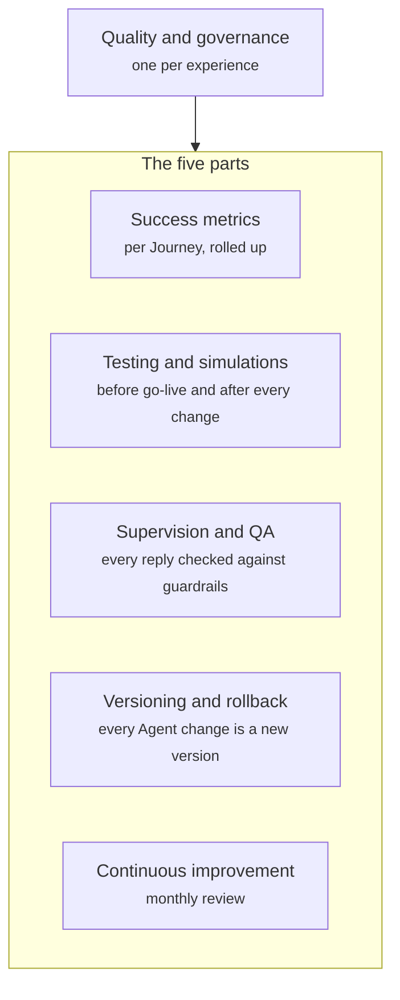

Quality and governance is how you keep an experience working well after it goes live. You measure each Journey against its goals, test every change before shoppers see it, check replies as they are written, keep a version history for every Agent, and feed what you learn back into the experience.

## What it contains

Quality and governance has five parts.



| Part | What it does |
| ---- | ------------ |
| Success metrics | Measures each Journey against its goals, and rolls the results up for the whole experience |
| Testing and simulations | Runs test conversations for every Journey before go-live and after every change |
| Supervision and QA | Checks every reply against the guardrails, and puts flagged conversations in front of your team |
| Versioning and rollback | Saves every change to an Agent as a new version you can roll back to |
| Continuous improvement | Turns unanswered questions into knowledge and tunes the experience each month |

## Success metrics

Each Journey has its own success metrics, taken from its primary and secondary goals. The Product Q&A Journey, for example, measures add to cart first and bundle or Subscribe & Save second. Read [Journeys](/orchestration/journeys).

Across the experience, the Journey metrics roll up to four numbers:

- **Chat-assisted revenue.** Orders placed after a conversation with an Agent.
- **Resolution rate.** The share of conversations resolved in chat.
- **Ticket deflection.** Questions answered in chat that would otherwise have become a support ticket.
- **CSAT.** How satisfied shoppers say they are. Read [Feedback and CSAT](/components/conversation/feedback).

## Testing and simulations

Before a Journey goes live, you run test conversations through it. Each test plays out a shopper's question or tap and checks the result against pass criteria:

- The right Agent answers.
- The right product is shown.
- No guardrail is broken.

Tests re-run after every change, so an edit to one Agent cannot quietly break another Journey.

## Supervision and QA

Every reply is checked against the guardrails as it is written, both the [global guardrails](/global/overview#global-guardrails) and the Agent's own. A reply that would break a guardrail does not reach the shopper.

Your team reviews every flagged conversation. They also review a sample of conversations each week, so problems that no guardrail catches still surface.

## Versioning and rollback

Every change to an Agent is saved as a new version. You can roll back to any earlier version at any time.

Agent versions sit alongside experience revisions. When you publish the experience to an environment, Crossword creates a numbered revision. Read [Deployment](/orchestration/deployment). To compare two approaches with real traffic, run an A/B test. Read [Experiments](/orchestration/experiments).

## Continuous improvement

Questions the Agents could not answer become new knowledge, so the next shopper who asks gets an answer. Read [Knowledge and context](/agents/knowledge-and-context).

Once a month, your team reviews the metrics and a set of conversations. The review tunes each Agent's operating procedure, the conversation starters, and the proactive messages. Read [Goal and operating procedure](/agents/goal-and-operating-procedure).

## Example

The quality and governance plan from a gummy supplement store's board, written out in full.

```yaml
Quality and governance:
  Success metrics:
    Per Journey: Each Journey's own goals
    Rolled up:
      - Chat-assisted revenue
      - Resolution rate
      - Ticket deflection
      - CSAT
  Testing and simulations:
    When: Test conversations for every Journey before go-live, re-run after every change
    Pass criteria:
      - The right Agent answers
      - The right product is shown
      - No guardrail is broken
  Supervision and QA:
    Every reply: Checked against the guardrails as it is written
    Team review: Flagged conversations, plus a weekly sample
  Versioning and rollback:
    Versions: Every change to an Agent is a new version
    Rollback: To any earlier version, at any time
    A/B tests: Run as an Experiment
  Continuous improvement:
    Knowledge: Questions the Agents could not answer become new knowledge
    Monthly review: Metrics and conversations, to tune operating procedures, starters, and proactive messages
```

In practice, the store's team sees that shoppers on the Sleep gummies page keep asking whether the gummies melt in a hot car. The Product Q&A Agent has no answer, so it offers to connect them with the team. The question lands in the unanswered list, the team adds the answer to the product's FAQ, and the test conversations for the Product Q&A Journey re-run before the change goes live.

## Related

<CardGroup cols={2}>
  <Card title="Journeys" href="/orchestration/journeys" />
  <Card title="Global settings" href="/global/overview" />
  <Card title="Deployment" href="/orchestration/deployment" />
  <Card title="Experiments" href="/orchestration/experiments" />
</CardGroup>
