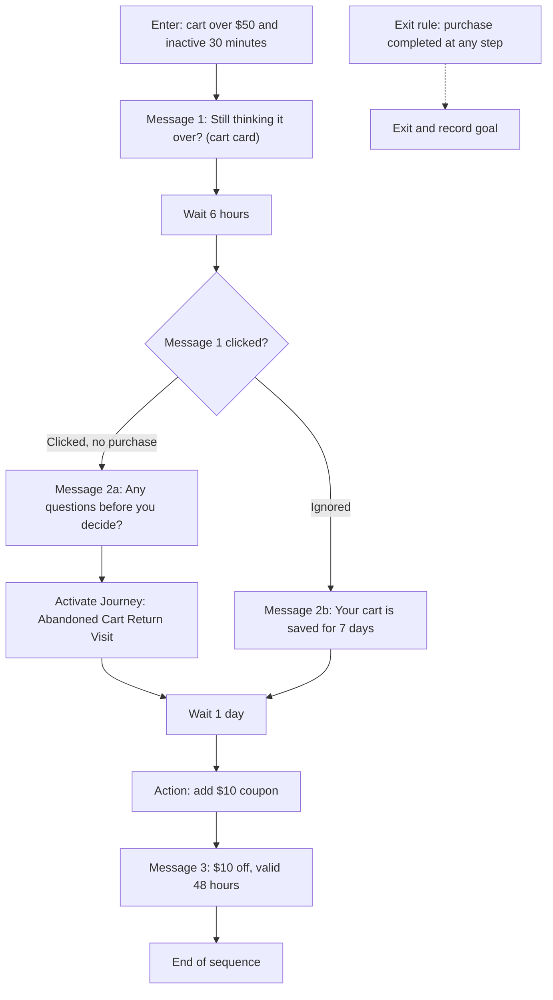

A shopper on your storefront adds Product A and Product B to the cart, $150 in total, and closes the tab. Most of those carts never come back on their own. The merchant goal is to recover abandoned carts above $50 by following up over the next day, changing the message depending on how the shopper responds, and stopping the instant they buy. That needs memory of where each shopper is, which is why this is a [Campaign](/orchestration/campaigns) and not a Journey.

## What the shopper sees

Because the journey runs over a day, the image below is a strip of three small screenshots in sequence. The first is the cart with Product A and Product B at $150 just before the shopper leaves, and the second is the first message, "Still thinking it over? Your cart is saved." with the cart card showing both items. The third is the return visit, where the activated Journey greets the shopper with a proactive message, "Welcome back. Your cart is right where you left it.", with a **Go to my cart** suggestion beneath it.

<Frame caption="Cart, first message, and return visit in sequence">
  
</Frame>

Follow one shopper over about 30 hours. Messages go out on the channel your experience runs on.

| When | What happens |
| ---- | ------------ |
| 2:00 pm, day 1 | The shopper adds Product A and Product B, $150 in total, and leaves. |
| 2:30 pm | Thirty minutes with no activity. The shopper enters the abandoned-cart segment and is enrolled in the Campaign. They have not purchased, so the first message goes out: "Still thinking it over? Your cart is saved." with a cart card showing both items. |
| 8:30 pm | Six hours later the Campaign checks whether the shopper clicked that message. Two paths open up. |
| 8:30 pm, clicked path | The shopper opened the message but did not buy. They get "Any questions before you decide? Ask me about sizing or delivery." The Campaign also activates a Journey called Abandoned Cart Return Visit, so on their next visit to the storefront a proactive message greets them with "Welcome back. Your cart is right where you left it." and shows a **Go to my cart** suggestion beneath it. |
| 8:30 pm, ignored path | The shopper never opened the first message. They get a different angle: "Your cart is saved for 7 days. Product A is down to the last few in your size." |
| 8:30 pm, day 2 | One day later, both paths meet. The Campaign applies a $10 coupon to the shopper's account and sends "$10 off your cart, valid for 48 hours." |
| Any time | The shopper completes the purchase. They exit the Campaign immediately, wherever they were in the sequence, and the goal is recorded. |

If the same shopper abandons another cart three days later, nothing happens. Re-entry is limited to once every 7 days.

## Building blocks used

- **Segment.** A dynamic segment named High-value abandoned carts. Rule: cart value over $50 and no activity for 30 minutes. Membership recalculates continuously, so a shopper enters when both conditions become true and leaves when either stops being true. See [Audiences and segments](/orchestration/audiences).
- **Campaign.** Cart Recovery. Audience is the segment above. Entry trigger is segment entry. Re-entry once every 7 days. Exit rule is purchase completed. Goal event is `purchase_completed`.
- **Sequence.** Seven steps: a campaign message, a wait, a branch, two campaign messages on the branch paths, a Journey activation, a wait, an action, and a final campaign message.
- **Campaign messages.** Four [proactive messages](/components/conversation/proactive-message), one per send. Each holds its own content and carries a Campaign reference instead of a rule. The first embeds a [cart card](/components/cards/cart-checkout-card) so the shopper sees exactly what they left.
- **Action.** Add coupon, which applies a $10 code to the shopper before the final message.
- **Journey activation.** Makes the Abandoned Cart Return Visit [Journey](/orchestration/journeys) applicable on the shopper's next visit. That Journey holds a return greeting sent as a [proactive message](/components/conversation/proactive-message) with a **Go to my cart** suggestion in its suggestion set, and a second proactive message for the cart page. Each carries a lightweight rule, because the activation already limits who can see them. The cart prompt is a suggestion on the greeting, not a [conversation starter](/components/conversation/conversation-starter), because starters are set by page only and do not depend on the cart. The [welcome message](/components/conversation/welcome-message) does not change. It is global and set in the Default Journey, so the return greeting is a proactive message instead.
- **Audience-exit behavior.** Set to **Continue Campaign**, for a reason explained in the steps below.

Here is the sequence as a flow.

The exit rule is not a step. Crossword evaluates it continuously, so a shopper who buys during the six-hour wait leaves without ever receiving the second message.

## Step by step

<Steps>
  <Step title="Define the segment">
    Go to **Audiences** and click **New segment**. Choose **Dynamic**. Name it `High-value abandoned carts`. Add two conditions and set them to match **all**: **Cart value** is greater than `2000`, and **Last activity** is more than `30` minutes ago. Use **Preview** to see how many profiles currently qualify, then save. Because the segment is dynamic, you never maintain the list. Shoppers enter and leave as their carts and activity change.
  </Step>
  <Step title="Create the return-visit Journey">
    Before the Campaign, build the Journey it will activate. Go to **Journeys**, click **New Journey**, and name it `Abandoned Cart Return Visit`. Add two components. A **Proactive message** with no conditions, timing **Delay** of `1` second, priority `20`, and a frequency cap of once per session, reading "Welcome back. Your cart is right where you left it." Add a suggestion set to it with one suggestion labelled **Go to my cart**, whose action opens the cart. A **Proactive message** with the condition **Page type** is **Cart**, timing **Inactivity** of `20` seconds, priority `20`, reading "Want me to check delivery to your pincode before you check out?" Leave this Journey **disabled**. A Campaign activation makes it applicable for enrolled shoppers only, so it never needs to be enabled for everyone. The high priority means its greeting wins over other Journeys' candidates for those shoppers.
  </Step>
  <Step title="Create the Campaign">
    Go to **Campaigns** and click **New Campaign**. Name it `Cart Recovery`. Under **Goal**, name the goal `Complete purchase` and pick the `purchase_completed` event. The goal is what the Campaign reports against. It is separate from the exit rule, which you set next.
  </Step>
  <Step title="Set the audience and entry trigger">
    Under **Audience**, choose the `High-value abandoned carts` segment. Under **Entry trigger**, choose **Segment entry**. A shopper is enrolled the moment they become a member of the segment, which happens 30 minutes after their last activity with a qualifying cart. You do not add a 30-minute wait as a step. The segment already carries it.
  </Step>
  <Step title="Set re-entry and exit">
    Under **Re-entry**, choose **Once every 7 days**. A shopper who finishes or exits the sequence cannot be enrolled again for a week, even if they abandon a new cart the next day. Under **Exit rule**, choose the `purchase_completed` event. When that event arrives for an enrolled shopper, they leave the sequence immediately, from whatever step they are on.
  </Step>
  <Step title="Add the first message">
    Open the **Sequence** builder. Click **Add step** and choose **Campaign message**. Click **Choose component** and create a proactive message in the Component library with the text "Still thinking it over? Your cart is saved." Add an embedded [cart card](/components/cards/cart-checkout-card) so the message shows the items, quantities, and total. Set the message's dismiss behavior to keep the cart card visible until the shopper acts on it.
  </Step>
  <Step title="Add the wait and the branch">
    Click **Add step** and choose **Wait**. Set it to `6` hours. Click **Add step** again and choose **Branch**. Set the branch condition to **Message clicked** and point it at the first message. The branch creates two paths, one for shoppers who clicked and one for shoppers who did not. The Campaign remembers which path each shopper took.
  </Step>
  <Step title="Build the clicked path">
    On the **Clicked** path, add a **Campaign message** step with a component that reads "Any questions before you decide? Ask me about sizing or delivery." Then add a **Journey activation** step. Choose `Abandoned Cart Return Visit`, set **Scope** to **Next website visit**, and set **Lifetime** to `7` days or until the shopper exits the Campaign, whichever comes first. This shopper showed interest, so their next visit should pick up where the message left off.
  </Step>
  <Step title="Build the ignored path">
    On the **Ignored** path, add a **Campaign message** step with a different component: "Your cart is saved for 7 days. Product A is down to the last few in your size." Use a variable for the product name so the same component works for any cart. This shopper did not open the first message, so repeating it would not help. A new reason to look is the point of the branch.
  </Step>
  <Step title="Merge the paths and add the final message">
    Drag both paths into a shared **Wait** step of `1` day. After it, add an **Action** step of type **Add coupon** with a $10 code and a 48-hour validity. Then add a **Campaign message** step with a component that reads "$10 off your cart, valid for 48 hours." The action runs before the message, so the coupon is already on the shopper's account when they read it. Finish the sequence with an **End** step. Shoppers who reach it without buying leave the Campaign and count as not converted.
  </Step>
  <Step title="Set delivery limits">
    Under **Delivery limits and suppression**, cap this Campaign at `3` messages per enrollment, which matches the longest path. Add a scheduled window so nothing sends between 10 pm and 8 am in the shopper's time zone. A message that falls inside the window is held until it opens. Add a suppression rule so a shopper who received a message from any other Campaign in the last 24 hours is skipped for that step rather than double-messaged.
  </Step>
  <Step title="Choose the audience-exit behavior">
    Under **On audience exit**, choose **Continue Campaign**. This matters here. The segment requires 30 minutes of inactivity, so the moment a shopper returns to the storefront they become active and leave the segment. With **Exit Campaign**, a shopper who came back to look at their cart but did not buy would be dropped from the sequence at exactly the moment the return-visit Journey is doing its work. With **Continue Campaign**, they finish the sequence, and the exit rule still removes them the instant they purchase.
  </Step>
  <Step title="Publish">
    Go to **Deployment** and publish the experience to **Test**. Crossword creates a numbered revision that includes the segment, the Campaign, and the return-visit Journey. On a storefront running the Test snippet, build a cart over $50, wait 30 minutes, and confirm the first message arrives. Click it, return to the storefront, and confirm the return-visit greeting. Complete a test purchase and confirm the shopper exits. Then publish to **Production**. Enrollment begins with the next shopper who enters the segment. See [Deployment](/orchestration/deployment).
  </Step>
</Steps>

## Measuring it

The goal event is `purchase_completed`. The Campaign tracks each enrolled shopper individually, so every count below is a count of people, not of sessions.

| Signal | What you count | What it tells you |
| ------ | -------------- | ----------------- |
| Enrolled | Shoppers who entered the Campaign | The size of the abandoned-cart problem above $50. Compare with the segment's membership to confirm the entry trigger fires. |
| Messages delivered | Campaign messages sent, per step | Where shoppers are in the sequence, and how many the delivery window or suppression held back |
| Clicked | Shoppers who clicked each message, divided by shoppers who received it | Which message earns attention. The branch at six hours also tells you the split between the clicked and ignored paths. |
| Converted | Enrolled shoppers who fired `purchase_completed` before the end of the sequence, divided by enrolled | The recovery rate. Break it down by exit step to see whether the first message, the branch, or the coupon does the work. |

Read the two branch paths separately. If the clicked path converts well and the ignored path does not, the second message on the ignored path is the one to rewrite. If most conversions happen after the coupon, test a version of the sequence without it to learn whether the discount is earning its cost. The cart card in the first message emits its own impression and click events, so you can also see whether shoppers act on the card or on the message text.

## Related

<CardGroup cols={2}>
  <Card title="Campaigns" href="/orchestration/campaigns" />
  <Card title="Audiences and segments" href="/orchestration/audiences" />
  <Card title="Proactive messages" href="/components/conversation/proactive-message" />
</CardGroup>
