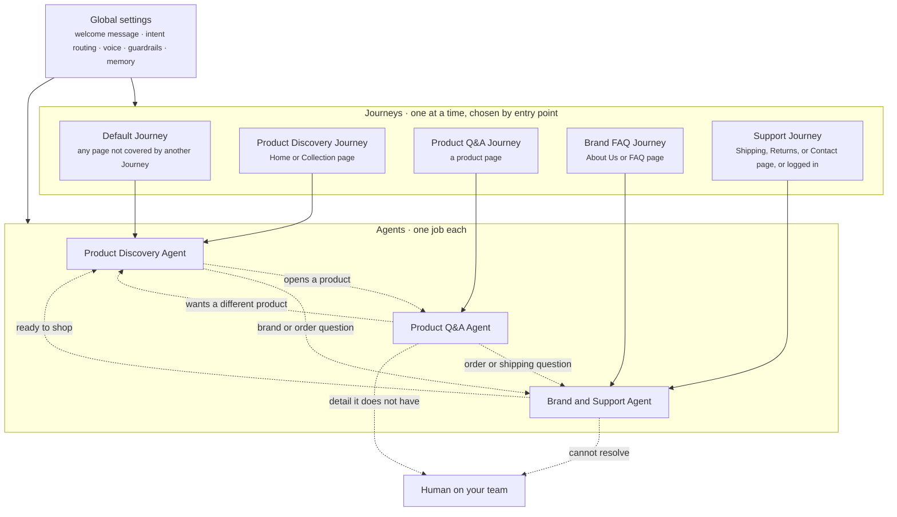

This page walks through one complete Crossword setup for a store that sells functional gummy supplements. One storefront runs five Journeys and three Agents, on top of one set of global settings. Read it as the reference setup. Every other page in these docs describes one part of it.

The setup answers three questions, in three layers.

- **Journeys** answer "where is the shopper, and what do we offer them?" Each Journey has an entry point, starters, proactive messages, an Agent, and goals.
- **Agents** answer "who talks, and how?" Each Agent has one job, its own knowledge, its own guardrails, and clear handoffs.
- **Global settings** answer "what is true everywhere?" The welcome message, intent routing, the brand voice, and the rules no Agent may break live here once.

A shopper is in one Journey at a time. Crossword picks it by entry point, the most specific entry point wins, and the Default Journey covers every page nothing else claims.

## The map

The diagram shows the whole setup. Global settings sit above everything. Each Journey points to the Agent that handles it. The dashed lines are handoffs, where one Agent passes the conversation to another or to a person on your team.



## The Journeys

Every Journey has the same six parts: an entry point, a welcome message, conversation starters, proactive messages, an Agent, and goals. The table sums up all five.

| Journey | Entry point | Starters | Proactive messages | Agent | Primary goal | Secondary goal |
| ------- | ----------- | -------- | ------------------ | ----- | ------------ | -------------- |
| Default | Any page not covered by another Journey | 3: which gummy, find my routine (Quiz), what makes you different | None | Product Discovery Agent | Interacted | View product page |
| Product Discovery | Arrives on Home or a Collection page | 3: the same as Default | None | Product Discovery Agent | Interacted | View product page |
| Product Q&A | Arrives on a product page | 3: fit check (Quiz if unsure), one question per product, best value pack | 3: how fast it works, reorder, ad arrivals | Product Q&A Agent | Add to cart | Bundle or Subscribe & Save |
| Brand FAQ | Arrives on About Us or FAQ page | 3: lab testing, sugar, where to start (Quiz) | 2: About Us visitors, Google brand search arrivals | Brand and Support Agent | Answered question or ticket deflection | Back to shopping |
| Support | Arrives on Shipping, Returns, or Contact page, or is logged in | 3: track my order, when will it arrive, not working for me | 1: Returns page visitors | Brand and Support Agent, in support mode | Ticket deflection | Convert return to exchange |

Three things are worth noticing before you read the details.

- **The welcome message is the same everywhere.** It lives in global settings, so every Journey shows the same greeting. A Journey tailors what comes after the greeting: its starters and its proactive messages.
- **A starter can go to a different Agent than its Journey's.** In the Default Journey, **What makes you different?** goes straight to the Brand and Support Agent. Each starter and each proactive message names its own Agent. Questions the shopper types go through [intent routing](/global/intent-routing) instead.
- **Default and Product Discovery start out identical.** They differ only in entry point. Giving Home and Collection pages their own Journey lets you change them later without changing every other page.

### Default Journey

```yaml
entry_point: Any page not covered by another Journey
welcome_message: "Hi! Energy, sleep, mood or strength: what are you after today?"  # global, the same on every page
conversation_starters:
  - label: "Which gummy is for me?"
    agent: Product Discovery Agent
  - label: "Find my routine"
    agent: Product Discovery Agent
    opens: Quiz
  - label: "What makes you different?"
    agent: Brand and Support Agent
proactive_messages: []
agent: Product Discovery Agent
goals:
  primary: Interacted
  secondary: View product page
```

### Product Discovery Journey

```yaml
entry_point: Arrives on Home or a Collection page
welcome_message: Global greeting
conversation_starters:
  - label: "Which gummy is for me?"
    agent: Product Discovery Agent
  - label: "Find my routine"
    agent: Product Discovery Agent
    opens: Quiz
  - label: "What makes you different?"
    agent: Brand and Support Agent
proactive_messages: []
agent: Product Discovery Agent
goals:
  primary: Interacted
  secondary: View product page
```

### Product Q&A Journey

```yaml
entry_point: Arrives on a product page
welcome_message: Global greeting
conversation_starters:
  - label: "Is this right for me?"
    agent: Product Q&A Agent
    note: Fit check. Opens the Quiz if the shopper is unsure.
  - label: One per product
    agent: Product Q&A Agent
    per_product:
      Sleep: "Will I wake up groggy?"
      Energy: "Will I crash later?"
      Passion: "Works for men & women?"
      Creatine: "Need a loading phase?"
  - label: "Best value pack?"
    agent: Product Q&A Agent
proactive_messages:
  - message: "Curious how fast %Product Name% works? Most people notice it in the first week."
    agent: Product Q&A Agent
    shows_when: 30 seconds on the product page, or scrolls to reviews
  - message: "Running low on %Product Name%? Want to reorder?"
    agent: Product Q&A Agent
    shows_when: On the product page and has ordered this product before
  - message: "Here from our %Ad Angle% ad? Ask me anything about %Product Name%."
    agent: Product Q&A Agent
    shows_when: Source is a paid ad, 5 seconds on the product page
agent: Product Q&A Agent
goals:
  primary: Add to cart
  secondary: Bundle or Subscribe & Save
```

The proactive messages use variables. `%Product Name%` fills in the product on screen. `%Ad Angle%` fills in the angle of the ad the shopper clicked.

### Brand FAQ Journey

```yaml
entry_point: Arrives on About Us or FAQ page
welcome_message: Global greeting
conversation_starters:
  - label: "Are these lab tested?"
    agent: Brand and Support Agent
  - label: "Any sugar in these?"
    agent: Brand and Support Agent
  - label: "Where should I start?"
    agent: Brand and Support Agent
    opens: Quiz
proactive_messages:
  - message: "Hi! We would love to tell you more about <brand>!"
    agent: Brand and Support Agent
    shows_when: 10 seconds on the About Us page
  - message: "New to functional mushrooms? Ask me anything, or get matched in 60 seconds."
    agent: Brand and Support Agent
    shows_when: Source is a Google brand search, 10 seconds on About Us
agent: Brand and Support Agent
goals:
  primary: Answered question or ticket deflection
  secondary: Back to shopping
```

### Support Journey

```yaml
entry_point: Arrives on Shipping, Returns, or Contact page, or is logged in
welcome_message: Global greeting
conversation_starters:
  - label: "Track my order"
    agent: Brand and Support Agent
  - label: "When will it arrive?"
    agent: Brand and Support Agent
  - label: "Not working for me"
    agent: Brand and Support Agent
    note: Suggests a better-fit swap first, then the 30-day return.
proactive_messages:
  - message: "Hi! Need help with an order or a return?"
    agent: Brand and Support Agent
    shows_when: 10 seconds on the Returns page
agent: Brand and Support Agent, in support mode (resolves the issue, no selling)
goals:
  primary: Ticket deflection
  secondary: Convert return to exchange
```

## The Agents

Every Agent has the same eleven parts. Each part has its own page under [Agents](/agents/overview): [goal and operating procedure](/agents/goal-and-operating-procedure), [persona and brand voice](/agents/persona-and-brand-voice), [knowledge and context](/agents/knowledge-and-context), [rich responses and actions](/agents/rich-responses-and-actions), [guardrails and fallback](/agents/guardrails-and-fallback), [customer memory](/agents/customer-memory), and [escalation and handoff](/agents/escalation-and-handoff).

Each Agent adds to global settings. It never overrides them. The global guardrails, for example, apply to all three Agents on top of their own.

### Product Discovery Agent

Handles shoppers who have not picked a product yet.

```yaml
goal_and_success_criteria:
  goal: An undecided shopper finds the right product and adds it to cart.
  success: The shopper views or adds a recommended product.
operating_procedure:
  - "Ask one or two quick questions: what they want to feel, gummy or spray."
  - Recommend one best pick and one alternative, bestsellers first.
  - Still unsure? Open the Quiz, then explain the result in plain words.
  - At the pick, mention Subscribe & Save once.
persona_and_brand_voice: The full brand voice
knowledge_sources:
  - Full product catalog, with every gummy, spray, and bundle, prices, and bestsellers
  - General FAQs
customer_context:
  - Which page they are on
  - Where they came from
rich_responses:
  - Product cards with Add to cart
  - Quiz component
actions_and_integrations:
  - Recommends products
  - Adds products to the cart
  - Runs the quiz and explains the result
guardrails:
  - Recommends at most two products at a time
  - Never re-scores or changes a quiz result
fallback_behavior: Says so honestly and offers the quiz. Never guesses.
customer_memory:
  - What they are looking for (energy, sleep, mood, strength)
  - Products they looked at or added to cart
escalation_and_handoff:
  - to: Product Q&A Agent
    when: They open a product
  - to: Brand and Support Agent
    when: They ask a brand or order question
```

### Product Q&A Agent

Handles shoppers on a product page who have doubts about that product.

```yaml
goal_and_success_criteria:
  goal: A shopper on a product page gets their doubts answered and buys with confidence.
  success: The product, or a better fit, is added to cart.
operating_procedure:
  - Answer in two or three sentences, straight from the product's FAQ.
  - For "Is this right for me?", ask a question or two, then confirm or suggest a better fit.
  - Still unsure? Open the Quiz.
  - Once doubts are cleared, point to the best-value pack. Suggest a bundle only when it fits.
persona_and_brand_voice: Friendly and confident, facts first. Light playfulness, but never jokes about how the product works or its effects.
knowledge_sources:
  - The product on screen and its own FAQ
  - Reviews, pack sizes, prices, Subscribe & Save, and the 30-day guarantee
customer_context:
  - Which product page they are on
  - Whether they have ordered this product before
  - Whether they came from an ad
rich_responses:
  - Product detail
  - Review summary
  - Bundle suggestion
  - Add to cart
  - Quiz component
actions_and_integrations:
  - Answers product questions
  - Checks product fit
  - Adds the right pack to the cart
  - Offers a reorder to returning customers
guardrails:
  - Only states results and timelines the product's FAQ states
fallback_behavior: Says it does not have that detail and offers to connect them with the team.
customer_memory:
  - Questions already answered
  - The pack size they chose
escalation_and_handoff:
  - to: Product Discovery Agent
    when: They want a different product
  - to: Brand and Support Agent
    when: They ask an order or shipping question
  - to: A human on the team
    when: It does not have a detail the shopper needs
```

### Brand and Support Agent

Handles brand questions and every order, shipping, and return problem.

```yaml
goal_and_success_criteria:
  goal: Brand questions are answered, and order, shipping, and return issues are resolved without a ticket.
  success: Resolved in chat, or handed to the team with everything they need.
operating_procedure:
  - Work out if it is a brand question or a problem.
  - "Brand question: a short, friendly answer, then a nudge to shop or take the quiz."
  - "Order or shipping: look it up and answer. If it cannot, hand off to the team."
  - "Not working for me: find out why, offer a better-fit swap first, then the 30-day return."
persona_and_brand_voice:
  brand_questions: The brand voice
  problems_and_orders: Calm, warm, and straight to the point. No jokes, no emojis.
knowledge_sources:
  - Brand FAQs on ingredients, sourcing, lab testing, sugar-free, and vegan
  - Shipping, returns, and contact policies
customer_context:
  - Which page they are on
  - Whether they are logged in, and their orders
rich_responses:
  - Order status
  - Product cards, for swaps
  - Quiz component
actions_and_integrations:
  - Answers brand questions
  - Tracks orders, once connected to the store
  - Starts a return or exchange
  - Brings in a human from the team
guardrails:
  - Never blocks a return
  - No selling while resolving a problem
fallback_behavior: Brings in a human from the team.
customer_memory:
  - Name, email, and order number, once shared
  - The problem already described
escalation_and_handoff:
  - to: A human on the team
    when: It cannot resolve the problem in chat
  - to: Product Discovery Agent
    when: They are ready to shop
```

## Global settings

Global settings hold what every Journey and every Agent shares. The welcome message is set here once. Intent routing sends every typed question to the right Agent, while tapped starters and proactive messages go straight to the Agent named next to them. The global voice and guardrails apply to every reply, and the escalation rules make sure a shopper never repeats themselves. Read [Global settings](/global/overview).

```yaml
welcome_message: "Hi! Energy, sleep, mood or strength: what are you after today?"
intent_routing: >-
  Every typed question goes to the Intent Routing Agent, which sends it to the right Agent.
  Tapped starters and proactive messages go straight to the Agent shown next to them.
persona_and_brand_voice: >-
  Playful, upbeat, and a little cheeky, like the brand's own FAQ.
  Short, friendly sentences, one emoji at most.
  Nerdy about mushrooms, but always in plain words.
global_guardrails:
  - No health or medical claims. Never says a product treats, cures, or prevents anything.
  - Says "Please check with your doctor" if the shopper is on medication, pregnant, or has a condition.
  - Only shares facts the brand has published. Never invents details.
  - Shows products as cards, never as long text lists.
  - Never asks for card or payment details.
  - Never promises refunds or delivery dates it cannot confirm.
shared_rich_responses_and_actions:
  - Product cards and Add to cart
  - Quiz component ("Find my routine")
  - Handoff to a human on the team
escalation_and_handoff:
  - Agents pass the chat with the conversation so far, so the shopper never repeats themselves.
  - A human handoff arrives with name, email, order number, and the problem already collected.
customer_memory:
  - The page they are on and where they came from (ad, Google, direct)
  - Logged-in status and past orders
  - Quiz result, once they have taken it
```

## Quality and governance

Quality and governance is how you know the setup works and keep it working. Each Journey has its own goal, and those roll up into storefront-wide metrics. You test every Journey before it goes live, check every reply against the guardrails, keep every change as a version you can roll back, and turn unanswered questions into new knowledge. Read [Quality and governance](/quality/overview).

```yaml
success_metrics:
  per_journey: Each Journey's own primary and secondary goal (see the Journeys above)
  rolled_up:
    - Chat-assisted revenue
    - Resolution rate
    - Ticket deflection
    - CSAT
testing_and_simulations:
  - Test conversations for every Journey before go-live
  - "Pass criteria: the right Agent answers, the right product shows, no guardrail is broken"
  - Re-run after every change
supervision_and_qa:
  - Every reply is checked against the guardrails as it is written
  - The team reviews flagged conversations and a weekly sample
versioning_and_rollback:
  - Every change to an Agent is a new version
  - Roll back to any earlier version at any time
continuous_improvement:
  - Questions the Agents could not answer become new knowledge
  - A monthly review of metrics and conversations tunes operating procedures, starters, and messages
```

## A shopper's path through it

Follow one shopper who clicks a paid ad for the Sleep gummy.

1. **The entry point picks the Journey.** The shopper lands on the Sleep gummy's product page from a paid ad. A product page is the Product Q&A Journey's entry point, and it is more specific than the Default Journey's, so the shopper is in Product Q&A. The widget shows the global greeting and the Journey's three starters: **Is this right for me?**, **Will I wake up groggy?**, and **Best value pack?**
2. **A proactive message greets the ad arrival.** After 5 seconds on the page, the ad message's "shows when" rule matches. A bubble reads "Here from our better-sleep ad? Ask me anything about Sleep." with `%Ad Angle%` and `%Product Name%` filled in.
3. **The Product Q&A Agent answers from the FAQ.** The shopper taps the message and asks whether they will wake up groggy. The message routes straight to the Product Q&A Agent. It answers in two or three sentences from the Sleep gummy's own FAQ, and it states only the results and timelines that FAQ states.
4. **The Quiz settles the doubt.** The shopper is still unsure the gummy is right for them. Following its operating procedure, the Agent asks a question or two and then opens the Quiz. The quiz result lands in customer memory. The Agent confirms the fit, points to the best-value pack, and shows it as a product card with **Add to cart**.
5. **A shipping question hands off with context.** The shopper types "How fast do you ship?" Intent routing sends it to the Brand and Support Agent, which is the Product Q&A Agent's handoff for shipping questions. The conversation so far comes with it, so the shopper does not repeat anything. The Agent answers from the shipping policy and promises no delivery date it cannot confirm.
6. **The goal is reached.** The shopper taps **Add to cart** on the pack card from step 4. They are still in the Product Q&A Journey, so this counts toward its primary goal, add to cart. Had they chosen Subscribe & Save, it would also count toward the secondary goal. The conversation rolls up into chat-assisted revenue.

## The board

The product owner planned this setup on a board before building it in Crossword. It shows the five Journeys, the three Agents, and the global settings described above.

<Frame caption="The planning board behind this setup">
  
</Frame>

## Related

<CardGroup cols={2}>
  <Card title="Journeys" icon="route" href="/orchestration/journeys" />
  <Card title="Agents" icon="robot" href="/agents/overview" />
  <Card title="Global settings" icon="globe" href="/global/overview" />
  <Card title="Quality and governance" icon="clipboard-check" href="/quality/overview" />
</CardGroup>
